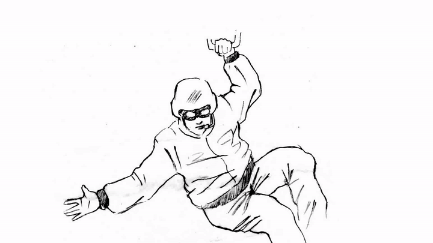

# Введение

Synfig Studio - это бесплатная программа для 2D-анимации с открытым исходным кодом, которая создана чтобы упростить процесс создания мультфильмов, графических иллюстраций и отдельных анимированных элементов (web-анимации, спецэффекты для видео, инфографика и т.п.).&#x20;

Программа предлагает широкий спектр функций, как для начинающих, так и для опытных пользователей:

* Инструменты для создания векторной графики и анимации.
* Инструменты для комбинирования растровых изображений.
* Автоматическое создание промежуточных кадров для объектов “от одной позиции к другой” (включая векторный морфинг).
* Создание скелетов и определение взаимосвязей между элементами для управления анимацией.
* Набор фильтров для создания визуальных эффектов.

Данные функции позволяют применять программу на следующих этапах производства анимации:

1\. Раскрашивание ключевых кадров анимации с сопутствующим созданием промежуточных кадров (векторный твининг).

<figure><figcaption>
Рис. 1  Векторизация изображений и их раскрашивание
</figcaption></figure>

2\. Выполнение совмещения (композитинга) слоёв анимации с сопутствующим добавлением спецэффектов.

<figure><figcaption>
Рис. 2 Композитинг анимации: добавление спец. эффектов, фона, камеры
</figcaption></figure>

3\. Создание скелетной анимации с использованием растровых или векторных элементов (компьютерная перекладка).

<figure><figcaption>
Рис. 3 Скелетная анимация в Synfig
</figcaption></figure>

4\. Моушен-дизайн.

<figure><figcaption>
Рис. 4 Пример моушн-дизайна сделанный в Synfig Studio
</figcaption></figure>


Рис. 4.1 Примеры моушн дизайна в Synfig Studio

