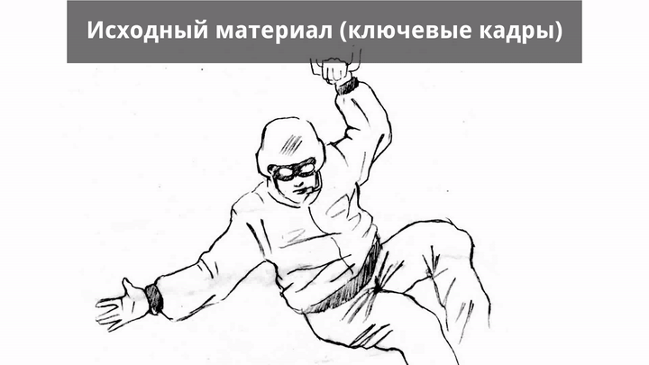
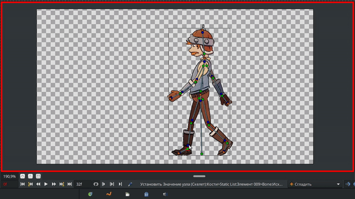

# Введение

Synfig Studio - это бесплатная программа для 2D-анимации с открытым исходным кодом, которая создана чтобы упростить процесс создания мультфильмов, графических иллюстраций и отдельных анимированных элементов (web-анимации, спецэффекты для видео, инфографика и т.п.).

Программа предлагает широкий спектр функций, как для начинающих, так и для опытных пользователей:

* Инструменты для создания векторной графики и анимации.
* Инструменты для комбинирования растровых изображений.
* Автоматическое создание промежуточных кадров для объектов “от одной позиции к другой” (включая векторный морфинг).
* Создание скелетов и определение взаимосвязей между элементами для управления анимацией.
* Набор фильтров для создания визуальных эффектов.

Эти функции позволяют применять программу на следующих этапах производства анимации:

1\. Раскрашивание ключевых кадров анимации с сопутствующим созданием промежуточных кадров (векторный твининг).

<figure><figcaption>
Векторизация изображений и их раскрашивание
</figcaption></figure>

2\. Выполнение совмещения (композитинга) слоёв анимации с сопутствующим добавлением спецэффектов.

<figure><figcaption>
Композитинг анимации: добавление спец. эффектов, фона, камеры
</figcaption></figure>

3\. Создание скелетной анимации с использованием растровых или векторных элементов (компьютерная перекладка).

<figure><figcaption>
Скелетная анимация в Synfig
</figcaption></figure>

4\. Моушен-дизайн.

<figure><figcaption>
Пример моушн-дизайна в Synfig Studio
</figcaption></figure>

{% embed url="https://files.gitbook.com/v0/b/gitbook-x-prod.appspot.com/o/spaces%2Fe9XVEXa2X3Uhr8yAecH3%2Fuploads%2F3yMtc7VHr6vCnJtTMTo2%2F0%20to%20100%20Animations%20Progress%20in%20Synfig%20Studio.mp4?alt=media&token=62e1b4e0-b910-4028-9630-bd0c00cb8a7f" %}
Примеры моушн-дизайна в Synfig Studio

