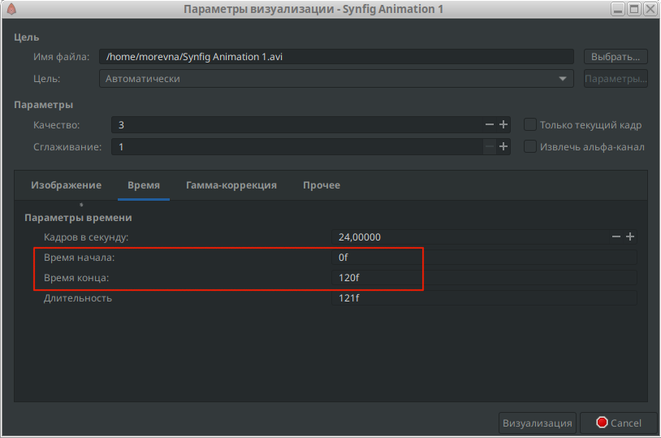

# Экспорт видео

Рендеринг — это визуализация (конвертирование) готовой анимации в формат  видео ролика или серии изображений.

  — Чтобы запустить рендеринг, нужно щекнуть на кнопку “вызова диалогового окна параметров визуализации”.

После чего откроется диалог "параметры визуализации".

<figure><figcaption>
Рис. 1 Окно "Параметры визуализации"
</figcaption></figure>

**Рендеринг в avi**

Давайте сделаем рендеринг нашей анимации в формате "avi". Для этого в строке "имя файла" напишем название нашего ролика — "first-animation", а после точки укажем формат видео — "avi". Также нажав на кнопку "Выбрать" можно задать путь для файла.


По-умолчанию синфиг закодирует вашу анимацию кодеком H.264, применив сжатие без потерь. Этот формат прекрасно подходит если вы хотите потом вставить отрендереную анимацию в видеоредактор, чтобы сшить сцены вместе и наложить звук.


Но возможно, вы захотите выбрать другой кодек. Тогда нужно дополнительно выполнить следующие действия. В строке "Цель" выберите пункт "ffmpeg", после чего станет активной кнопка "Параметры". Нажмём на нее - появится вот такой диалог, из которого можно выбрать подходящий кодек.

Ниже вы можете задать размер изображения. А на вкладке "Время" можно указать диапазон кадров который вы хотите отрендерить.

<figure><figcaption>
Рис. 2 Вкладка "Время"
</figcaption></figure>

Щелкните "Визуализация" и не закрывайте программу пока не появится надпись: "Файл успешно визуализирован", а в панале "Инфо" не загрузится полоса 100%. И если вы все сделали правильно, то в назначенной папке появится ваш файл.

<figure><figcaption></figcaption></figure>
