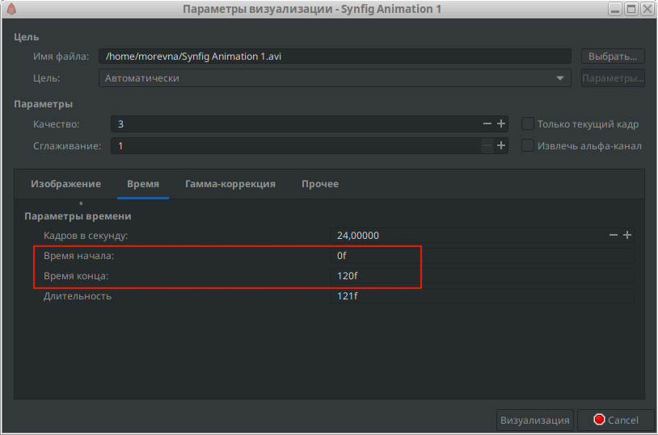

# Экспорт видео

**Рендеринг** — это визуализация (конвертирование) готовой анимации в формат **видеоролика** или серии **изображений**.

  — Чтобы запустить рендеринг, щёлкните на кнопку «**Вызвать диалоговое окно параметров визуализации**».

После этого откроется диалоговое окно «**Параметры визуализации**».

<figure><figcaption>
Окно "Параметры визуализации"
</figcaption></figure>

**Рендеринг в AVI**

Чтобы выполнить рендеринг анимации в формате `avi`, в поле «**Имя файла**» введите название вашего ролика, например: `first-animation.avi`.

Чтобы выбрать путь для сохранения файла, нажмите кнопку «**Выбрать**» и укажите нужную директорию.


По умолчанию **Synfig** кодирует вашу анимацию кодеком `H.264`, применяя сжатие без потерь. Этот формат идеально подходит, если вы планируете вставить отрендеренную анимацию в видеоредактор для дальнейшей сборки сцен и наложения звука.


Если вы захотите выбрать другой кодек, выполните следующие действия:

1. В строке «**Цель»** выберите пункт **ffmpeg**. После этого станет активной кнопка **«Параметры»**.
2. Нажмите на **«Параметры»** — откроется диалоговое окно, в котором можно выбрать подходящий кодек.
3. В этом же окне можно задать **размер изображения**.
4. На вкладке **«Время»** можно указать диапазон кадров, который вы хотите отрендерить.

<figure><figcaption>
Вкладка «Время»
</figcaption></figure>

Щелкните **«Визуализация»** и не закрывайте программу, пока не появится надпись **«Файл успешно визуализирован»**, а в панели **«Инфо»** не загрузится полоса 100%. Если вы все сделали правильно, в назначенной папке появится ваш файл.

<figure><figcaption></figcaption></figure>
