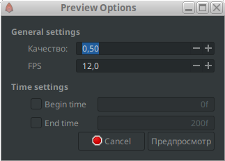

# Предварительный просмотр

Предварительный просмотр позволяет просматривать тяжелые файлы с анимацией, снижая ее качество во время просмотра.

— Чтобы запустить диалоговое окно предпросмотра стоит кликнуть на кнопку “открыть диалог параметров предпросмотра”.

Далее перед вами откроется диалоговое окно,где можно указать желаемое качество предпросмотра и FPS. Если же вы хотите просмотреть определённый кусочек анимации, то стоит потавить галочки в параметрах “Begin time” и “End time”, после этого вам можно будет менять начало и конец анимации, тем самым вы можете указать тот отрывок который хотите просмотреть.

<figure><figcaption>
Предварительный просмотр
</figcaption></figure>

После чего откроется предпросмотр с вашей анимацией, которую можно будет запустить.

<figure><figcaption>
Окно предпросмотра
</figcaption></figure>

