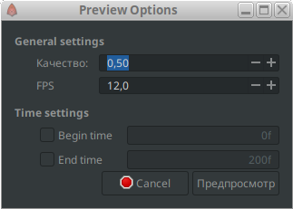

# Предварительный просмотр

Предварительный просмотр позволяет просматривать тяжелые файлы с анимацией, снижая ее качество во время просмотра.

 — Чтобы открыть диалоговое окно **предпросмотра**, щёлкните на кнопку «**Открыть диалог параметров предпросмотра**».

Далее откроется диалоговое окно, в котором можно указать желаемое **качество предпросмотра** и **FPS**.

Если вы хотите просмотреть определённый участок анимации, установите галочки в параметрах «**Begin time**» и «**End time**». После этого можно будет изменять начало и конец анимации, указывая именно тот фрагмент, который требуется просмотреть.

<figure><figcaption>
Предварительный просмотр
</figcaption></figure>

После чего откроется предпросмотр с вашей анимацией, которую можно будет запустить.

<figure><figcaption>
Окно предпросмотра
</figcaption></figure>

