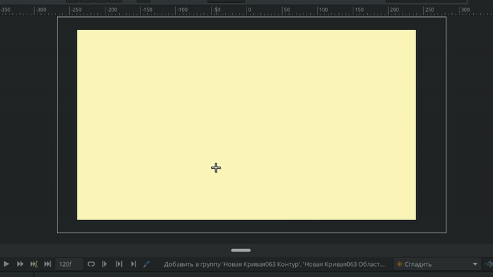
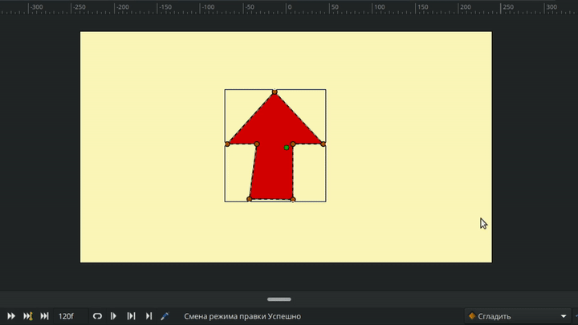
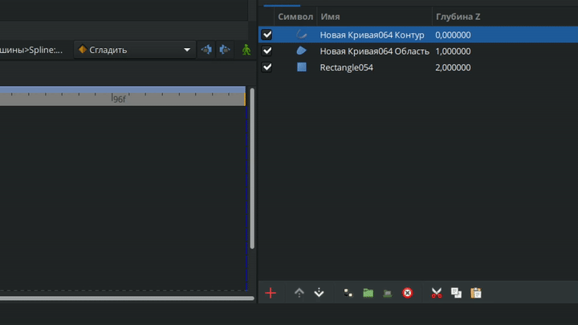
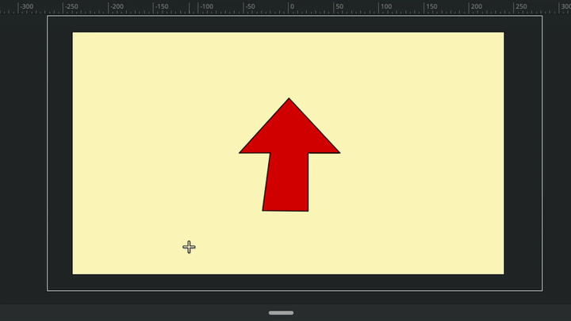
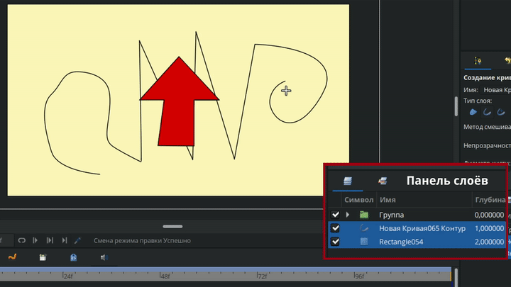
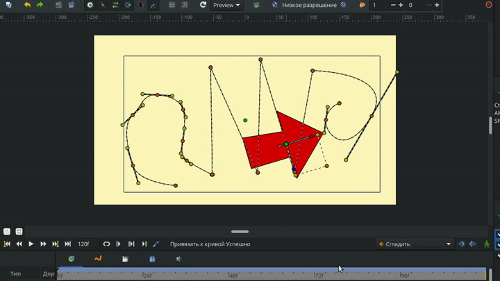
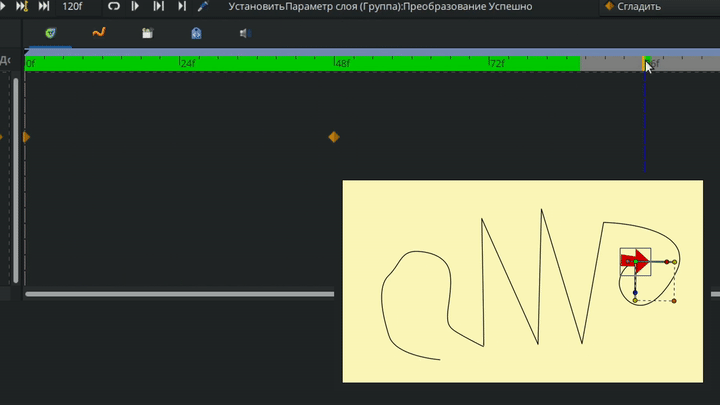
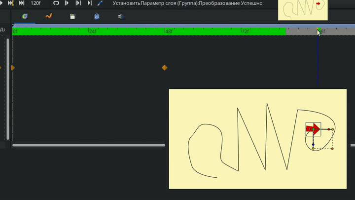

# Анимация вдоль кривой

**Анимация вдоль кривой** представляет собой метод анимирования объектов, при котором их движение ограничено траекторией, задаваемой кривой.&#x20;

На видео ниже представлен пример использования данного метода. В данной анимации используется всего два фиксатора: для указания точки начала и конца.

<figure><figcaption>
Анимация вдоль кривой
</figcaption></figure>

При этом, траекторию движения (кривую) можно скрыть, выключив слой на панели слоёв.

<figure><figcaption>
Анимация вдоль кривой без отображения пути.
</figcaption></figure>

Для того, чтобы воспользоваться этой функцией, нужно:

1. Создать или добавить объект, который будет анимироваться вдоль кривой и поместить его в группу;
2. Создать кривую, вдоль которой будет двигаться объект
3. Привязать точку позиции объекта к кривой.

### Пошаговая инструкция

Создаем произвольный объект. Для наглядности создадим стрелку с помощью инструмента [“кривые”,](../osnovnye-principy/instrumenty.md#instrument-krivye) так мы будем видеть направление движения.

<figure><figcaption>
Создание объекта
</figcaption></figure>

Далее, выделяем все вершины стрелки и перемещаем их таким образом, чтобы они были вокруг точки позиции по центру рабочей области. Так мы задаем центр вращения для стрелки.

<figure><figcaption>
Смещение объекта для выставления его центра
</figcaption></figure>


Шаг выше можно пропустить, при условии если вы выставите центр вращения группы со стрелкой на следующем шаге. Как это сделать смотрите в разделе "параметры слоя", рисунок 16.


Помещаем слои кривую и область, которые являются нашей стрелкой, в группу.

<figure><figcaption>
Группирование слоев
</figcaption></figure>


Обратите внимание, что если вы хотите таким же способом анимировать растровое изображение, то помещать его в группу не нужно, так как в Synfig Studio импортированное изображение технически является слоем переключателем, у которого точки управления идентичны с группой. Подробнее о слое-переключателе смотрите в разделе "Слой-переключатель".


Выбираем инструмент “кривые” и создаем произвольную кривую - путь, по которому будет двигаться наша стрелка.

<figure><figcaption>
Построение кривой
</figcaption></figure>

На панели слоев выделяем группу со стрелкой, на рабочей области выделяем зеленую точку позиции группы. Затем, зажав клавишу ctrl, выделяем слой с кривой (путь для стрелки) и на рабочей области нажимаем правой кнопки мыши на любом месте кривой, кроме вершин. В появившемся окне нажимаем “привязать к кривой”.

<figure><figcaption>
Привязка объекта к кривой
</figcaption></figure>

Выставляем стрелке нужную позицию, размер, поворот. Включаем режим анимации, переходим на любой кадр, переносим за точку позиции группу со стрелкой в финальную позицию, например, на конец кривой.&#x20;

<figure><figcaption>
Анимирование вдоль кривой
</figcaption></figure>

Обратите внимание, если поставить ещё один кадр, чтобы стрелка вернулась в начальную позицию, стрелка будет двигаться “задним ходом”.

<figure><figcaption>
Демонстрация работы анимации вдоль кривой
</figcaption></figure>

Чтобы стрелка разворачивалась, нужно в режиме анимации развернуть её в нужном направлении (в любой момент анимации), а получившийся кадр передвинуть на шкале кадров в тот момент, когда стрелка должна развернуться. Затем у этого кадра поставить тип интерполяции “константа”.


Подробнее о типах интерполяции смотрите в разделе “Фиксаторы”


<figure><figcaption>
Анимация вдоль кривой
</figcaption></figure>

