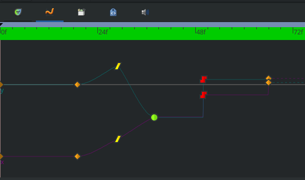
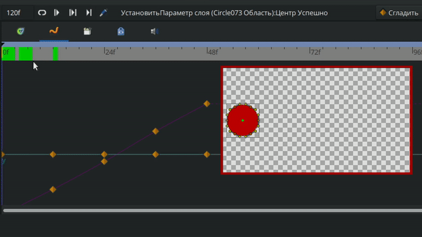
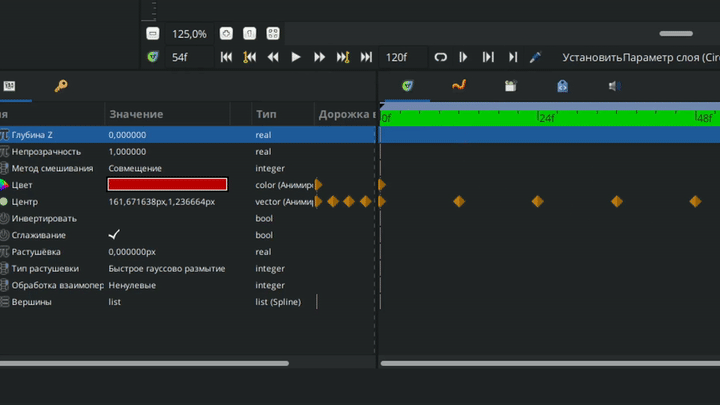
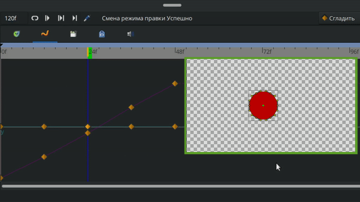

# Графики

**Графики** - графическое отображение изменения параметров в анимации между фиксаторами, которое зависит от типа интерполяции.

<figure><figcaption>
Графики в Synfig Studio
</figcaption></figure>

Преимущества графиков в том, что вы наглядно видите сделанные вам изменения на анимации, можете точнее её контролировать, а также изменять вне режима анимации.

Одновременно можно смотреть и редактировать графики только одного параметра или вершины.

<figure><figcaption>
Настройка анимации с помощью Synfig
</figcaption></figure>

Чтобы включить графики, нужно сначала выбрать редактируемый параметр на “панели параметров”, затем перейти во вкладку “графики” на панели, которая находится чуть выше шкалы кадров. Если параметр не выбран, графики показываться не будут.

<figure><figcaption>
Включение отображения "графиков"
</figcaption></figure>

На панели графиков вы найдете те же самые фиксаторы, что и на шкале кадров, только разделенные на два графика: оси X и оси Y. Потянув за соответствующий фиксатор, можно редактировать параметр относительно любой из осей.&#x20;

<figure><figcaption>
Изменение параметров через графики
</figcaption></figure>
