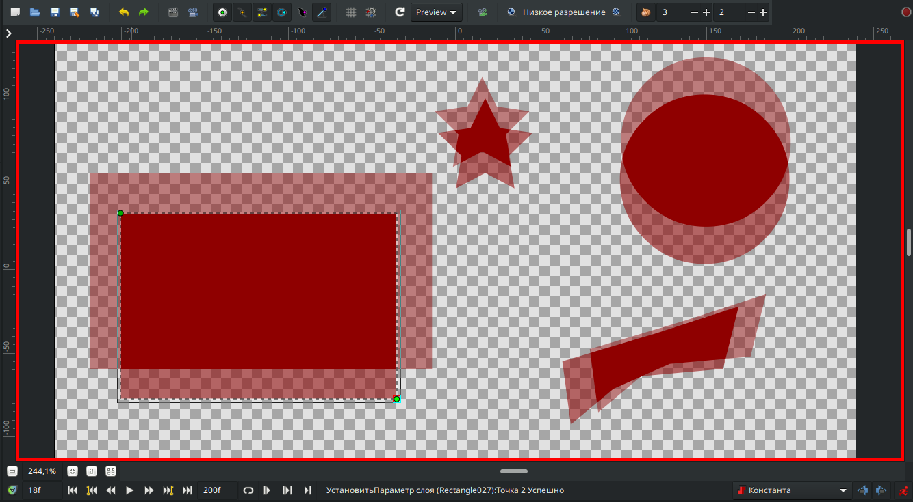

# Калька

Если вам нужно, чтобы отображались предыдущие кадры, то в программе, над рабочей областью есть кнопка “Показывать кальку”

<figure><figcaption>
Иконка "Показать кальку"
</figcaption></figure>

Рядом с ней есть 2 строчки в которых можно настраивать количество отображаемых кадров после текущего кадра и перед текущем кадром&#x20;

<figure><figcaption>
Отображение предыдущих и последующих кадров
</figcaption></figure>
