# Липсинк

**Липсинк** (синхронизация движения губ со звуком) — важный аспект анимации, делающий персонажей более реалистичными.

Чтобы сделать липсинк, сначала нужно нарисовать фонемы для персонажа - позы для рта. Они могут быть как векторными, так и растровыми.&#x20;

Использование разнообразных фонем при создании липсинка является одним из ключевых факторов, обуславливающих его реалистичность и экспрессивность.

<figure><figcaption><p>Список фонем</p></figcaption></figure>

Для оптимизации процесса создания липсинка предлагается метод взаимозамены фонем. Суть метода заключается в повторном использовании одних и тех же фонем для разных звуков, при этом сохраняя смысловое значение речи и минимизируя влияние на визуальное восприятие липсинка. Например, заменить фонему FV и MBP на rest, U на O, L на etc. Таким образом из девяти фонем, мы получаем пять.

<figure>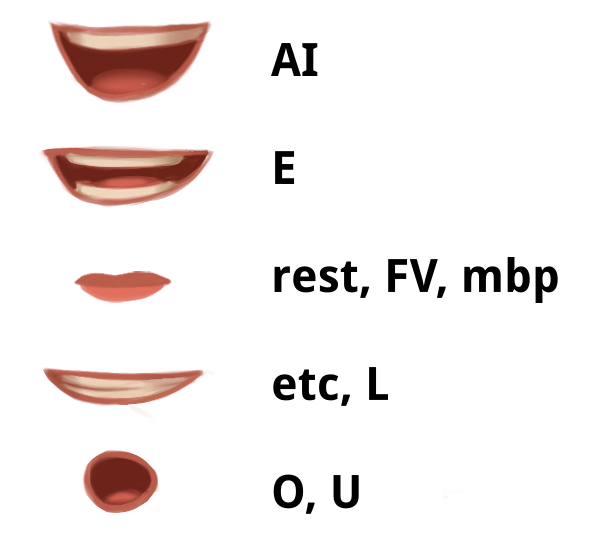<figcaption><p>Сокращенный список фонем</p></figcaption></figure>

Когда фонемы созданы или импортированы в Synfig, можно приступать к созданию анимации липсинка.&#x20;

Есть два базовых способа как сделать липсинк в Synfig Studio:

* Ручной;
* С помощью программы Papagayo-NG.

## Ручной способ

Первое — нужно объединить фонемы в [слой-переключатель](sloi-pereklyuchatel.md).


Как объединять слои в слой-переключатель смотрите в разделе «[Слой-переключатель](sloi-pereklyuchatel.md)».


Далее импортировать звуковой файл с голосом, под который будет делаться липсинк. Для этого нажмите **Файл**, **Импортировать** и выберите нужный звуковой файл.&#x20;

После того, как звуковой файл был импортирован, он появится на панели слоёв, а при воспроизведении анимации - будет воспроизводиться и звук (рис.3).

<figure><figcaption><p>Аудиофайл на панели слоёв</p></figcaption></figure>

После этого, включаем режим анимации, переключаем вручную фонемы там, где необходимо, ориентируясь на звуковой файл.&#x20;


Чтобы легче было ориентироваться какую фонему использовать, проговаривайте фразу самостоятельно и обращайте внимание как в тот или иной момент открывается ваш рот.&#x20;


## Липсинк с помощью Papagayo-NG

Первое, что нужно сделать - это установить программу Papagayo-NG. Скачать её можно тут (вставить ссылку) (рис. 4).

<figure>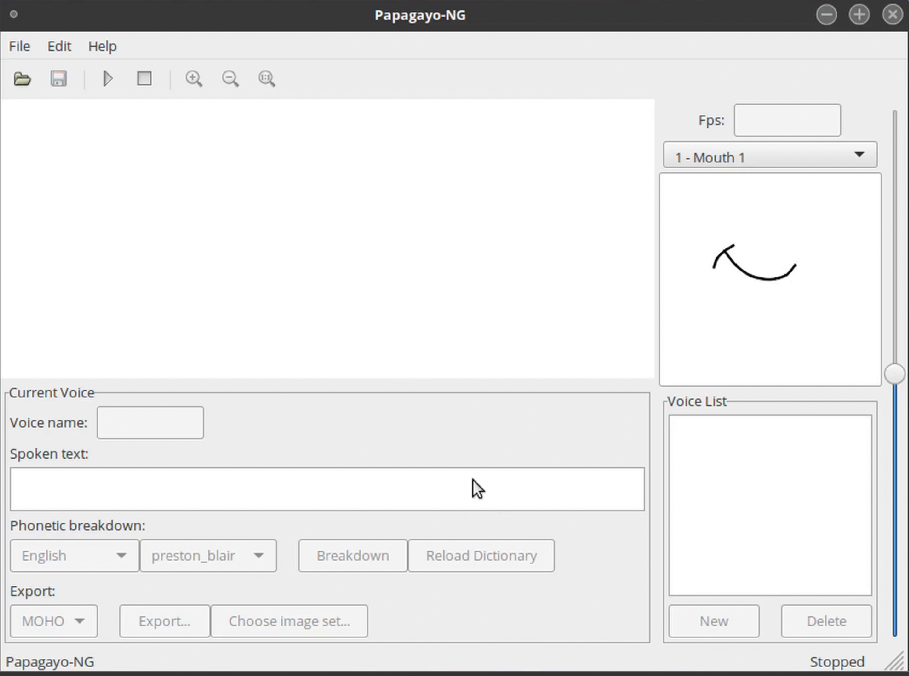<figcaption><p>Стартовое окно Papagayo-NG</p></figcaption></figure>

### Интерфейс

<figure><figcaption><p>Интерфейс Papagayo-NG</p></figcaption></figure>

1. **Панель инструментов** — позволяет:
   * открыть файл;
   * сохранить файл;
   * воспроизвести или остановить звук;
   * приблизить, отдалить или растянуть рабочую область.
2. **Рабочая область** — отображает звуковую волну, а также текстовую фразу в виде блоков и фонем.
3. **Окно частоты кадров (FPS)** — используется для задания количества кадров в секунду проекта, для которого создаётся липсинк.
4. **Меню режима отображения** — позволяет выбрать визуальное представление липсинка при воспроизведении.
5. **Область визуализации липсинка** — показывает, как липсинк выглядит во время воспроизведения.
6. **Поле имени говорящего** — используется для задания имени персонажа. Актуально при работе с несколькими голосами в одном аудиофайле.
7. **Таблица голосов** — служит для добавления и управления несколькими голосами. По назначению напоминает панель слоёв и применяется при работе с несколькими говорящими в одном аудиофайле.
8. **Поле ввода текста** — сюда вводится текст, по которому будет создаваться липсинк.
9. **Меню выбора языка** — определяет язык вводимого текста.
10. **Меню выбора системы фонем** — позволяет выбрать используемую фонетическую систему:
    * **Preston Blair** — использует набор фонем (основных звуков языка) для определения формы рта и движений губ;
    * **Flemming Dobbs** — использует виземы (артикуляционные единицы), определяющие форму рта и движения губ.


**Preston Blair** используется преимущественно для 2D анимации, поскольку эта система является более простой и эффективной. При этом, она может быть менее реалистичной особенно при отображении сложных эмоций или быстрой речи.&#x20;

**Flemming Dobbs** используется преимущественно для 3D анимации, поскольку эта система требует более детальной отрисовки позиций рта. Она может быть более реалистичной, чем система **Preston Blair**, поскольку она учитывает больше нюансов артикуляции.


11. **Кнопка автоматической расстановки текста** — автоматически размещает введённый текст на рабочей области поверх звуковой дорожки.
12. **Главный блок предложения** — отвечает за длительность всей фразы. Его можно растягивать и перемещать; все вложенные блоки при этом будут двигаться и масштабироваться вместе с ним. Используется для задания начала и конца фразы в аудиофайле.
13. **Блоки слов** — представляют отдельные слова в предложении и позволяют точно задать их начало и конец в аудиофайле.
14. **Фонемы** — привязаны к блокам слов и используются для тонкой настройки синхронизации звуков с открыванием рта путём перемещения фонем внутри слова.

### Автоматический липсинк в Papagayo-NG

Первое, что нужно сделать — это импортировать звуковой файл с голосом. Для этого, в левом верхнем углу нажимаем иконку с папкой и выбираем звуковой файл в формате `.wav`. Или в меню **File** нажмите **Open**. &#x20;

<figure>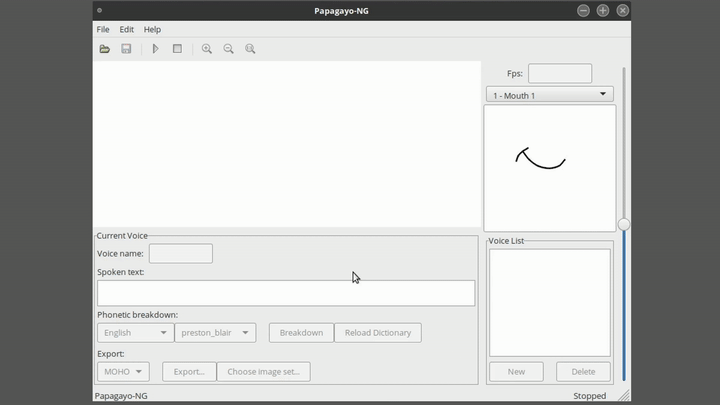<figcaption><p>Импорт аудиофайла в Papagayo-NG</p></figcaption></figure>

После этого в поле **Spoken text** пишем фразу, которая произносится в аудио-файле.&#x20;

Вот несколько подсказок, которые помогут вам в работе с программой:

* **Пишите слова так, как они звучат на слух.**\
  Это помогает программе корректнее расставлять фонемы.\
  Например:
  * «собака» → «сабака»
  * «голубчик» → «галупчик»
* **Присоединяйте отдельно стоящие буквы и предлоги к соседним словам.**\
  Так будет удобнее редактировать положение фонем на рабочей области.\
  Например:
  * «мы и не такое в казарме слушаем» →\
    «мыине такое вказарме слушаем»

Ниже выберите **язык** и систему фонем **preston\_blair**, затем нажмите кнопку **Breakdown**.

Программа **Papagayo-NG** автоматически разместит фонемы поверх звуковой волны в соответствии с аудиофайлом. Однако автоматическая расстановка не всегда бывает точной, так как в записи могут присутствовать посторонние шумы, музыка и другие звуки.

Поэтому рекомендуется **вручную задать начало и конец фразы**, чтобы добиться более точной синхронизации липсинка.

Чтобы это сделать, мы тянем начало зеленого блока и выставляем его на начало фразы. Соответственно, конец зеленого блока на конец фразы.&#x20;

<figure>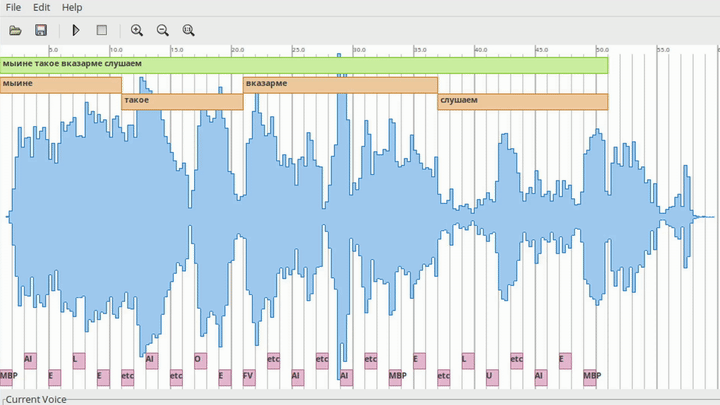<figcaption><p>Задаём начало и конец фразы</p></figcaption></figure>

Таким же образом можно обозначить начало и конец слов с помощью оранжевых блоков.

<figure>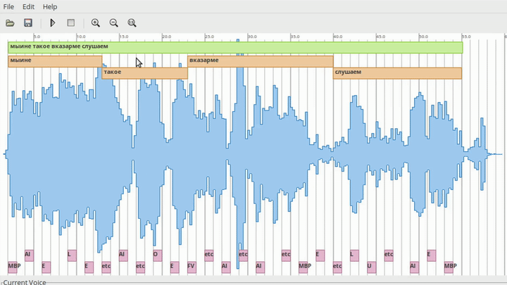<figcaption><p>Задаём начало и конец слова</p></figcaption></figure>

А также можно двигать отдельно стоящие фонемы для более точной настройки липсинка.

<figure>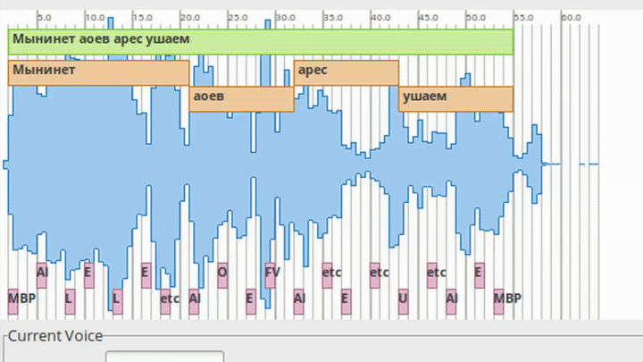<figcaption><p>Перемещение фонем</p></figcaption></figure>

После того, как начало и конец фразы/слов выставлены, нажимаем воспроизвести. Рот в окне справа начнет говорить под заданную фразу.

<figure>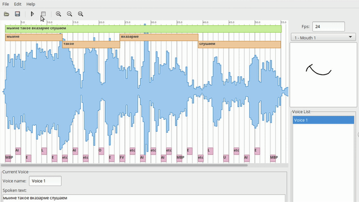<figcaption><p>Демонстрация липсинка</p></figcaption></figure>

Теперь нужно сохранить то, что получилось в файл. Для этого нужно нажать на иконку дискеты на панели инструментов и указать путь.

### Импортирование липсинка из Papagayo-NG в Synfig

Открываем проект Synfig Studio. Нажимаем файл, импортировать и выбираем сохраненный файл из **Papagayo-NG**.  На панели слоёв появится звуковой файл и слой-переключатель, который содержит пустые группы с фонемами.

<figure>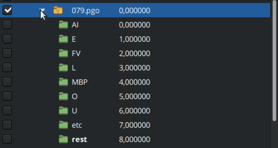<figcaption><p>Файл из Papagayo-NG импортированый в Synfig</p></figcaption></figure>

Заполняем эти группы фонемами, которые мы создали/нарисовали ранее. Недостающие фонемы компенсируем существующими по сокращенному списку фонем.

<figure>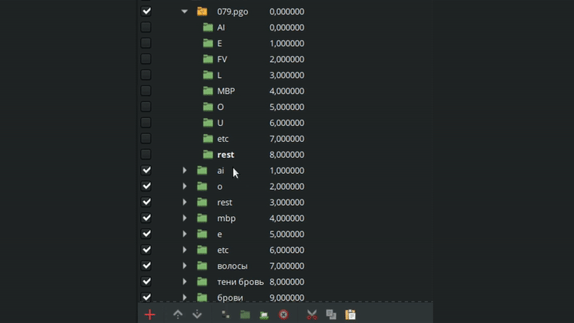<figcaption><p>Перемещение фонем в группы переключателя слоёв</p></figcaption></figure>

После того, как все фонемы были перенесены в группы в слой-переключатель, липсинк готов. При воспроизведении анимации, персонаж начнет говорить.

<figure>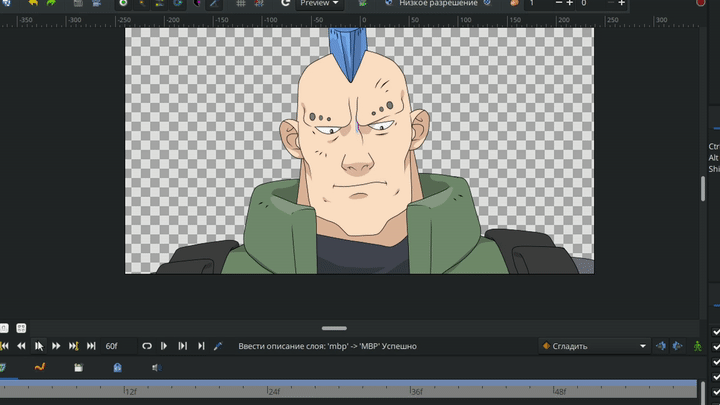<figcaption><p>Результат липсинка через Papagayo-NG</p></figcaption></figure>

## Редактирование липсинка после импортирования в Synfig

Очень часто происходит так, что персонаж «тараторит», т.е. происходит быстрая смена фонем. Это исправить очень просто - нужно отредактировать текст фразы таким образом, чтобы сократилось количество фонем, но при этом сохранилась естественность речи.

Вот несколько подсказок, которые помогут вам это сделать:

1.  **Удаляйте согласную между гласными с разной артикуляцией.**\
    Если в слове стоят две гласные, отличающиеся по артикуляции (например, _А и О_, _Е и У_), а между ними находится согласная, эту согласную можно убрать.\
    Это помогает избежать частого использования фонемы `etc`, из-за которой персонаж слишком часто закрывает рот.

    **Пример:**

    * «такое» → «таое»
2.  **По возможности избавляйтесь от повторяющихся и похожих пар фонем.**\
    Старайтесь убирать:

    * одинаковые пары фонем;
    * пары фонем с близкой артикуляцией.

    **Пример:**\
    Словосочетание «в казарме» в виде фонем выглядит так:

```
«FV etc AI etc AI etc mbp E».
```

В данном случае дважды повторяется пара `etc AI`, а также присутствует пара фонем `etc mbp`, которые близки друг к другу по артикуляции.

Нужно сделать так, чтобы получилось «FV etc AI mbp E», для этого удаляем буквы в слове, чтобы «в казарме» стало «в каре».


Это обусловлено тем, что в жизни человек не артикулирует каждую букву, каждый слог.&#x20;


3.  **Избегайте стыка согласных между словами.**\
    Если одно слово заканчивается на согласную, а следующее начинается с согласной, рекомендуется удалить согласную в начале второго слова.\
    В противном случае возникает повторение фонем, что противоречит пункту 2.

    **Пример:**

    * «такоев казарме» → «такоев азарме»
4. **Перенос согласной, если слово заканчивается на гласную, а следующее начинается с согласной.** \
   Если слово заканчивается на гласную, а следующее начинается на согласную, то переносим эту согласную в конец первого слова. Так мы акцентируем то, что одно слово заканчивается, а следующее начинается, при этом у нас появляется возможность выставить паузу между словами, если это необходимо.

Исходя из этих четырех пунктов, фраза «Мыине такое вказарме слушаем» превращается в «Мыинет аоев арес ушаем».

<figure>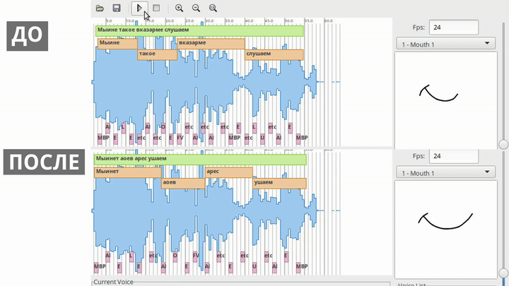<figcaption><p>Сравнение липсинка до и после сокращения фонем</p></figcaption></figure>


Не всегда эти подсказки приводят к желаемому результату, поэтому важно экспериментировать и проверять каждое изменение.


Сохраняем файл. Изменения, внесенные в Papagayo-NG, будут автоматически применены к проекту Synfig.&#x20;

<figure>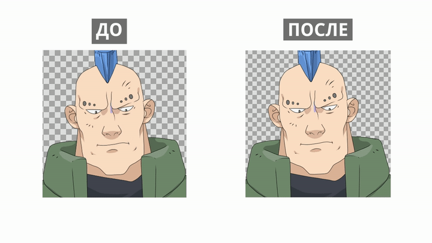<figcaption><p>Сравнение липсинка до и после сокращения фонем</p></figcaption></figure>

