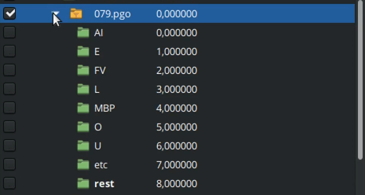

# Липсинк

**Липсинк** (синхронизация движения губ со звуком) – важный аспект анимации, делающий персонажей более реалистичными.

Чтобы сделать липсинк, сначала нужно нарисовать фонемы для персонажа - позы для рта. Они могут быть как векторными, так и растровыми.&#x20;

Использование разнообразных фонем при создании липсинка является одним из ключевых факторов, обуславливающих его реалистичность и экспрессивность.

<figure><figcaption>
Список фонем
</figcaption></figure>

Для оптимизации процесса создания липсинка предлагается метод взаимозамены фонем. Суть метода заключается в повторном использовании одних и тех же фонем для разных звуков, при этом сохраняя смысловое значение речи и минимизируя влияние на визуальное восприятие липсинка. Например, заменить фонему FV и MBP на rest, U на O, L на etc. Таким образом из девяти фонем, мы получаем пять.

<figure><figcaption>
Сокращенный список фонем
</figcaption></figure>

Когда фонемы созданы или импортированы в Synfig, можно приступать к созданию анимации липсинка.&#x20;

Есть два базовых способа как сделать липсинк в Synfig Studio:

* Ручной;
* С помощью программы Papagayo-NG.

## Ручной способ

Первое - нужно объединить фонемы в [слой-переключатель](sloi-pereklyuchatel.md).


Как объединять слои в слой-переключатель смотрите в разделе "[Слой-переключатель](sloi-pereklyuchatel.md)".


Далее импортировать звуковой файл с голосом, под который буедт делаться липсинк. Для этого нажмите "Файл", "Импортировать" и выберите нужный звуковой файл.&#x20;

После того, как звуковой файл был импортирован, он появится на панели слоёв, а при воспроизведении анимации - будет воспроизводиться и звук (рис.3).

<figure><figcaption>
Аудиофайл на панели слоёв
</figcaption></figure>

После этого, включаем режим анимации, переключаем вручную фонемы там, где необходимо, ориентируясь на звуковой файл.&#x20;


Чтобы легче было ориентироваться какую фонему использовать, проговаривайте фразу самостоятельно и обращайте внимание как в тот или иной момент открывается ваш рот.&#x20;


## Липсинк с помощью Papagayo-NG

Первое, что нужно сделать - это установить программу Papagayo-NG. Скачать её можно тут (вставить ссылку) (рис. 4).

<figure><figcaption>
Стартовое окно Papagayo-NG
</figcaption></figure>

### Интерфейс

<figure><figcaption>
Интерфейс Papagayo-NG
</figcaption></figure>

1\) Панель инструментов, с помощью которой вы можете открыть файл, сохранить файл, возпроизвести/остановить звук, приблизить/отдалить/растянуть окно с рабочей областью;

2\)  Рабочая область, на которой отображается звуковая волна и написаная фраза в виде блоков и фонем;

3\) Окно, в котором выставляется количество кадров в секунду вашего проекта, для которого вы делаете липсинк;

4\) Меню, в котором можно выбрать визуальное отображение липсинка при воспроизведении;

5\) Визуальное отображение липсинка при воспроизведении;

6\) Окно, в котором вы можете написать имя говорящего. Это нужно в том случае, если вы одновременно работаете с несколькими голосами в одном аудио файле;

7\) Табличка, в которой можно добавлять другие голоса. Это, своего рода, панель слоёв. Это нужно в том случае, если вы одновременно работаете с несколькими голосами в одном аудио файле;

8\) Поле, в которое вводится текст для липсинка;

9\) Меню, в котором выбирается язык вводимого текста;

10\) Меню, в котором выбирается система фонем. Доступно две системы: preston\_blair и flemming\_dobbs. Preston Blair использует набор фонем (основных звуков языка) для определения формы рта и движения губ, а Flemming Dobbs использует набор визем (артикуляционных единиц) для определения формы рта и движения губ;


Preston Blair используется преимущественно для 2D анимации, поскольку эта система является более простой и эффективной. При этом, она может быть менее реалистичной особенно при отображении сложных эмоций или быстрой речи.&#x20;

Flemming Dobbs используется преимущественно для 3D анимации, поскольку эта система требует более детальной отрисовки позиций рта. Она может быть более реалистичной, чем система Preston Blair, поскольку она учитывает больше нюансов артикуляции.


11\) Кнопка, которая автоматически выставляет набранный текст на рабочую область поверх звуковой дорожки;

12\) Главный блок, который отвечает за длительность всего предложения. Мы можем растягивать/перемещать его, а все остальные блоки, которые находятся под ним, будут двигаться/растягиваться вместе с ним. Используется для того, чтобы выставить начало и конец фразы в аудио файле;

13\) Блоки, которые отвечают за слова в предложении. Они нужны, чтобы выставить начало и конец слов в аудио-файле;

14\) Фонемы, которые привязаны к блокам-словам. Они нужны, чтобы передвигать фонемы в пределах слова, чтобы сделать более точную синхронизацию звуков с открыванием рта.

### Автоматический липсинк в Papagayo-NG

Первое, что нужно сделать - это импортировать звуковой файл с голосом. Для этого, в левом верхнем углу нажимаем иконку с папкой и выбираем звуковой файл в формате .wav. Или в меню File нажмите Open. &#x20;

<figure><figcaption>
Импорт аудиофайла в Papagayo-NG
</figcaption></figure>

После этого в поле "Spoken text" пишем фразу, которая произносится в аудио-файле. Вот несколько подсказок, которые помогут вам в работе с программой:

* Для более правильного выставления фонем, нужно писать слова так, как мы их слышим. Например, "собака" - "сабака", "голубчик" - "галупчик".
* Отдельно стоящие буквы/предлоги присоединям к соседним словам, так будет удобнее редактировать положение фонем на рабочей области. Например, "мы и не такое в казарме слушаем" - "мыине такое вказарме слушаем".&#x20;

Ниже выбираем язык и систему preston\_blair. Нажимаем breakdown. Papagayo-NG автоматически поместит фонемы на имеющийся звуковой файл по звуковой волне. Однако, программа делает это не всегда точно, поскольку в записи могут быть постороние шумы, музыка и др. Поэтому мы в ручную задаем начало и конец фразы.

Чтобы это сделать, мы тянем начало зеленого блока и выставляем его на начало фразы. Соответственно, конец зеленого блока на конец фразы.&#x20;

<figure><figcaption>
Задаём начало и конец фразы
</figcaption></figure>

Таким же образом можно обозначить начало и конец слов с помощью оранжевых блоков.

<figure><figcaption>
Задаём начало и конец слова
</figcaption></figure>

А также можно двигать отдельно стоящие фонемы для более точной настройки липсинка.

<figure><figcaption>
Перемещение фонем
</figcaption></figure>

После того, как начало и конец фразы/слов выставлены, нажимаем воспроизвести. Рот в окне справа начнет говорить под заданную фразу.

<figure><figcaption>
Демонстрация липсинка
</figcaption></figure>

Теперь нужно сохранить то, что получилось в файл. Для этого нужно нажать на иконку дискеты на панели инструментов и указать путь.

### Импортирование липсинка из Papagayo-NG в Synfig

Открываем проект Synfig Studio. Нажимаем файл, импортировать и выбираем сохраненный файл из Papagayo-NG.  На панели слоёв появится звукой файл и слой-переключатель, который содержит пустые группы с фонемами.

<figure><figcaption>
Файл из Papagayo-NG импортированый в Synfig
</figcaption></figure>

Заполняем эти группы фонемами, которые мы создали/нарисовали ранее. Недостающие фонемы компенсируем существующими по сокращенному списку фонем.

<figure><figcaption>
Перемещение фонем в группы переключателя слоёв
</figcaption></figure>

После того, как все фонемы были перенесены в группы в слой-переключатель, липсинк готов. При воспроизведении анимации, персонаж начнет говорить.

<figure><figcaption>
Результат липсинка через Papagayo-NG
</figcaption></figure>

## Редактирование липсинка после импортирования в Synfig

Очень часто происходит так, что персонаж "тараторит", т.е. происходит быстрая смена фонем. Это исправить очень просто - нужно отредактировать текст фразы таким образом, чтобы сократилось количество фонем, но при этом сохранилась естественность речи.

Вот несколько подсказок, которые помогут вам это сделать:

1\) Если в слове несколько гласных, отличающихся по артикуляции (А и О, Е и У), а между ними стоит согласная, то эту согласную можно удалить. Например, "такое" превращается в "таое". Таким образом мы исбавляемся от частого использования фонемы "etc", из-за которой персонаж часто закрывает рот.

2\) Нужно по возможности избавиться от повторяющихся пар фонем и пар фонем, похожих друг на друга. Например, словосочетание "в казарме" в виде фонем будет выглядеть как "FV etc AI etc AI etc mbp E". Здесь у нас дважды повторяется etc AI и есть пара фонем etc mbp, которые похожи друг на друга.&#x20;

Нужно сделать так, чтобы получилось "FV etc AI mbp E", для этого удаляем буквы в слове, чтобы "в казарме" стало "в каре".


Это обусловленно тем, что в жизни человек не артикулирует каждую букву, каждый слог.&#x20;


3\) Если слово заканичвается на согласную, а следующее также начинается на согласную, то нужно удалить согласную из начала второго слова. Иначе получится повторение фонем, что противоречит пункту 2. Например, "такоев казарме" становится "такоев азарме".&#x20;

4\) Если слово заканчивается на гласную, а следующее начинается на согласную, то переносим эту согласную в конец первого слова. Так мы акцентируем то, что одно слово заканчивается, а следующее начинается, при этом у нас появляется возможность выставить паузу между словами, если это необходимо.

Исходя из этих четырех пунктов, фраза "Мыине такое вказарме слушаем" превращается в "Мыинет аоев арес ушаем".

<figure><figcaption>
Сравнение липсинка до и после сокращения фонем
</figcaption></figure>


Не всегда эти подсказки приводят к желаемому результату, поэтому важно экспериментировать и проверять каждое изменение.


Сохраняем файл. Изменения, внесенные в Papagayo-NG, будут автоматически применены к проекту Synfig.&#x20;

<figure><figcaption>
Сравнение липсинка до и после сокращения фонем
</figcaption></figure>

