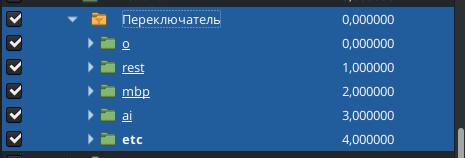
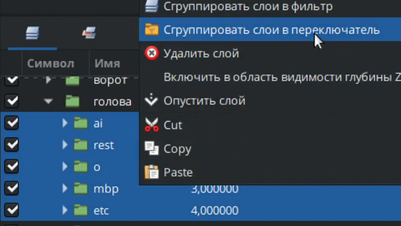
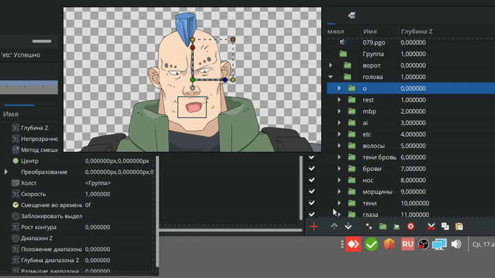
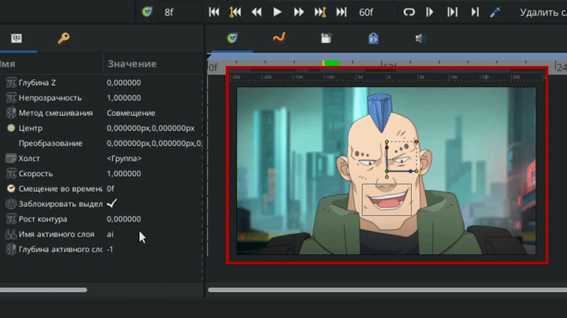
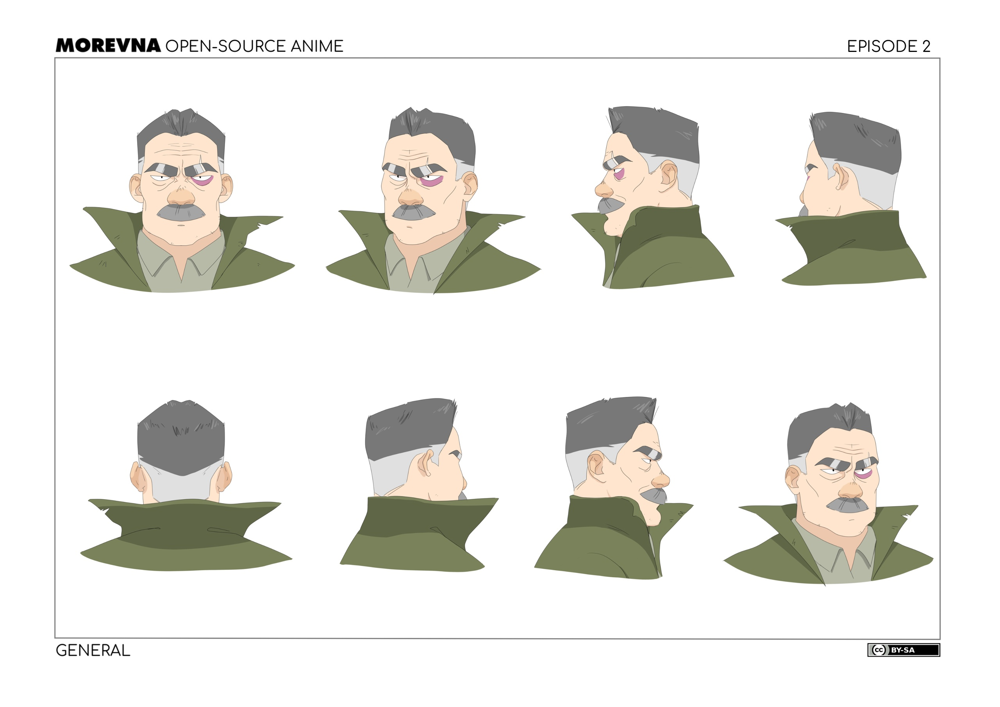
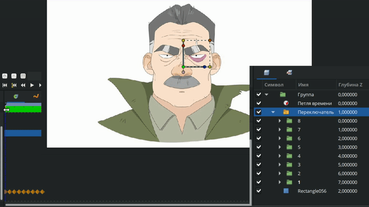
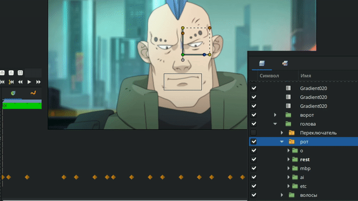
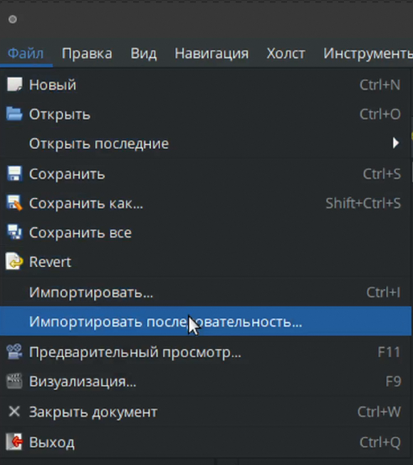
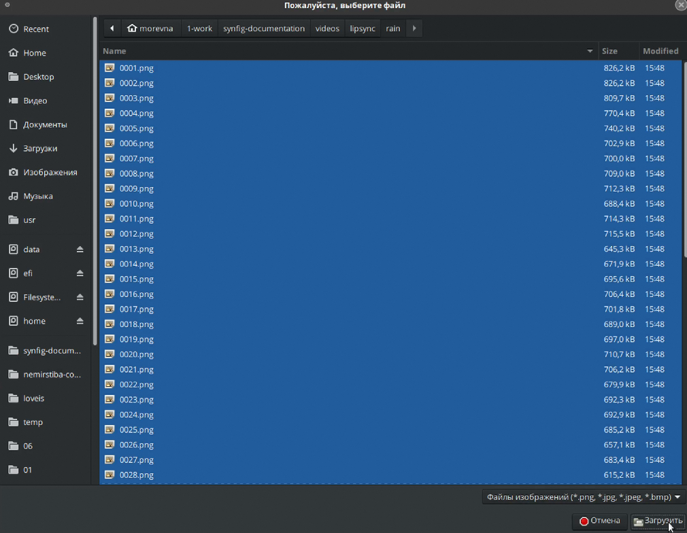

# Слой-переключатель

**Слой-переключатель** - это специальный тип слоя, предназначенный для группировки множества других слоев. Особенность слоя-переключателя заключается в том, что он одновременно отображает только один из вложенных слоев (рис. 1).

<figure><figcaption>
Рис. 1 Слой-переключатель
</figcaption></figure>

Чтобы поместить слои в слой-переключатель, нужно выделить все необходимые слои на панели слоёв, нажать правой кнопкой мыши на любом из них и из появившегося окна выбрать "сгруппировать слои в переключатель" (рис. 1.1).

<figure><figcaption>
Рис. 1.1  Группировка слоёв в слой-переключатель
</figcaption></figure>

Также можно создать переключатель с помощью кнопки "создать слой" внизу панели слоёв. Нажимаем на крест, из появившегося меню выбираем "другое" и "переключатель". Далее перемещаем необходимые слои в переключатель как в обычную группу.

<figure><figcaption>
Рис. 1.2 Группировка слоёв в слой-переключатель
</figcaption></figure>

У этой группы есть специальный параметр «Имя активного слоя» - он указывает какой именно слой отображается на рабочей области (рис. 2).

<figure><figcaption>
Рис.  2 Переключение слоёв
</figcaption></figure>

Если мы будем изменять этот параметр в режиме анимации, то у нас будут появляться фиксаторы и слои будут переключаться (рис.  3).

<figure><figcaption>
Рис.  3 Анимирование переключения слоёв
</figcaption></figure>

### Применение

Слои-переключатели применяются для управления видимостью взаимоисключающих элементов анимации или сцены. Варианты использования:

* Переключение между различными частями персонажа (разные выражения лица, варианты позиций рук, ног и др.) (рис.  4);

<figure><figcaption>
Рис.  4 Разворот персонажа
</figcaption></figure>

<figure><figcaption>
Рис.  4.1 Анимированый разворот персонажа с помощью слоя-переключателя
</figcaption></figure>

* Липсинк (переключение между фонемами - разными позициями рта) (рис.  5);

<figure><figcaption>
Рис.  5 Липсинк с помощью слоя-переключателя
</figcaption></figure>

* Использование последовательности кадров (покадровая анимация, png-секвенции). При импорте в synfig, последовательность кадров автоматически сохраняется в слой-переключатель (рис.  6).

<figure><figcaption>
Рис.  6 Ипортирование последовательности
</figcaption></figure>

<figure><figcaption>
Рис.  6.1 Ипортирование последовательности
</figcaption></figure>

<figure><figcaption>
Рис.  6.2 Ипортирование последовательности
</figcaption></figure>

