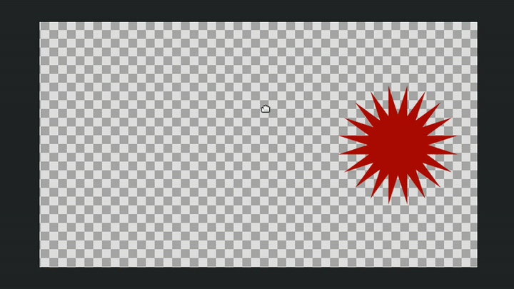

# Деформация

Инструмент **Деформация** предназначен для управления контрольными точками. В отличие от **Трансформации**, при перемещении одной из выбранных точек соседние точки не просто смещаются, а пропорционально растягиваются и деформируются. \
\
Чтобы активировать инструмент:

* Выберите **Деформацию** на **Панели инструментов**
* Или нажмите горячую клавишу `m`

<figure><figcaption></figcaption></figure>

<figure><figcaption>
Инструмент <strong>Деформация</strong>
</figcaption></figure>

Степень влияния на соседние контрольные точки определяется параметром **Радиус** в **Панели параметров инструмента**.

<figure><figcaption>
Степень влияния <strong>радиуса</strong> инструмента <strong>Деформация</strong>
</figcaption></figure>
