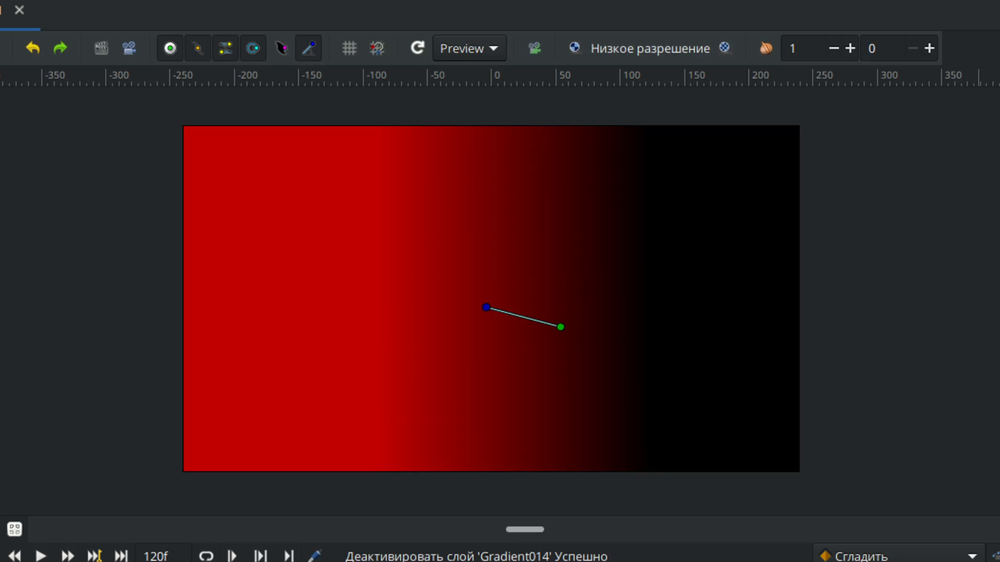
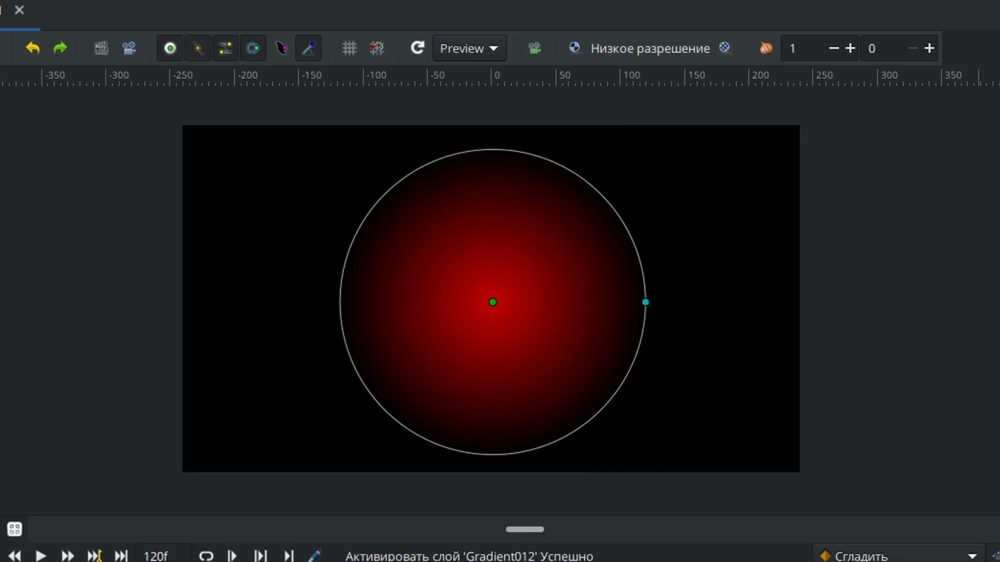
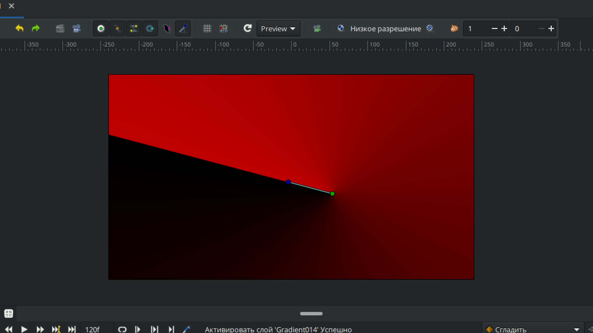
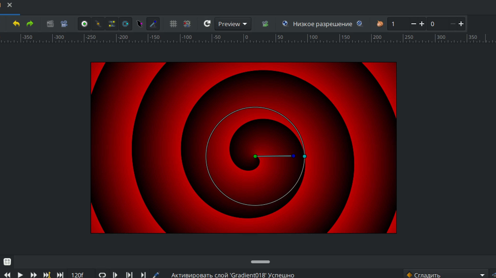

# Градиент

**Градиент** — инструмент для создания плавных переходов между цветами. Создается как отдельный слой, который можно комбинировать с другими объектами с помощью **Режимов смешивания**. 

<figure><figcaption></figcaption></figure>

**Чтобы активировать инструмент:**

* Выберите его на **Панели инструментов**;
* Или нажмите горячую клавишу `g`.

**Порядок работы:**

1. Создайте слой градиента на **Рабочей области**.
2. Используйте контрольные точки для настройки:
   * **Размера** и **положения** градиента;
   * **Угла поворота**;
   * **Радиуса** (для радиальных градиентов).

Доступные настройки для инструмента «**Градиент**»:

* **Имя**
* **Метод смешивания**
* **Непрозрачность**
* **Тип слоя**

С помощью инструмента **Градиент** можно создать следующие типы заливок:

* **Линейный**

<figure><figcaption>
Линейный градиент
</figcaption></figure>

* **Радиальный**

<figure><figcaption>
Радиальный градиент
</figcaption></figure>

* **Конический**

<figure><figcaption>
Конический градиент
</figcaption></figure>

* **Спиральный**

<figure><figcaption>
Спиральный градиент
</figcaption></figure>
