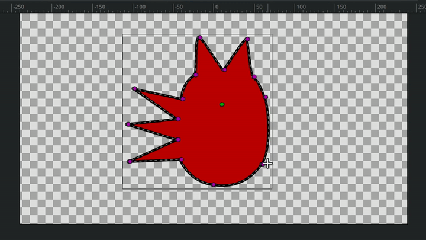
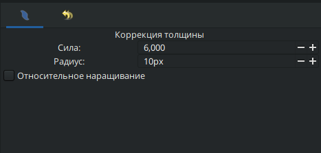

# Коррекция толщины

**Коррекция толщины** — инструмент для динамического изменения толщины контура (аналог нажима карандаша).

<figure><figcaption></figcaption></figure>

**Порядок работы:**

1. Наведите курсор на нужный сегмент линии.
2. Зажмите **ЛКМ** и проведите курсором вдоль линии вперед-назад для **увеличения** толщины.
3. Удерживайте клавишу `Ctrl` при движении курсором для **уменьшения** толщины линии.

<figure><figcaption>
Коррекция толщины контура
</figcaption></figure>

В **Панели параметров инструмента** можно изменять следующие параметры:

* **Сила** — регулирует интенсивность увеличения или уменьшения контура.
* **Радиус** — определяет количество контрольных точек, захватываемых при изменении контура.

<figure><figcaption>
Настройки инструмента <strong>Коррекция толщины</strong>
</figcaption></figure>
