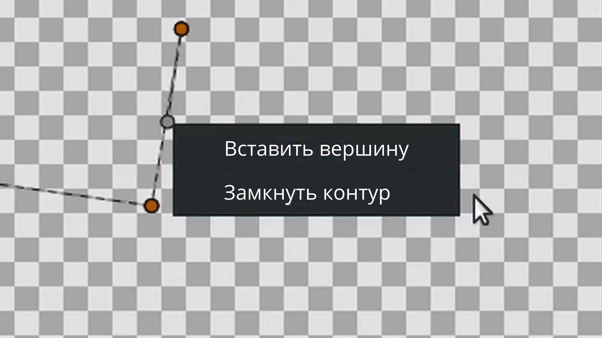
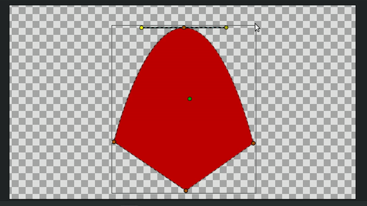
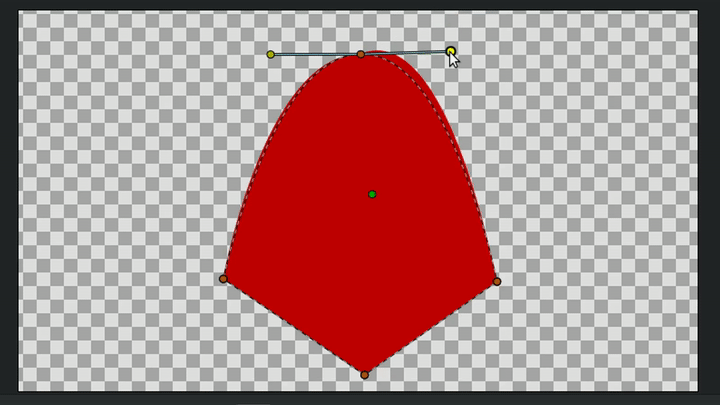
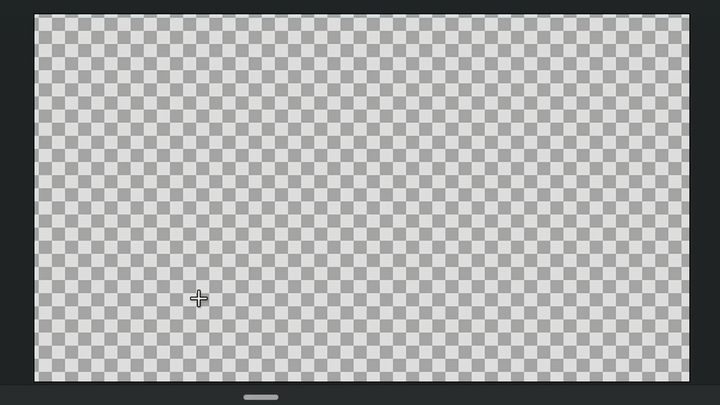

# Кривые

**Кривые** — инструмент, позволяющий создавать произвольные области. \
**Области** — это наиболее часто используемые объекты в анимации, созданной с помощью Synfig.&#x20;

<figure><figcaption></figcaption></figure>

Каждый клик на **Рабочей области** создает новую вершину фигуры.

**Порядок построения:**

* **Создание угла:** Щелкните **ЛКМ**, чтобы поставить вершину с острым углом.
* **Создание скругления:** При установке вершины зажмите **ЛКМ** и потяните в сторону для создания плавного изгиба.
* **Замыкание фигуры:** Нажмите **ЛКМ** на первую (начальную) вершину.
* **Завершение без замыкания:** Дважды щелкните **ЛКМ** в любом месте **Рабочей области**.

<figure><figcaption>
Использование инструмента <strong>Кривые</strong>
</figcaption></figure>

Каждая новая вершина соединяется с предыдущей **кривой Безье**. Эта кривая определяется положением вершин и касательных. Кривая строится последовательно, каждая вершина следует за предыдущей. Конец дуги предыдущей кривой направляет следующую создаваемую дугу, пока вы ее не замкнете.&#x20;

При создании области правый щелчок по кривой или вершине открывает контекстное меню.

**Контекстное меню кривой:**

* **Вставить вершину** — вставляет в месте вызова контекстного меню на кривой вершину.
* **Замкнуть контур** — замыкает первую и последнюю вершины.

<figure><figcaption>
<strong>Контекстное меню кривой</strong>
</figcaption></figure>

**Контекстное меню вершины:**

<figure><figcaption>
<strong>Контекстное меню вершины</strong>
</figcaption></figure>

* **Разделить/связать касательные**, **угол касательных**, **радиус**. Если касательные или их углы, или радиус связаны, они будут изменяться симметрично друг другу.

Если касательные или их углы, или радиус развязаны, они будут изменяться отдельно друг от друга

<figure><figcaption>
Развязанный угол касательных
</figcaption></figure>

<figure><figcaption>
Развязанный радиус касательных
</figcaption></figure>

* **Замкнуть контур**
* **Удалить вершину** — удаляет выбранную вершину, при этом, если удаляемая точка находится между двумя другими, то эти точки автоматически соединятся.

<figure><figcaption>
Удаление вершин
</figcaption></figure>
