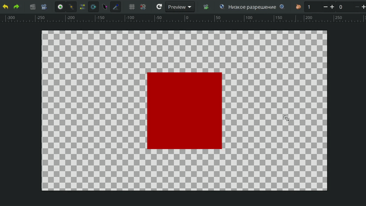
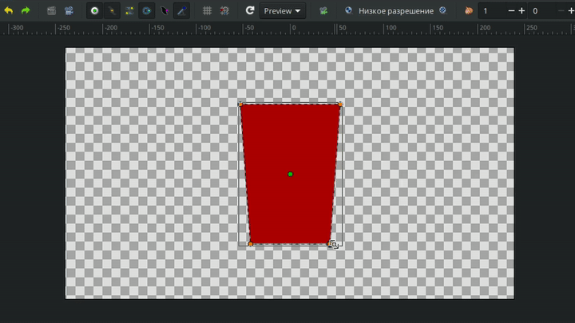

# Масштабирование

**Масштабирование** — инструмент для изменения размера группы контрольных точек.

<figure><figcaption></figcaption></figure>

Чтобы активировать инструмент:

* Выберите **Масштабирование** на **Панели инструментов**;
* Или нажмите горячую клавишу `l`.

**Порядок работы:**

1. Выделите две или более точки.
2. Зажмите **ЛКМ** на одной из них и потяните в сторону для изменения масштаба.

<figure><figcaption>
Изменение масштаба объекта с помощью инструмента <strong>Масштабирование</strong>
</figcaption></figure>

Если вы хотите, чтобы ваши точки при масштабировании оставались в одном положении относительно друг друга, сохраняя форму объекта, нужно включить параметр **Запереть соотношение сторон** на панели настроек инструмента.&#x20;

<figure><figcaption>
Изменение масштаба объекта с фиксированным соотношением сторон
</figcaption></figure>
