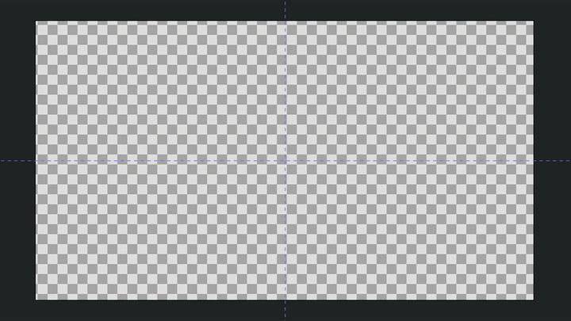
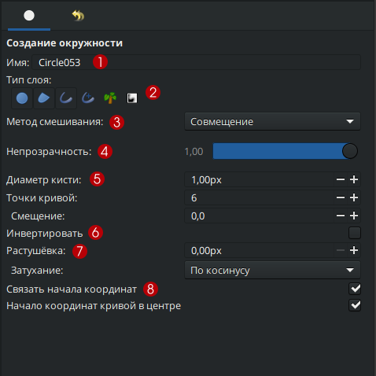

# Окружность, прямоугольник, звезда, многоугольник

Инструменты **Окружность**, **Прямоугольник**, **Звезда**, **Многоугольник** — предназначены для создания объектов с формой, соответствующей их названию.

Тип создаваемого слоя зависит от настроек на **Панели параметров** инструмента.**Чтобы выбрать фигуру:**

* Щелкните по нужной иконке на **Панели инструментов**;
* Или воспользуйтесь горячими клавишами:
  * `e` — **Окружность**;
  * `r` — **Прямоугольник**;
  * `*` — **Звезда**;
  * `o` — **Многоугольник**.


Подробнее о типах создаваемых слоев смотрите в разделе **Перечень слоёв**


<figure><figcaption>
<strong>Окружность</strong>, <strong>Прямоугольник</strong>, <strong>Звезда</strong>, <strong>Многоугольник</strong>
</figcaption></figure>

У данных инструментов имеется ряд общих настроек параметров **слоя**, доступных на панели настроек инструмента:

1. **Имя** — задает название нового слоя. Если в этом поле ввести любое число, оно будет автоматически увеличиваться при создании каждого нового слоя того же типа (например, Слой1, Слой2, Слой3 и т.д.).
2. **Тип слоя** — определяет тип создаваемого слоя. Можно выбрать один или несколько типов слоёв сразу из списка: **Окружность**, **Область**, **Контур**, **Расширенный контур**, **Растение**, **Градиентная заливка**.
3. **Метод смешивания** — устанавливает способ, которым новый слой будет взаимодействовать с нижележащими слоями.
4. **Непрозрачность** — задает степень прозрачности нового слоя. Значение по умолчанию - `1,00` (полностью непрозрачный).
5. **Диаметр кисти** — определяет ширину контура или размер градиента (только для типов **Контур**, **Расширенный контур** и **Градиентная заливка**).
6. **Инвертировать** — определяет, будет ли созданный слой инвертирован. Зависит от параметра слоя **Инвертировать**.
7. **Растушевка** — определяет ширину области сглаживания по краям слоя (не применяется к типам **Растение** и **Слой кривой градиента**).
8. **Связать начало координат** — включение данного параметра определяет, будут ли связаны опорные точки областей, если выбрано более двух типов создаваемых слоёв.

<figure><figcaption>
Настройки инструмента <strong>Окружность</strong>
</figcaption></figure>

За исключением инструмента **Многоугольник,** все остальные инструменты, упомянутые выше, обладают набором дополнительных параметров.

Доступные дополнительные настройки для инструмента **Окружность**:

1. **Точки кривой** — задает количество опорных контрольных точек, которые будут использоваться при создании новых областей (кроме типа слоя **Слой окружности**).&#x20;
2. **Смещение** — задает смещение касательных в опорных точках создаваемой области (кроме типа **Слой окружности**).&#x20;
3. **Затухание** — определяет функцию затухания растушевки (только для типа слоя **Окружность**).
4. **Начало координат кривой в центре** — позволяет установить начало координат слоя в центре окружности. Если этот параметр не выбран, **начало координат** будет располагаться в центре холста.

<figure><figcaption>
Настройки инструмента <strong>Окружность</strong>
</figcaption></figure>

Доступные дополнительные настройки для инструмента **Прямоугольник**:

1. **Расширение** — расширение прямоугольника из его углов (доступно только для слоев типа **Прямоугольник**). Связано с параметром **Величина расширения**.

<figure><figcaption>
Настройки инструмента «<strong>Прямоугольник</strong>»
</figcaption></figure>

Доступные дополнительные настройки для инструмента **Звезда**:

1. **Точки звезды** — целочисленное значение, определяющее количество лучей звезды.
2. **Смещение** — угловое значение смещения вращения создаваемой звезды.
3. **Соотношение радиусов** — соотношение между длиной луча звезды (от центра до вершины) и длиной выемки звезды (от центра до середины стороны между лучами). Значение **1** создает окружность.
4. **Обычный многоугольник** — флажок, определяющий, следует ли создавать обычный многоугольник вместо звезды.
5. **Внутренняя величина** — ширина внутренней границы звезды
6. **Внутренняя касательная** — угол касательной внутренней границы звезды
7. **Внешняя величина** — ширина внешней границы звезды
8. **Внешняя касательная** — угол касательной внешней границы звезды

<figure><figcaption>
Настройки инструмента <strong>Звезда</strong>
</figcaption></figure>
