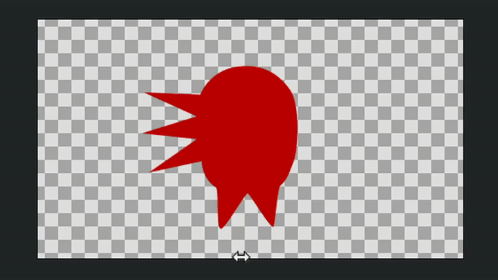
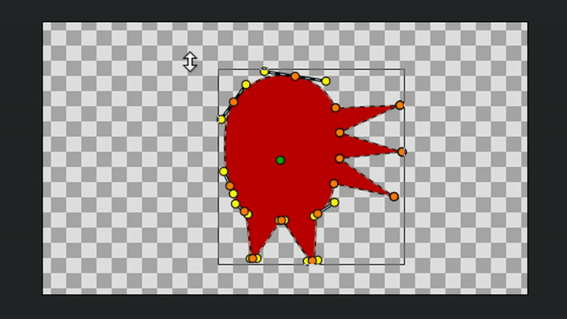

# Отражение

**Отражение** — инструмент для симметричного отображения контрольных точек относительно оси.

<figure><figcaption></figcaption></figure>

**Чтобы активировать инструмент:**

* Выберите его на **Панели инструментов**;
* Или нажмите горячую клавишу `i`.

**Порядок работы:**

1. Выделите две или более точки.
2. Зажмите **ЛКМ** на одной из них и потяните в нужную сторону для зеркального отображения.

<figure><figcaption>
Отражение контрольных точек по горизонтали
</figcaption></figure>

В **Панели параметров инструмента** можно выбрать ось, относительно которой точки будут отражены по горизонтали или вертикали.

Также переключить ось можно с помощью клавиши `Shift`.

<figure><figcaption>
Отражение контрольных точек по вертикали
</figcaption></figure>
