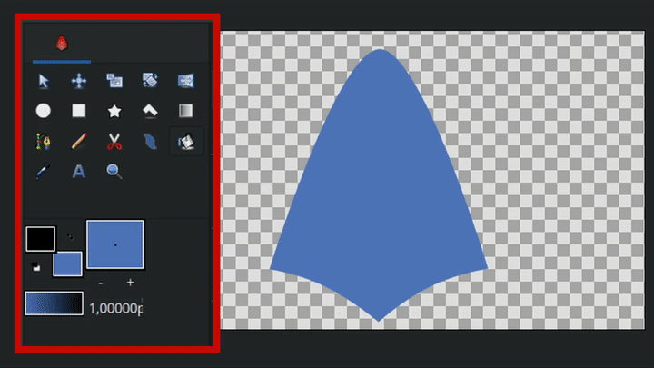

# Сплошная заливка

**Сплошная заливка** — инструмент для быстрого изменения цвета геометрических объектов. При клике на объект инструмент переносит выбранный цвет фона в параметр слоя **Цвет**.**Чтобы активировать инструмент:**

* Выберите его на **Панели инструментов**;
* Или нажмите горячую клавишу `u`.

**Порядок работы:**

1. Выберите нужный цвет в палитре (цвет фона).
2. Наведите курсор на объект в **Рабочей области**.
3. Щелкните **ЛКМ**, чтобы применить цвет к выбранному слою.

<figure><figcaption></figcaption></figure>

<figure><figcaption>
Сплошная заливка
</figcaption></figure>
