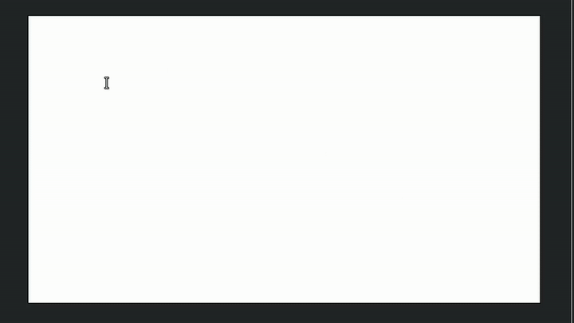
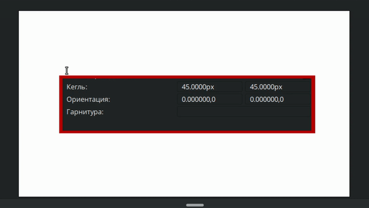
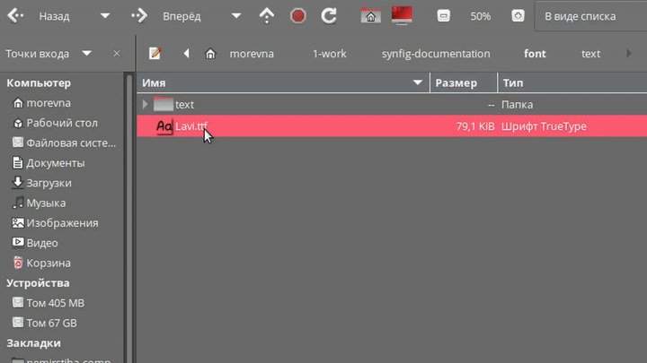

# Текст

Инструмент «**Текст**» — инструмент, позволяющий создавать векторный слой с текстом.&#x20;

**Чтобы активировать инструмент:**

* Выберите его на **Панели инструментов**;
* Или нажмите горячую клавишу `t`.

**Порядок работы:**

1. Щелкните **ЛКМ** в любом месте на **Рабочей области**.
2. В указанном месте будет создан новый **Текстовый слой**, и вы сможете ввести текст.

<figure><figcaption></figcaption></figure>

<figure><figcaption>
Инструмент «<strong>Текст</strong>»
</figcaption></figure>

Доступные настройки для инструмента «**Текст**»:

1. **Имя**
2. **Многострочный текст** — флажок, определяющий тип редактора текста:&#x20;

* **Однострочный редактор** — при нажатии клавиши `Enter` в окне ввода, текст сохраняется и слой создается;

<figure><figcaption>
<strong>Однострочный редактор текста</strong>
</figcaption></figure>

* **Многострочный редактор** — при нажатии клавиши `Enter`, произойдет переход на следующую строку. Чтобы текст сохранился и создался слой, необходимо нажать на кнопку **OK**.

<figure><figcaption>
<strong>Многострочный редактор текста</strong>
</figcaption></figure>

3. **Кегль** — числовые значения, определяющие соответственно **горизонтальный** и **вертикальный** размер текста.
4. **Ориентация** — числовые координаты, определяющие расположение текстового слоя относительно контрольной точки (зелёная точка позиции).

* **По умолчанию (0.5, 0.5)**: текст будет выровнен по центру относительно точки позиции;
* **(0, 0)**: верхний левый угол текстового поля будет расположен в точке позиции.
* **(1, 1)**: нижний правый угол текстового поля будет расположен в точке позиции.

5. **Гарнитура** — параметр, который позволяет указать стиль шрифта для текста. Существует несколько способов выбора стиля шрифта:

* **Использование системных шрифтов**. Введите точное название существующего системного шрифта в поле **Гарнитура** на панели **Настройки инструмента** или в параметрах существующего текстового слоя. Например, **DejaVu Serif**.

<figure><figcaption>
Использование системных шрифтов
</figcaption></figure>

* **Использование файлов шрифтов**. Введите полный путь к файлу шрифта в поле **Гарнитура**. Например, `/home/morevna/1-work/synfig-documentation/font/Lavi.ttf`.

<figure><figcaption>
Использование файлов шрифтов
</figcaption></figure>

* **Использование локальные шрифтов проекта**. Поместите файл шрифта в папку, где находится файл проекта Synfig. Затем Введите в поле **Гарнитура** название шрифта с его расширением. Например, `Lavi.ttf`.

<figure><figcaption>
Использование локальных шрифтов
</figcaption></figure>
