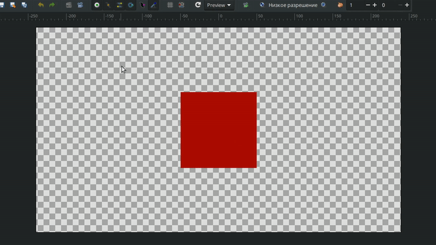
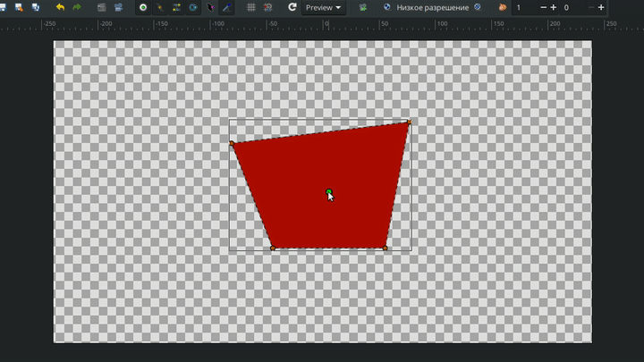
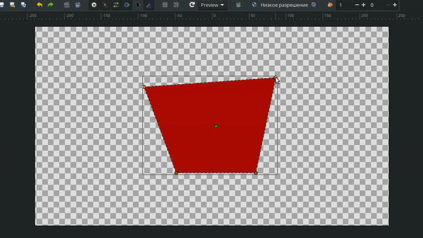

# Трансформация

**Трансформация** — это основной инструмент управления объектами в Synfig Studio, который включает в себя функции и других инструментов редактирования. Он позволяет редактировать **положение**, **размер**, **форму** и **ориентацию** объектов на **Рабочей области**.

<figure><figcaption></figcaption></figure>

Чтобы воспользоваться инструментом:

1. Выберите его на **Панели инструментов** или нажмите клавишу `s`.
2. Щелкните по объекту на **Рабочей области** или выберите его в списке на **Панели слоев**.
3. Перетащите контрольные точки объекта для изменения его формы.


Подробнее о контрольных точках смотрите в разделе [Параметры слоя](../osnovnye-principy/parametry-sloya.md)


<figure><figcaption>
Использование инструмента трансформации
</figcaption></figure>

Если вы зажимаете `Shift` при использовании **Трансформации**, перемещаемый объект будет двигаться строго по **горизонтали** или **вертикали**.

<figure><figcaption>
Использование инструмента трансформации. Перемещение по осям.
</figcaption></figure>

При зажатой клавише `Alt` инструмент **Трансформация** выполняет функции **Масштабирования** (для двух и более выбранных точек).

<figure><figcaption>
Масштабирование с помощью инструмента трансформации
</figcaption></figure>

Выберите две или более контрольные точки и зажмите клавишу `Ctrl` — инструмент **Трансформация** перейдет в режим **Вращения**.

<figure><figcaption>
Вращение с помощью инструмента <strong>Трансформация</strong>
</figcaption></figure>
