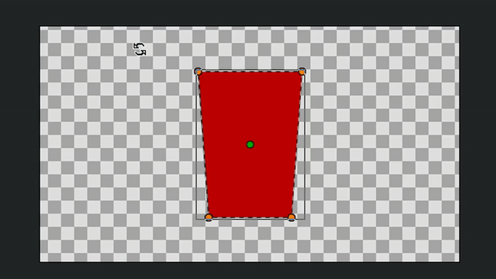
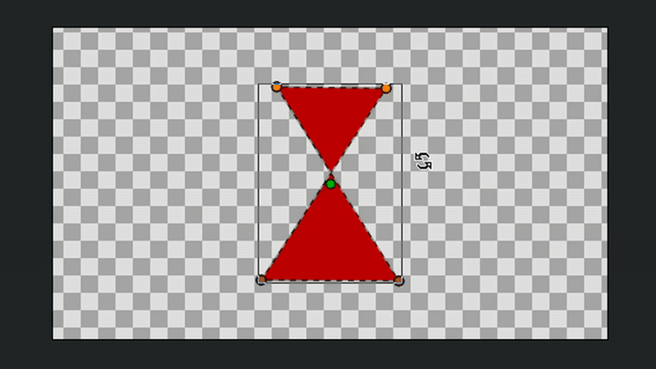

# Вращение

**Вращение** — инструмент, который предназначен для вращения выделенных **контрольных точек**.&#x20;

<figure><figcaption></figcaption></figure>

Чтобы активировать инструмент:

* Выберите **Вращение** на **Панели инструментов**
* Или нажмите горячую клавишу `A` 

Чтобы его использовать, нужно выделить две или более точки, зажать одну из них **левой кнопкой мыши** и потянуть в сторону.&#x20;

<figure><figcaption>
Вращение объекта 
</figcaption></figure>

Если вы хотите, чтобы ваши точки при вращении ещё и масштабировались, нужно включить параметр **Разрешить масштабирование** в **Панели параметров инструмента**.&#x20;

<figure><figcaption>
Вращение объекта с функцией масштабирования
</figcaption></figure>
