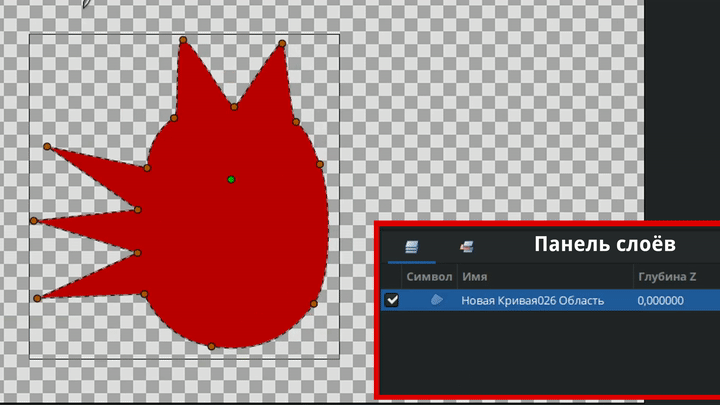
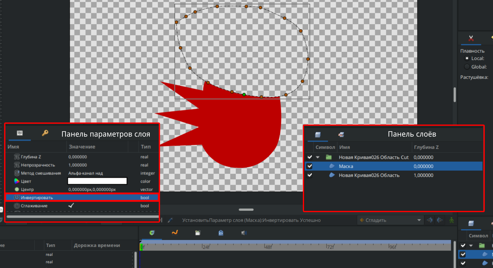

# Вырезание

**Вырезание** — позволяет вырезать произвольную область композиции, создав маску, делающую область вокруг объекта прозрачной.

<figure><figcaption></figcaption></figure>

**Чтобы активировать инструмент:**

* Выберите **Вырезание** на **Панели инструментов**;
* Или нажмите горячую клавишу `c`.

**Порядок работы:**

1. Обведите нужную область (аналогично рисованию кистью).
2. После завершения обводки выделенный фрагмент автоматически переместится в новую группу, а над ним создастся слой-маска.

<figure><figcaption>
Принцип работы инструмента <strong>Вырезание</strong>
</figcaption></figure>

Выбрав слой **Маска** на **Панели слоёв** и убрав галочку **Инвертировать** в параметрах этого слоя, на **Рабочей области** будут скрыты все элементы, находящиеся в пределах области маски, а отображаться будут только те элементы, которые находятся вне её.

<figure><figcaption>
Инвертирование маски
</figcaption></figure>
