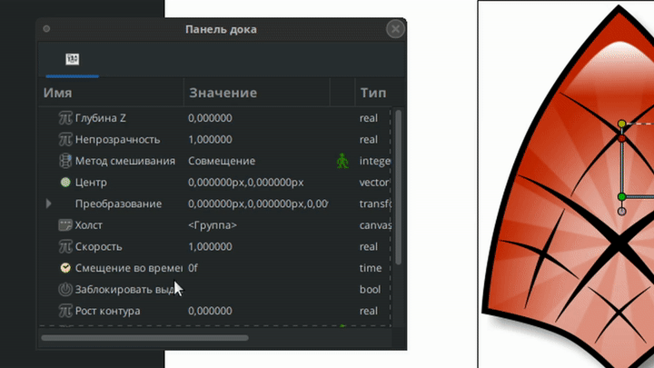

# О Конвертерах

Щелчок правой кнопкой мыши по значению на панели параметров вызывает контекстное меню, в котором есть подменю "Преобразование". Там вы найдете список конвертеров.

<figure><figcaption></figcaption></figure>

Меню "Преобразовать" позволяет указать для параметра режим автоматического управления или использования в математических формулах. Доступные опции зависят от типа параметра.

Для отключения автоматического управления и возврата параметра к исходному типу данных необходимо выбрать пункт "Отсоединить" в его контекстном меню.

<figure><figcaption>
Пример использования конвертера "Random"
</figcaption></figure>


**Преобразование анимированных значений**

Когда параметр анимирован, он преобразуется в узел анимированного значения. Преобразование в другие типы преобразования заменяет ссылку.

