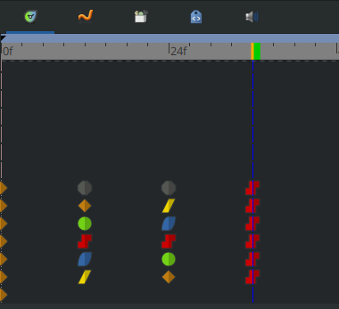
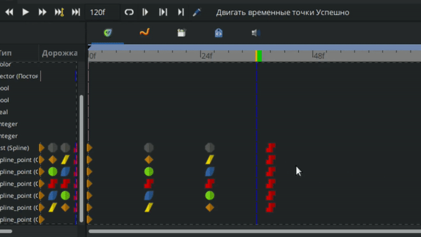
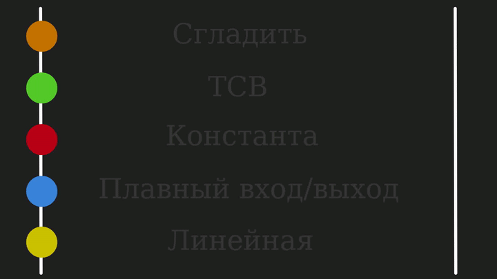
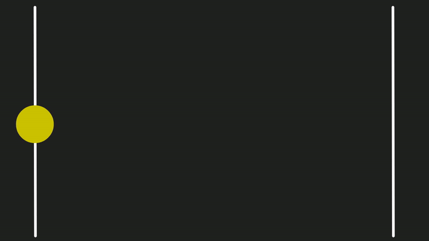
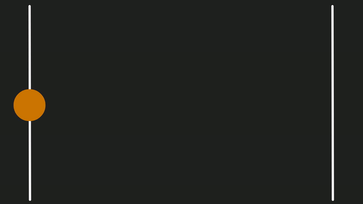
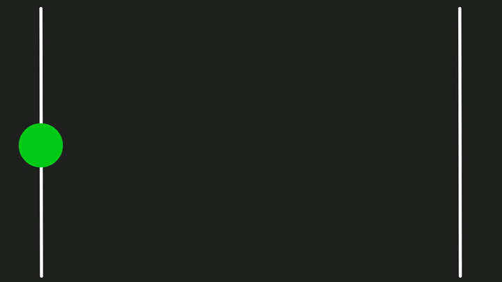
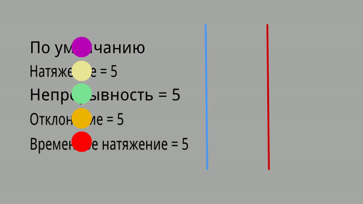
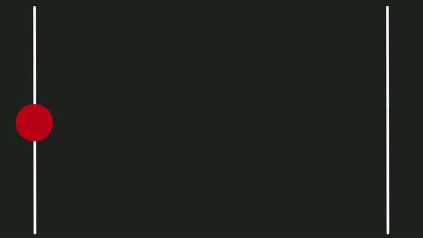
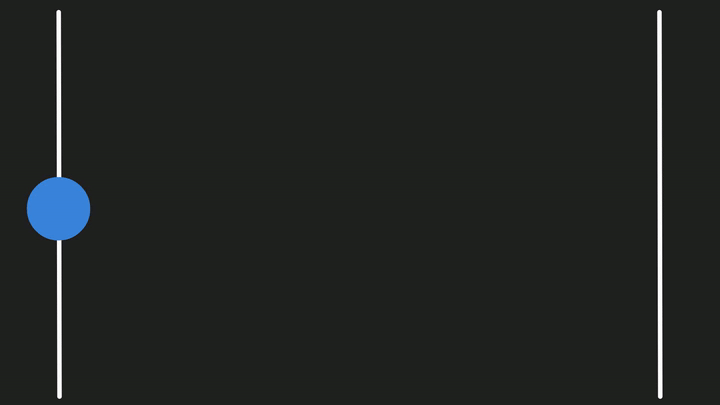
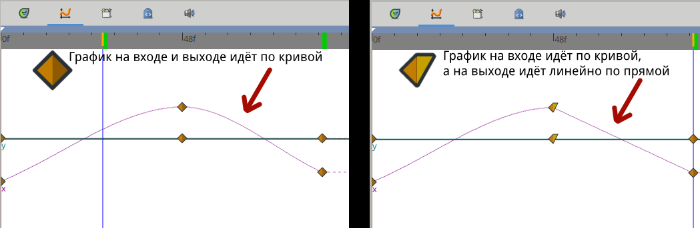

# Фиксаторы

**Фиксаторы** — это графические элементы, отображаемые на шкале кадров. Они автоматически создаются при изменении значений параметров объекта (слоя) в режиме анимации. Для каждого параметра создается отдельный фиксатор.

<figure><figcaption>
Графическое отображение фиксаторов
</figcaption></figure>

### Перемещение фиксаторов

Фиксаторы можно перемещать по временной шкале влево или вправо с помощью зажатой левой кнопки мыши. Это позволяет изменить момент времени, в который данная временная точка влияет на соответствующий ей параметр(ы) анимации. Самый верхний фиксатор перемещает все нижележащие фиксаторы.

Если вы хотите передвинуть на временной шкале несколько фиксаторов одновременно, при этом сохраняя расстояния между ними, удерживайте клавишу ctrl, выделите нужные фиксаторы и перемещайте их как одно целое.

<figure><figcaption>
Перемещение фиксаторов
</figcaption></figure>

### Дополнительные действия с фиксаторами

Щелчок правой кнопкой мыши по фиксатору открывает контекстное меню, содержащее функции для взаимодействия с фиксаторами:

Преобразовать, отсоединить, экспортировать значение в библиотеку проекта, запретить анимацию, удалить и др.

<figure><figcaption>
Действия с фиксаторами
</figcaption></figure>

В самом верху меню находятся команды, которые позволяют связывать значение фиксатора с другими параметрами (или другими фиксаторами). Подробнее об этом можно прочитать в разделе [“Связывание параметров”.](../svyazyvanie-dannykh/svyazyvanie-parametrov.md)

## Интерполяция

Интерполяция – это метод автоматического создания промежуточных кадров между фиксаторами анимации. Это позволяет создавать плавные анимации без необходимости вручную рисовать каждый кадр.

<figure><figcaption>
Фиксаторы с разной интерполяцией
</figcaption></figure>

От типа интерполяции зависит каким образом будут меняться параметры между фиксаторами, например если используется линейная интерполяция, то анимируемый параметр между кадрами будет изменяться равномерно и т.д.&#x20;

<figure><figcaption>
Разница типов интерполяции при одинаковых параметрах
</figcaption></figure>


Подробнее о типах интерполяции смотрите ниже в разделе “Типы интерполяции”.


Каждый фиксатор разделен на две половины. Левая половина указывает на ее "входную" интерполяцию, а правая половина указывает на ее "Выходную" интерполяцию, поэтому возможно комбинировать разные типы интерполяций.

Чтобы изменить интерполяцию у фиксатора, кликните правой кнопкой мыши на нужный фиксатор и в появившемся окне снизу выберите нужную интерполяцию.&#x20;

<figure><figcaption>
Окно с выбором интерполяции
</figcaption></figure>

Чтобы изменить интерполяцию только одной половины фиксатора, также щелкните правой мыши на фиксаторе, в выпавшем меню выберите вход/выход, затем нажмите на нужной интерполяции.&#x20;


Подробнее смотрите ниже, в разделе Интерполяция Входа и Выхода.


## Типы интерполяции

Цвет и форма фиксатора, отображаемые на шкале кадров, указывают на тип её интерполяции:

*  - Сгладить
* &#x20; - TCB (Ти-Си-Би)
* &#x20; - Константа
* &#x20; - Плавный вход/выход
*  - Линейная

### Линейная интерполяция

Линейная интерполяция - это метод, в котором значения между фиксаторами меняются по прямой равномерно и с постоянной скоростью.

<figure><figcaption>
Демонстрация "линейной" интерполяции
</figcaption></figure>

### Интерполяция “Сгладить”

Интерполяция “Сгладить” – это метод интерполяции, который ограничивает значения фиксатора между заданными минимальным и максимальным значениями. Это предотвращает "перелеты" значений за пределы допустимого диапазона, что может привести к нежелательным артефактам в анимации. Данный тип интерполяции позволяет создавать плавную кривую между соседними фиксаторами.&#x20;

<figure><figcaption>
Демонстрация интерполяции "Сгладить"
</figcaption></figure>

### Интерполяция ТСВ

TCB-интерполяция (Tension, Continuity, Bias) – это тип интерполяции, определяющий форму кривой изменения параметра во времени. Данный метод схож с инструментом создания областей (инструмент “кривые”), который формирует гладкие кривые между вершинами.

<figure><figcaption>
Демонстрация интерполяции "TCB"
</figcaption></figure>

Интерполяцией можно управлять с помощью четырех значений:&#x20;

* "Натяжение"
* "Непрерывность"
* "Отклонение"
* "Временное натяжение"

Чтобы открыть окно с возможностью редактирования этих параметров, вам следует щелкнуть правой кнопкой мыши по фиксатору ТСВ, затем из списка выбрать “Правка”.\

<figure><figcaption>
Настройки интерполяции "TCB"
</figcaption></figure>

### Натяжение

Натяжение определяет остроту прохождения кривой через фиксатор. Этот параметр аналогичен влиянию манипуляторов кривой Безье, но действует в обратном направлении, управляя длиной этих манипуляторов.

* Высокое значение натяжения (близкое к 1.0) приводит к более линейному перемещению между опорными точками. Чем выше натяжение, тем короче становятся манипуляторы, что заставляет кривую резко менять направление. При значении натяжения, равном 1.0, и остальных параметрах по умолчанию (0), интерполяция становится линейной (длина манипуляторов равна 0). Значение натяжения выше 1.0 приводит к появлению изгиба кривой вокруг опорной точки, поскольку манипуляторы вытягиваются в отрицательном направлении (меняют направление).
* Низкое значение натяжения заставляет объект следовать касательной (манипулятору) опорной точки. При очень низких значениях основная часть движения будет происходить вдоль касательной из-за чрезвычайно длинных манипуляторов.

### Непрерывность

Непрерывность определяет способ расчета касательной (направления движения) в фиксаторе. Этот параметр также можно сравнить с манипуляторами кривой Безье.

* Значение 0 приводит к зеркальному отражению (объединению) манипуляторов, обеспечивая плавный переход между кривыми. Результатом становится непрерывность первого порядка (гладкое изменение направления).
* Значение -1.0 формирует простой острый угол, приводящий к линейной интерполяции с резким поворотом.
* Еще более низкие значения создают более острый угол, при этом движение внутрь и наружу опорной точки становится все более зеркальным.
* Значения выше 0 оказывают аналогичное влияние, но манипуляторы при этом отражаются в противоположном направлении. Вследствие этого интерполяция будет двигаться снаружи к опорной точке, создавая острый угол с другой стороны.

### Отклонение

Отклонение определяет, какой из сегментов кривой до и после фиксатора будет оказывать большее влияние на расчет касательной (направления движения).

* Значение смещения меньше 0 приводит к тому, что касательная будет ориентирована преимущественно вдоль входящего направления (движения к фиксатору).
* Значение смещения больше 0 обусловливает ориентацию касательной преимущественно вдоль исходящего направления (движения от фиксатора).

### Временное натяжение

По умолчанию объект движется с постоянной скоростью между равноудаленными фиксаторами с одинаковым временным интервалом. Временное натяжение позволяет управлять скоростью движения объекта.

* Значения выше 0 заставляют объект проводить больше времени вблизи опорной точки. Это приводит к замедлению движения непосредственно перед и после нее. С другой стороны, скорость будет увеличиваться по мере приближения к следующей опорной точке.


Наглядный пример: Представьте себе мяч, лежащий на небольшом холме (предыдущая опорная точка). Он скатывается по небольшой долине, постепенно набирая скорость, прежде чем начать подъем на большой холм (измененная опорная точка) и значительно замедлиться по мере приближения к вершине. Затем мяч снова скатится вниз, достигнув максимальной скорости в следующей долине, и начнет подъем на следующий небольшой холм, теряя скорость по мере приближения к вершине (следующая опорная точка).


* Значения ниже 0 приводят к более быстрому прохождению объекта через опорную точку. Это вызывает замедление движения вблизи предыдущей и следующей опорных точек.&#x20;

<figure><figcaption>
Демонастрация настроек интерполяции TCB
</figcaption></figure>

### Интерполяция константа

**Интерполяция константа** - это метод, в котором значения фиксатора остается неизменным до следующего фиксатора на временной шкале.

Иными словами, параметры объекта, заданные в фиксаторе с интерполяцией константа, будут неизменны на протяжении всего интервала времени до следующего фиксатора.

<figure><figcaption>
Демонстрация интерполяции "константа"
</figcaption></figure>

### Интерполяция “Плавный вход/выход”

**Интерполяция “Плавный вход/выход”** – это тип интерполяции, который обеспечивает плавное вхождение и выход кривой к/от фиксатора. Данный метод гарантирует гладкое изменение параметра даже в случае, когда кривая просто проходит через опорную точку, не останавливаясь на ней.

Иными словами:

* Плавный вход – кривая плавно ускоряется по мере приближения к опорной точке.
* Плавный выход – кривая плавно замедляется по мере удаления от опорной точки.

<figure><figcaption>
Демонстрация интерполяции "Плавный вход/выход"
</figcaption></figure>

### Интерполяция по умолчанию

Тип интерполяции по умолчанию для новых фиксаторов определяется раскрывающимся списком в нижней части окна холста. С его помощью вы можете установить нужную вам интерполяцию для фиксатора, которая в будущем будет создаваться на шкале кадров по умолчанию.

<figure><figcaption>
Окно с выбором интерполяции по умолчанию
</figcaption></figure>

### Интерполяция входа и выхода

Каждый фиксатор имеет настройки интерполяции входа и выхода, которые определяют, как будет изменяться её параметр:

* Интерполяция входа определяет, как параметр изменяется в моменты перед достижением фиксатора.

<figure><figcaption>
Окно с выбором интерполяции на "вход"
</figcaption></figure>

* Интерполяция выхода определяет, как параметр изменяется в моменты после достижения фиксатора.

<figure><figcaption>
Окно с выбором интерполяции на "выход"
</figcaption></figure>

Наглядно это видно на графиках анимации, которые вы можете включить сверху шкалы кадров.

<figure><figcaption>
Графики анимации
</figcaption></figure>

Ниже представлена таблица, в которой отображены все вариации фиксаторов, которые могут получится при использовании разных интерполяций на входе и выходе. Интерполяция на "входе" показана в столбце слева, а интерполяция на "выходе" показана на строке сверху.

<figure><figcaption>
Варианты использования разных интерполяций на входе и выходе.
</figcaption></figure>

- Неопределенный фиксатор (серый) - используется, когда у одного объекта на шкале кадров записано несколько фиксаторов для разных вершин с разными типами интерполяции.&#x20;

<figure><figcaption>
Неопределенный фиксатор на шкале кадров
</figcaption></figure>

Если у фиксаторов используется одна интерполяция, будет использоваться символ текущей интерполяции.&#x20;

<figure><figcaption>
Разная интерполяция для вершин одного объекта
</figcaption></figure>

Если у фиксаторов только одна часть имеет одинаковую интерполяцию, например на входе, а на второй части используется разная интерполяция, то у самого верхнего фиксатора одна часть будет иметь символ используемой интерполяции, а вторая будет неопределённой.

<figure><figcaption></figcaption></figure>

<figure><figcaption>
Разная интерполяция для вершин одного объекта
</figcaption></figure>
