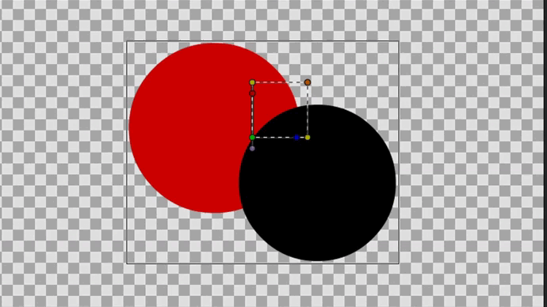
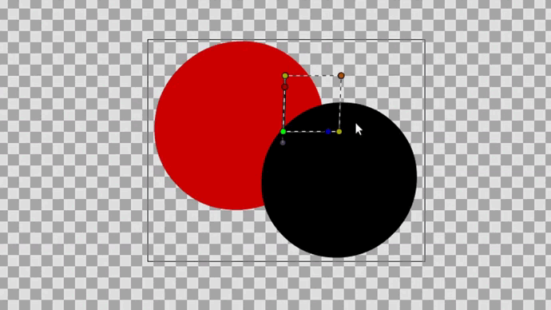
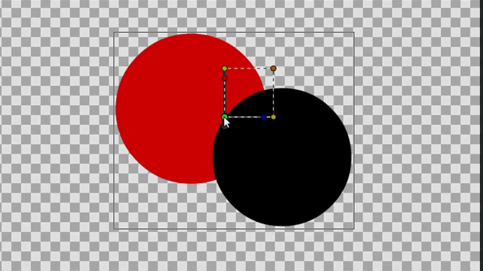

# Группирование слоев

Группа - это специальный слой, который может содержать другие слои.


В Synfig Studio мы можем сгруппировать несколько слоёв и работать с ними как с одним объектов.


Помимо группировки набора слоев, он также может применять преобразования к содержащимся слоям, такие как перевод, масштабирование и даже изменять их смещение по времени.

## **Параметры Группового слоя**

<figure><figcaption></figcaption></figure>

Параметр “Преобразование” является составным параметром, он содержит смещение, угол поворота, угол перекоса и значение масштаба для группы.

“Преобразование” Параметр уже [преобразуется](https://synfig.readthedocs.io/en/latest/converters/composite.html#converter-composite) при создании [группового слоя](https://synfig.readthedocs.io/en/latest/layers/group.html#layer-group) и, таким образом, напрямую предоставляет подпараметры параметров смещения, поворота, перекоса и масштабирования.

Точно также как у слоя изображения, у группы есть точки за которые мы можем изменять её положение размер и прочее. Более подробно про контрольные точки можно посмотреть в разделе: “Параметры на рабочей области" - "Контрольные точки, их цвета и типы”.

**Виды групп**

<table data-view="cards" data-full-width="true"><thead><tr><th></th><th></th><th></th></tr></thead><tbody><tr><td>

<strong>Группа</strong>
</td><td></td><td></td></tr><tr><td>

<strong>Группа переключатель</strong>
</td><td></td><td></td></tr><tr><td>

<strong>Группа фильтров</strong>
</td><td></td><td></td></tr></tbody></table>

Подробнее смотрите о "Группе-переключателе" в разделе "Слой-переключатель". Подробнее о "Группе фильров" смотрите в разделе "Группа фильтров"

## **Функции группы**

<figure><figcaption></figcaption></figure>

* Объединяет слои
* Изолирует воздействие фильтров
* Работает как отдельный объект

**Трансформация групп**

Трансформация групп происходит с помощью Контрольных точек слоя, при выделении слоя появляются контрольные точки с помощью которых мы можем редактировать объект на рабочей области, но у каждого слоя свои контрольные точки. Но сейчас нам нужны точки именно группы

## Точки вершин группы и изображений

С помощью точек вершин можно перемещать объекты по холсту, увеличивать, растягивать и.т.д.

<figure><figcaption>
Точки вершин
</figcaption></figure>

 - зелёная точка является ключевой опорной точкой для группы объектов или изображения. Все операции по изменению масштаба, повороту и наклону группы или изображения происходят относительно этой точки. Также она отвечает за перемещение объекта.

<figure><figcaption>
Перемещение группы объектов
</figcaption></figure>

 - желтые точки, расположенные в диагонально противоположных углах, позволяют сжимать и растягивать предмет по горизонтали и вертикали соответственно. Также через эти точки можно отражать объект, если перенести их на противоположную от них сторону.

<figure><figcaption>
Растягивание и сжимание объекта
</figcaption></figure>

 - синяя точка позволяет вращать предмет вокруг зелёной точки без изменения размера объекта.

<figure><figcaption>
Поворот объекта
</figcaption></figure>

 - коричневая точка позволяет увеличивать или уменьшать размер обектов без потери их пропорций. Увеличение производится относительно зелёной точки.

<figure><figcaption>
Масштабирование объекта
</figcaption></figure>

 - красная точка позволяет делать наклон/скос объекту.

<figure><figcaption>
Наклон объекта
</figcaption></figure>

 - прозрачная серая точка позволяет без влияния на объект сместить зелёную точку, а соответсвенно и все остальные точки вершин. Используется для точного позиционирования центра объекта.

<figure><figcaption>
Перемещение центра объекта
</figcaption></figure>

**Контрольные точки слоев у группы**

Каждая контрольная точка имеет свою функцию и отличается по цвету.

-эта точка позиции, которая отвечает за расположение объекта на рабочей области. По сути, это центр объекта вокруг которого происходят изменения.

<figure><figcaption></figcaption></figure>

- эта точка вершин, которая отвечает за расположение вершин на рабочей области. С помощью этой точки можно менять размеры и форму объекта.

<figure><figcaption></figcaption></figure>

- эта точка отвечает за касательные, с ее помощью можно менять стороны объектов.

<figure><figcaption></figcaption></figure>

- эта точка углов. С ее помощью мы можем менять наклон объекта и вращать его вокруг центральной точки.

<figure><figcaption></figcaption></figure>

- эта точка перемещает зелёную точку, а именно центр объекта.

<figure><figcaption></figcaption></figure>

- эта точка позволяет делать скос объекту.

<figure><figcaption></figcaption></figure>

Пример

Мы создали круг, но его можно только тянуть за две точки, это менять радиус и перемещать, но мы хотим этот круг превратить в овал или ещё как-нибудь его видоизменить, для этого мы просто нажимаем на Группу слой. Теперь у нашего круга появилось больше возможностей такие как: точки позиции, вершины, касательные и углов

<figure><figcaption>
Вне группы
</figcaption></figure>

<figure><figcaption>
В группе
</figcaption></figure>

**Как добавлять слои в группу**

Для того чтобы добавить новый объект в группу, есть два способа:

* Перетаскивание
* Копировать/вставить

**Перетаскивание**

При этом способе вы щелкаете на объект и с помощью ЛКМ удерживаете, и уже перетаскиваете в группу.

**Копировать/вставить**

При этом способе мы используем сочетание клавиш “CTRL+C” - копировать и “CTRL+V” - вставить, нажимая на сам объект который хотим скопировать и на саму группу в которой мы уже вставляем.

**Удаление слоя**

 - Для того чтобы удалить слой из группы, нужно выделить слой и нажать на иконку мусорного бака в нижней панели слоев

**Вынесение слоя за группу**

<figure><figcaption></figcaption></figure>

Но если вы уже в группе как-то изменяли объект, то при перетаскивание этого объекта (из группы), объект будет в прежнем состоянии в котором он изначально был.
