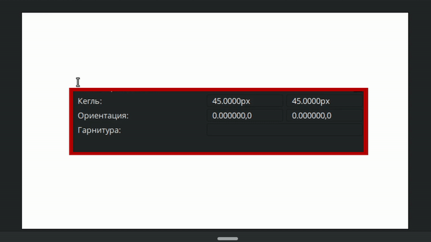

# Инструменты

Инструменты Synfig Studio позволяют создавать, редактировать и взаимодействовать с объектами на рабочей области. Их можно разделить на несколько категорий:

* Инструменты редактирования
* Инструменты создания объектов
* Инструменты утилиты

## Инструменты редактирования

###  **Инструмент трансформации**&#x20;

**Инструмент трансформации** – это основной инструмент управления объектами в Synfig Studio, который включает в себя функции и других инструментов редактирования. Он позволяет редактировать положение, размер, форму и ориентацию объектов на рабочей области.

Чтобы использовать инструмент трансформации, нужно выбрать его, кликнуть на объект или выделить этот объект на панели слоёв, затем на рабочей области перетаскивать его контрольные точки.


Подробнее о контрольных точках смотрите в разделе “[Параметры слоя](parametry-sloya.md)”


<figure><figcaption>
Использование инструмента трансформации
</figcaption></figure>

Если вы зажимаете шифт при использовании инструмента трансформации, перемещаемый объект будет двигаться строго по горизонтали или вертикали.

<figure><figcaption>
Использование инструмента трансформации. Перемещение по осям.
</figcaption></figure>

Выбрав две или более контрольные точки и зажав клавишу **alt**, инструмент трансформации начнет выполнять функцию инструмента [“Масштабирование”](instrumenty.md#instrument-masshtabirovaniya).

<figure><figcaption>
Масштабирование с помощью инструмента трансформации
</figcaption></figure>

Выбрав две или более контрольные точки и зажав клавишу **ctrl,** инструмент трансформации начнет выполнять функцию инструмента [“Вращение”](instrumenty.md#instrument-vrasheniya).

<figure><figcaption>
Вращение с помощью инструмента трансформации
</figcaption></figure>

###  **Инструмент деформации**

**Инструмент деформации** - инструмент управления контрольными точками, который с первого взгляда очень похож на инструмент трансформации, но есть существенные отличия. При выборе нескольких контрольных точек и перемещении одной из них, соседние точки не только смещаются, но и немного растягиваются и деформируются.

<figure><figcaption>
Инструмент деформации
</figcaption></figure>

Степень влияния на соседние контрольные точки определяется параметром "радиус" в настройках инструмента.

<figure><figcaption>
Степень влияния радиуса инструмента деформации
</figcaption></figure>

###  Инструмент Масштабирования&#x20;

**Инструмент Масштабирования** - инструмент, который предназначен для изменения размера выделенных контрольных точек. Чтобы его использовать, нужно выделить две или более точки, зажать одну из них левой кнопкой мыши и потянуть в сторону.&#x20;

<figure><figcaption>
Изменение масштаба объекта с помощью инструмента "Масштабирование"
</figcaption></figure>

Если вы хотите, чтобы ваши точки при масштабировании оставались в одном положении относительно друг друга, сохраняя форму объекта, нужно включить параметр “Запереть соотношение сторон” на панели настроек инструмента.&#x20;

<figure><figcaption>
Изменение масштаба объекта с фиксированным соотношением сторон
</figcaption></figure>

###  Инструмент Вращения&#x20;

**Инструмент Вращения** - инструмент, который предназначен для вращения выделенных контрольных точек. Чтобы его использовать, нужно выделить две или более точки, зажать одну из них левой кнопкой мыши и потянуть в сторону.&#x20;

<figure><figcaption>
Вращение объекта 
</figcaption></figure>

Если вы хотите, чтобы ваши точки при вращении ещё и масштабировались, нужно включить параметр “Разрешить масштабирование” на панели настроек инструмента.&#x20;

<figure><figcaption>
Вращение объекта с функцией масштабирования
</figcaption></figure>

###  Инструмент Отражение

**Инструмент Отражение** - предназначен для симметричного отображения контрольных точек относительно заданной оси. Чтобы его использовать, нужно выделить две или более точки, зажать одну из них левой кнопкой мыши и потянуть в нужную сторону.&#x20;

<figure><figcaption>
Отражение контрольных точек по горизонтали
</figcaption></figure>

В меню инструмента можно выбрать ось, относительно которой будут отражены точки - по горизонтали или вертикали. Также переключить ось можно клавишей Shift.

<figure><figcaption>
Отражение контрольных точек по вертикали
</figcaption></figure>

###  Инструмент Вырезание

**Инструмент Вырезание** - позволяет вырезать произвольную область композиции, создав маску, делающую область вокруг объекта прозрачной.

Чтобы вырезать фрагмент, нужно выбрать инструмент "Вырезание" и обвести (как кистью) нужную область. В результате, выделенный фрагмент композиции автоматически будет помещен в новую группу, а над ним добавится область, которая и будет служить маской.

<figure><figcaption>
Принцип работы инструмента "Вырезание"
</figcaption></figure>

Выбрав слой "Маска" на панели слоёв и убрав галочку "Инвертировать" в параметрах этого слоя, на рабочей области будут скрыты все элементы, находящиеся в пределах области маски, а отображаться будут только те элементы, которые находятся вне её.

<figure><figcaption>
Инвертирование маски
</figcaption></figure>

###  Инструмент Коррекция толщины&#x20;

**Инструмент Коррекция толщины** - позволяет динамически регулировать толщину контура, подобно тому, как художник меняет нажим карандаша на бумаге.&#x20;

Чтобы его использовать, наведите курсор мыши на нужный сегмент линии, зажмите левую кнопку мыши и проведите курсором по линии вперед-назад. В местах перемещения курсора толщина линии будет увеличиваться. Зажав клавишу Ctrl, толщина линии будет уменьшаться.

<figure><figcaption>
Коррекция толщины контура
</figcaption></figure>

В настройках инструмента можно менять силу, с которой будет увеличиваться или уменьшаться контур, а также радиус, который определяет количество контрольных точек, которые будут захвачены при изменении контура.

<figure><figcaption>
Настройки инструмента "Коррекция толщины"
</figcaption></figure>

## Инструменты создания объектов

###  Окружность, прямоугольник, астериск, многоугольник&#x20;

Инструменты “Окружность”, “Прямоугольник”, “Астериск”, “Многоугольник” - предназначены для создания объектов с формой, соответствующей их названию. Тип создаваемого слоя зависят от того, какой тип выбран на панели настроек инструмента.&#x20;


Подробнее о типах создаваемых слоев смотрите в разделе “Перечень слоёв”


<figure><figcaption>
Окружность, Прямоугольник, Астериск, Многоугольник
</figcaption></figure>

У данных инструментов имеется ряд общих настроек параметров слоя, доступных на панели настроек инструмента:

1. Имя - задает название нового слоя. Если в этом поле ввести любое число, оно будет автоматически увеличиваться при создании каждого нового слоя того же типа (например, Слой1, Слой2, Слой3 и т.д.).
2. Тип слоя - определяет тип создаваемого слоя. Можно выбрать один или несколько типов слоёв сразу из списка: “Окружность”, “Область”, “Контур”, “Расширенный контур”, “Растение”, “Градиентная заливка”.
3. Метод смешивания - устанавливает способ, которым новый слой будет взаимодействовать с нижележащими слоями.
4. Непрозрачность - задает степень прозрачности нового слоя. Значение по умолчанию - 1,00 (полностью непрозрачный).
5. Диаметр кисти - определяет ширину контура или размер градиента (только для типов "Контур", "Расширенный контур" и "Градиентная заливка").
6. Инвертировать - определяет, будет ли созданный слой инвертирован. Зависит от параметра слоя "Инвертировать".
7. Растушевка - определяет ширину области сглаживания по краям слоя (не применяется к типам "Растение" и "Слой кривой градиента").
8. Связать начало координат - включение данного параметра определяет, будут ли связаны опорные точки областей, если выбрано более двух типов создаваемых слоёв.

<figure><figcaption>
Настройки инструмента "Окружность"
</figcaption></figure>

За исключением инструмента "_Многоугольник_**",** все остальные инструменты, упомянутые выше, обладают набором дополнительных параметров.

Доступные дополнительные настройки для инструмента _Окружность_:

1. Точки кривой - задает количество опорных контрольных точек, которые будут использоваться при создании новых областей (кроме типа слоя "Слой окружности").&#x20;
2. Смещение - задает смещение касательных в опорных точках создаваемой области (кроме типа "Слой окружности").&#x20;
3. Затухание - определяет функцию затухания растушевки (только для типа слоя "Окружность").
4. Начало координат кривой в центре - позволяет установить начало координат слоя в центре окружности. Если этот параметр не выбран, начало координат будет располагаться в центре холста.

<figure><figcaption>
Настройки инструмента "Окружность"
</figcaption></figure>

Доступные дополнительные настройки для инструмента _Прямоугольник_:

1. Расширение - расширение прямоугольника из его углов (доступно только для слоев типа "Прямоугольник"). Связано с параметром "Величина расширения".

<figure><figcaption>
Настройки инструмента "Прямоугольник"
</figcaption></figure>

Доступные дополнительные настройки для инструмента _Астериск_:

1. Точки звезды - целочисленное значение, определяющее количество лучей звезды.
2. Смещение - угловое значение смещения вращения создаваемой звезды.
3. Соотношение радиусов - соотношение между длиной луча звезды (от центра до вершины) и длиной выемки звезды (от центра до середины стороны между лучами). Значение 1 создает окружность.
4. Обычный многоугольник - флажок, определяющий, следует ли создавать обычный многоугольник вместо звезды.
5. Внутренняя величина - ширина внутренней границы звезды
6. Внутренняя касательная - угол касательной внутренней границы звезды
7. Внешняя величина - ширина внешней границы звезды
8. Внешняя касательная - угол касательной внешней границы звезды

<figure><figcaption>
Настройки инструмента "Астериск"
</figcaption></figure>

###  Текст&#x20;

**Инструмент Текст** - инструмент, позволяющий создавать векторный слой с текстом.&#x20;

Для создания текстового слоя выберите сам инструмент и щелкните левой кнопкой мыши  на рабочей области в том месте, где должен быть создан текстовый слой.

<figure><figcaption>
Инструмент "Текст"
</figcaption></figure>

Доступные настройки для инструмента _Текст_:

1. **Имя**
2. **Многострочный текст** - флажок, определяющий тип редактора текста:&#x20;

* _Однострочный редактор_: при нажатии клавиши Enter в окне ввода, текст сохраняется и слой создается;

<figure><figcaption>
<em>Однострочный редактор текста</em>
</figcaption></figure>

* _Многострочный редактор:_ при нажатии клавиши Enter, произойдет переход на следующую строку. Чтобы текст сохранился и создался слой, необходимо нажать на кнопку OK.

<figure><figcaption>
Многос<em>трочный редактор текста</em>
</figcaption></figure>

3. **Кегль** - числовые значения, определяющие соответственно горизонтальный и вертикальный размер текста.
4. **Ориентация** - числовые координаты, определяющие расположение текстового слоя относительно контрольной точки (зелёная точка позиции).

* По умолчанию (0.5, 0.5): текст будет выровнен по центру относительно точки позиции;
* (0, 0): верхний левый угол текстового поля будет расположен в точке позиции.
* (1, 1): нижний правый угол текстового поля будет расположен в точке позиции.

5. **Гарнитура** - параметр, который позволяет указать стиль шрифта для текста. Существует несколько способов выбора стиля шрифта:

* Использование системных шрифтов. Введите точное название существующего системного шрифта в поле “Гарнитура” на панели настройки инструмента или в параметрах существующего текстового слоя. Например, DejaVu Serif.

<figure><figcaption>
Использование системных шрифтов
</figcaption></figure>

* Использование файлов шрифтов. Введите полный путь к файлу шрифта в поле "Гарнитура". Например, “/home/morevna/1-work/synfig-documentation/font/Lavi.ttf”.

<figure><figcaption>
Использование файлов шрифтов
</figcaption></figure>

* Использование локальные шрифтов проекта. Поместите файл шрифта в папку, где находится файл проекта Synfig. Затем Введите в поле "Гарнитура" название шрифта с его расширением. Например, “Lavi.ttf”.

<figure><figcaption>
Использование локальных шрифтов
</figcaption></figure>

###  **Инструмент Кривые**

**Инструмент Кривые** - инструмент, позволяющий создавать произвольные области. Области - это наиболее часто используемые объекты в анимации, созданной с помощью Synfig.&#x20;

Каждый щелчок мышью на рабочей области создает новую вершину. Изначально у новой вершины значения касательных равны (0,0), что создает острый угол. Чтобы замкнуть фигуру, нужно правой кнопкой мыши нажать на вершину и выбрать из выпавшего меню - "Замкнуть контур".&#x20;

Для того, чтобы фигура стала слоем, нужно дважды нажать левой кнопкой мыши на любой вершине.

<figure><figcaption>
Использование инструмента "Кривые"
</figcaption></figure>

Если зажать и перетащить мышь при создании новой вершины, изменится значение касательной в этой точке. Увеличение значения касательной сглаживает углы.

Каждая новая вершина соединяется с предыдущей кривой Безье. Эта кривая определяется положением вершин и касательных. Кривая строится последовательно, каждая вершина следует за предыдущей. Конец дуги предыдущей кривой направляет следующую создаваемую дугу, пока вы ее не замкнете.&#x20;

При создании области правый щелчок по кривой или вершине открывает контекстное меню.

**Контекстное меню кривой:**

* Вставить вершину - вставляет в месте вызова контекстного меню на кривой вершину.
* Замкнуть контур - замыкает первую и последнюю вершины.

<figure><figcaption>
<strong>Контекстное меню кривой</strong>
</figcaption></figure>

**Контекстное меню вершины:**

<figure><figcaption>
<strong>Контекстное меню вершины</strong>
</figcaption></figure>

* Разделить/связать касательные, угол касательных, радиус. Если касательные или их углы, или радиус связаны, они будут изменяться симметрично друг другу.

Если касательные или их углы, или радиус развязаны, они будут изменяться отдельно друг от друга

<figure><figcaption>
Развязанный угол касательных
</figcaption></figure>

<figure><figcaption>
Развязанный радиус касательных
</figcaption></figure>

* Замкнуть контур
* Удалить вершину - удаляет выбранную вершину, при этом, если удаляемая точка находится между двумя другими, то эти точки автоматически соединятся.

<figure><figcaption>
Удаление вершин
</figcaption></figure>

###  **Инструмент Рисование**

**Инструмент Рисование** - предназначен для создания произвольных областей. Он имеет схожие функции с инструментом "Кривые", но отличается механизмом работы:

_Инструмент "Кривые":_

* Построение области происходит поэтапно, точка за точкой.
* Толщина контура и чувствительность к нажатию не учитываются.

_Инструмент "Рисование":_

* Область создается "на лету", подобно рисованию кистью.
* При создании может учитывать чувствительность к нажатию, если вы работаете за планшетом.
* Количество создаваемых вершин зависит от настроек инструмента.

Доступные настройки для инструмента _“Рисование”:_

* **Имя**
* **Тип слоя**&#x20;
* **Режим смешивания**
* **Непрозрачность**
* **Диаметр кисти** - задает базовую толщину контура или размер градиента (только для типов слоев "Контур", "Расширенный контур" и "Градиент по кривой").
* **Чувствительно к давлению** - флажок, который включает/выключает чувствительность к давлению.
* **Минимальная толщина** - минимальное значение чувствительности к нажатию пера. Определяет насколько тонким может быть линия относительно параметра "Диаметр кисти".
* **Плавность** - степень сглаживания дрожания пера планшета. Влияет на количество вершин результирующей области. Может быть локальное или глобальное сглаживание.
  1. Локальное - применяется между точками области.
  2. Глобальное -  применяется ко всей области целиком.
* **Ошибка максимума для ширины** - действует только для слоев типа "Расширенный контур".
* **Закругленные концы** - задает закругление концов линий области (только для типов слоев "Контур" и "Расширенный контур").
* **Автозамыкание** - автоматическое соединение последней опорной точки к первой, если конец траектории инструмента "Рисование" находится рядом с началом.&#x20;
* **Авторасширение** - при начале и/или конце штриха инструмента "Рисование" вблизи опорной точки другого контура, результирующий контур просто добавляется к существующему слою "Контур".
* **Автосвязь** - при начале и/или конце штриха инструмента "Рисование" вблизи опорной точки другого контура, и если "Авторасширение" не применяется, первая и/или последняя вершина результирующего контура связывается с опорной точкой существующего слоя "Контур".
* **Растушевка** - задает степень растушевки слоя.
* **Автоэкспорт** - автоматический экспорт списка точек области в базовое значение узла библиотеки.

###  Инструмент Градиент&#x20;

**Инструмент Градиент** - позволяет создавать плавные переходы между двумя или более цветами в объекте. Градиент создается как отдельный слой, который можно наложить на другие слои с помощью режимов смешивания. Менять размер, поворот, радиус градиента можно за соответствующие контрольные точки.

Доступные настройки для инструмента _“Градиент”_:

* Имя
* Метод смешивания
* Непрозрачность
* Тип слоя

**Типы градиентов, создаваемые инструментов "Градиент":**

* Линейный

<figure><figcaption>
Линейный градиент
</figcaption></figure>

* Радиальный

<figure><figcaption>
Радиальный градиент
</figcaption></figure>

* Конический

<figure><figcaption>
Конический градиент
</figcaption></figure>

* Спиральный

<figure><figcaption>
Спиральный градиент
</figcaption></figure>

## Инструменты утилиты

###  **Сплошная заливка**

**Сплошная заливка** - инструмент, который предназначен для быстрого изменения цвета геометрических слоев. По сути этот инструмент берёт цвет фона и при клике на объект меняет параметр слоя “цвет”.

<figure><figcaption>
Сплошная заливка
</figcaption></figure>

###  **Инструмент Пипетка**

**Инструмент Пипетка** - инструмент, который позволяет выбрать цвет из рабочей области. Чтобы использовать его, наведите курсор на область изображения, цвет которой требуется выбрать, щелкните левой кнопкой мыши, чтобы выбрать этот цвет. Выбранный цвет отобразится в поле "Цвет контура" на панели инструментов.

<figure><figcaption>
Пипетка
</figcaption></figure>
