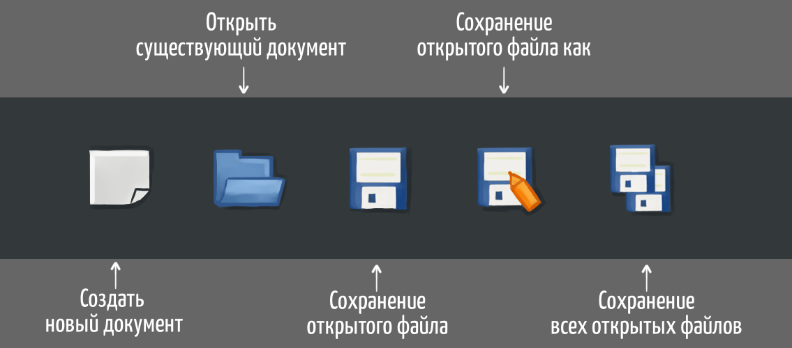
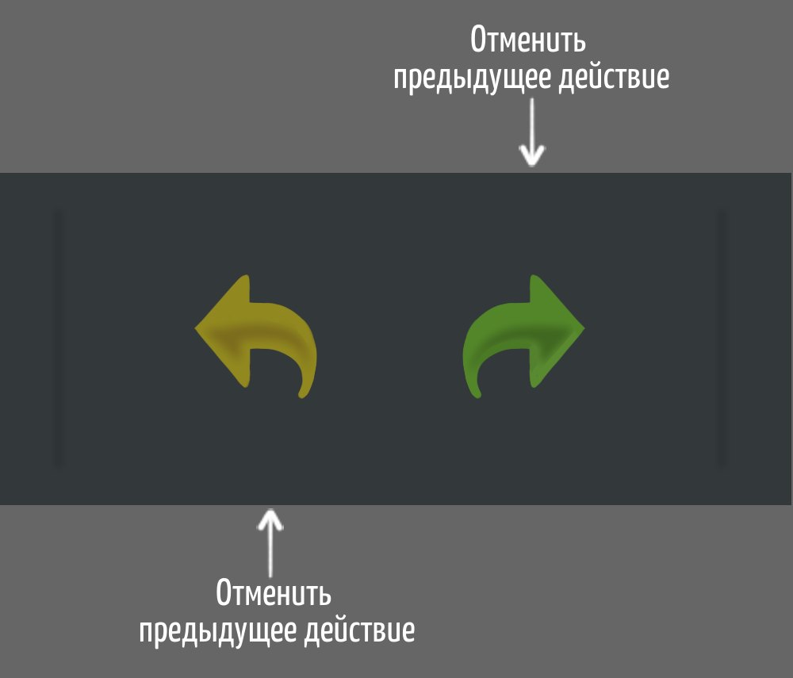
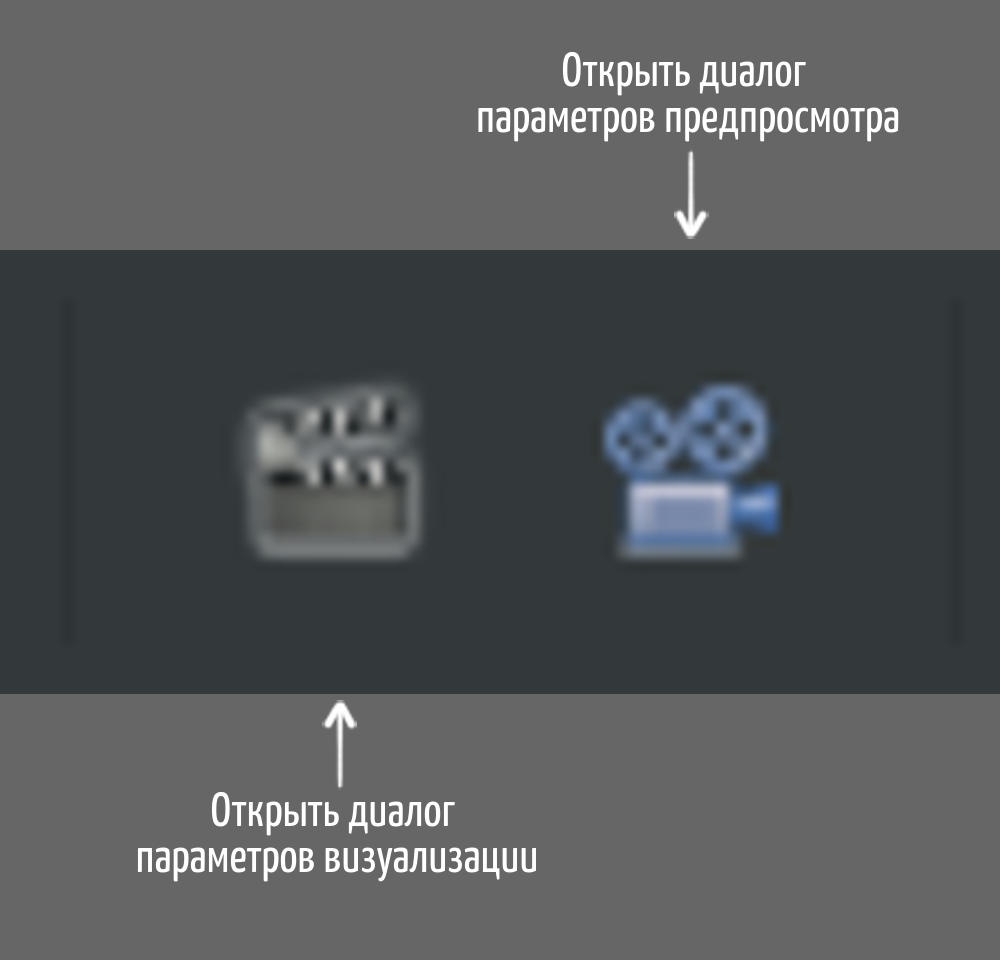

# Интерфейс

На рисунке ниже показано как выглядит интерфейс Synfig Studio при первом запуске. Главное окно разделено на нескольких областей: в центре находится рабочая область, слева - панель инструментов, а справа и снизу закреплены различные вспомогательные панели.

<figure><figcaption></figcaption></figure>


Если интерфейс у вас выглядит по другому, это значит что кто-то уже работал с программой до вас и изменил настройки. Вы можете восстановить настройки интерфейса к исходным значениям: для этого из меню **"Окно"** выберите пункт **"Рабочая область"** и далее пункт **"По умолчанию"**.

Дополнительно к этому мы рекомендуем сбросить вообще все настройки программы. Для этого из меню выберите пункт **“Правка”** - **“Настройки”**. Появится окно настроек и в его  нижней части нажмите на кнопку **“Сбросить настройки “.**


**Панель инструментов**

Панель инструментов разделена на две области:

* Верхняя область содержит инструменты, позволяющие создавать объекты и манипулировать ими.&#x20;
* Нижняя область содержит настройки по-умолчанию для новых слоев: цвет контура и заливки, толщина контура, градиент.&#x20;

**Рабочая область**

<figure><figcaption></figcaption></figure>

Область в центре с серыми клеточками - это рабочая область. Здесь вы будете создавать элементы/слои и управлять ими. Серые клеточки в этой области обозначают прозрачность. В данный момент они показывают, что наша рабочая область абсолютно пуста.

\
Сверху над рабочей областью находится панель с кнопками. Первая группа кнопок  позволяет создавать, открывать и сохранять документ(ы).

<figure><figcaption></figcaption></figure>

Когда мы создаем или открываем документ, то вверху для него появляется отдельная вкладка. Таким образом у вас есть возможность работать с несколькими документами одновременно и переключаться между ними с помощью вкладок вверху.


\-Когда мы создаем или открываем документ, то вверху для него появляется отдельная вкладка. Таким образом у вас есть возможность работать с несколькими документами одновременно и переключаться между ними с помощью вкладок вверху.

\-Чтобы сохранить все открытые документы используйте кнопку “Сохранить все открытые документы.


Далее идут кнопки отвечающие за отмену или повторение последнего действия.

<figure><figcaption></figcaption></figure>

Следующие две кнопки позволяют экспортировать вашу анимацию в файл и выполнить предпросмотр анимации без сохранения в файл. Подробную информацию об этих функциях смотрите в разделе “Экспорт”.

<figure><figcaption></figcaption></figure>

Следующие шесть кнопок управляют отображением различных типов управляющих точек на рабочей области. Подробную информацию об этих функциях смотрите в разделе “Работа с векторной графикой”.

Далее идут две кнопки которые позволяют включать и выключать отображение сетки и прилипание к ней.&#x20;

Следом расположен список который позволяет переключить режим упрощения отрисовки элементов на рабочей области. В режиме отображения “Final” изображения на рабочей области отрисовываются в максимальном качестве, в полном соответствии с тем как оно будет выглядеть при экспорте файла. В режиме отображения “Preview” изображения на рабочей области отрисовываются с некоторыми упрощения, которые незначительно влияют на качество картинки. Например, когда используется линейный тип интерполяции для масштабирования изображения. В режиме отображения “Draft” применяется еще больше упрощений - отключаются многие фильтрующие слои, которые влияют на скорость визуализации. Также, в этом режиме отрисовываются в упрощенном виде все эффекты размытия на контурах и заливках.

Далее идет кнопка которая позволяет включить отрисовку кадров в фоновом режиме. Если этот режим включен, то во время вашей работы с анимацией программа будет автоматически выполнять прорисовку не только текущего кадра, но и соседних кадров. Это обеспечит более плавное воспроизведение анимации прямо на рабочей области, без необходимости вызывать окно предварительного просмотра. При этом будет дополнительно расходоваться ресурсы процессора и оперативная память, поэтому включать данный режим не рекомендуется на слабых конфигурациях.
