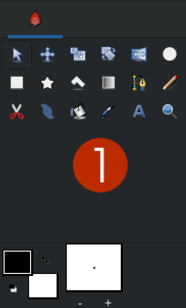

# Интерфейс

На рисунке ниже (_рис. 1_ ) показано как выглядит интерфейс Synfig Studio при первом запуске. Главное окно разделено на нескольких областей, давайте рассмотрим самые важные из них:

1. Панель инструментов
2. Панель параметров инструмента
3. Рабочая область
4. Панель слоёв
5. Панель параметров слоя
6. Шкала кадров

<figure><figcaption>
<em>Рис. 1 Интерфейс Synfig Studio</em> 
</figcaption></figure>


Если ваш интерфейс выглядит иначе, возможно, что кто-то другой уже использовал программу и изменил настройки. Чтобы восстановить исходный вид интерфейса, перейдите в меню “Окно”, затем выберите “Рабочая область”, а далее - “По умолчанию”.

Также мы рекомендуем выполнить полный сброс настроек программы. В меню выберите “Правка”, затем “Настройки”. Откроется окно настроек, в нижней части которого нажмите кнопку “Сбросить настройки”.


На “Панели инструментов” **(1)** можно выбрать инструмент для создания новых объектов или их редактирования.&#x20;

После выбора инструмента пользователь имеет возможность изменить настройки инструмента с помощью “Панели настроек инструмента” **(2).** Содержимое этой панели меняется в зависимости от того, какой у вас инструмент выбран в данный момент.

Выбрав инструмент, пользователь может совершать с его помощью действия на “Рабочей области” (3). Например, так можно создавать объекты.

Все созданные объекты отображаются на “Панели слоёв” (4). Здесь пользователь может видеть и изменять структуру документа.

Если выделить элемент на “Панели слоёв”, то на “Панели параметров” (5) отобразятся его свойства. Редактируя эти свойства пользователь может менять внешний вид и поведение объектов.&#x20;

Изменения параметров во времени настраивается с помощью “Шкалы кадров” (6). На ней отображаются точки, в которых происходят изменения значений параметров слоя.

**Рабочая область**

Область с клеточками в центре - это рабочая область. Здесь вы создаете элементы/слои и управляете ими. Серые клеточки в этой области обозначают прозрачность. В данный момент они показывают, что наша рабочая область абсолютно пуста.

\
Сверху над рабочей областью находится панель с кнопками. Первая группа кнопок  позволяет создавать, открывать и сохранять документ(ы).

  - Создать новый документ

 - Открыть существующий документ

 - Сохранить документ

 - Сохранить открытый файл как

 - Сохранить все открытые документы


Когда мы создаем или открываем документ, то вверху для него появляется отдельная вкладка. Это позволяет работать с несколькими документами одновременно и легко переключаться между ними

Чтобы сохранить все открытые документы используйте кнопку “Сохранить все открытые документы.


Далее идут кнопки отвечающие за отмену или повторение последнего действия.

 - Отменить предыдущее действие

 - Повторить отмененное ранее действие

Следующие две кнопки позволяют экспортировать вашу анимацию в файл и выполнить предпросмотр анимации без сохранения в файл.&#x20;

 - Отркыть диалог параметров визуализации

 - Отркыть диалог параметров предпросмотра


Подробную информацию об этих функциях смотрите в разделе “Экспорт”.


Следующие шесть кнопок управляют отображением различных типов управляющих точек на рабочей области.&#x20;


Подробную информацию об этих функциях смотрите в разделе “Работа с векторной графикой”.


Далее идут две кнопки которые позволяют включать и выключать отображение сетки и прилипание к ней.&#x20;

 - Показывать сетку

 - Привязывать к сетке если включено

Следом расположен выпадающий список, который позволяет переключить режим упрощения отрисовки элементов на рабочей области:

* В режиме отображения **“Draft”** применяется еще больше упрощений - отключаются многие фильтрующие слои, которые влияют на скорость визуализации. Также, в этом режиме отрисовываются в упрощенном виде все эффекты размытия на контурах и заливках.
* В режиме отображения **“Preview”** изображения на рабочей области отрисовываются с некоторыми упрощения, которые незначительно влияют на качество картинки. Например, когда используется линейный тип интерполяции для масштабирования изображения.&#x20;
* В режиме отображения **“Final”** изображения на рабочей области отрисовываются в максимальном качестве, в полном соответствии с тем как оно будет выглядеть при экспорте файла.&#x20;

Далее идет кнопка, которая позволяет включить отрисовку кадров в фоновом режиме. Если этот режим включен, то во время вашей работы с анимацией программа будет автоматически выполнять прорисовку не только текущего кадра, но и соседних кадров. Это обеспечит более плавное воспроизведение анимации прямо на рабочей области без необходимости вызывать окно предварительного просмотра.&#x20;

 - Отрисовка будущих и прошлый кадров в фоновом режиме если включено


Данная функция дополнительно расходует ресурсы процессора и оперативную память, поэтому её включение не рекомендуется на слабых конфигурациях.

