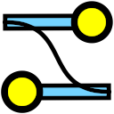

# Параметры слоя

Каждый слой в Synfig Studio обладает набором параметров, которые определяют способ отображения объектов на рабочей области.  Если слой выделен, то на панели в левом нижнем углу отображается список его параметров.

<figure><figcaption>
Рис. 1  Панель параметров слоя.
</figcaption></figure>

Все типы слоёв имеют три базовых параметра:

* Глубина Z - определяет порядок отрисовки слоев. Слой с меньшим значением глубины будет отрисован поверх слоев с большим значением.&#x20;
* Непрозрачность - определяет уровень прозрачности слоя. Значение 0% означает полную прозрачность (слой невидим), а значение 100% - полную непрозрачность (слой полностью виден).
* Метод смешивания - определяет способ комбинирования слоя с нижележащими слоями.

<figure><figcaption>
Рис. 2.1 Панель параметров слоя "Окружность". Базовые параметры.
</figcaption></figure>


Подробнее о методах смешивания слоёв смотрите  в разделе "Смешивание слоёв"


Помимо трех базовых параметров, у разных типов слоев могут быть дополнительные параметры, которые определяют их специфические свойства. Например:

* Цвет
* Радиус
* Растушёвка
* Толщина контура
* Преобразование и др.

<figure><figcaption>
Рис. 2.2 Панель параметров слоя "Окружность". Дополнительные параметры.
</figcaption></figure>

## Редактирование параметров 

Существует несколько способов редактирования параметров слоя:

* Через панель параметров. Чтобы изменить параметр слоя, нужно щекнуть на его значении.
* На рабочей области. Если вы будете перетаскивать, менять размер и форму объекта, то его параметры отвечающие за преобразование, будут меняться автоматически в панели параметров (Рис. 3).

<figure><figcaption>
Рис. 3  Изменение параметров слоя на рабочей области.
</figcaption></figure>

Когда у вас выделено несколько слоёв, в списке параметров отобразятся только те параметры, которые присутствуют у каждого типа слоя. При этом изменение любого параметра автоматически применяется ко всем выделенным слоям (_Рис. 4)_.

<figure><figcaption>
Рис. 4  Изменение параметров нескольких слоёв одновременно.
</figcaption></figure>

Если выделено несколько слоёв и какие-либо из их общих параметров имеют разные значения, то они будут окрашены серым цветом.  При этом такие параметры по прежнему можно редактировать - в этом случае новое значение будет применено ко всем выделенным слоям (_Рис. 5)_.

<figure><figcaption>
Рис. 5  Изменение серых параметров слоя на рабочей области.
</figcaption></figure>

### Контрольные точки

При выделении слоя, у связанного с ним объекта на рабочей области появляются контрольные точки, позволяющие его редактировать.


У каждого слоя свои индивидуальные контрольные точки.


<figure><figcaption>
Рис. 6  Контрольные точки
</figcaption></figure>

Существует несколько типов контрольных точек, каждый из которых обладает уникальной функциональностью:

 - это точка позиции, которая отвечает за расположение объекта на рабочей области. По сути, это центр объекта вокруг которого происходят изменения.&#x20;

 - это точка, отвечающая за расположение вершин на рабочей области. С помощью этой точки можно менять размеры и форму объекта.

 - эта точка отвечает за касательные, с ее помощью можно менять стороны объектов.

 - это точка радиуса, с ее помощью можно менять радиус окружностей.

 - это точка углов. С ее помощью мы можем менять наклон объекта и вращать его вокруг центральной точки.

 - это точка ширины. С помощью этой точки можно изменять ширину контура (кривых). Также она применяется у слоя “Деформирующий скелет”.&#x20;


Про функции точки ширины в "Деформирующем скелете" подробнее смотрите в разделе ["Деформирующий скелет".](../skeletnaya-animaciya/deformiruyushii-skelet.md)


### Видимость контрольных точек на рабочей области&#x20;

Для управления отображением контрольных точек на создаваемом слое необходимо использовать панель инструментов над рабочей областью.

<figure><figcaption>
Рис. 7  Панель управления отображением контрольных точек
</figcaption></figure>

-  включить отображение точки позиции;

-  включить отображение точек вершин;

-  включить отображение точек касательных;

-  включить отображение точки радиуса;

-  включить отображение точек ширины;

-  включить отображение точек углов.

### Связывание параметров

Для **связывания** параметров двух и более слоев необходимо выполнить следующие действия:

1. Выделить необходимые слои в списке слоев;
2. На панели параметров слоя щелкнуть правой кнопкой мыши на нужном параметре;
3. Из контекстного меню выбрать пункт "**Связь**" (рис. 8).

<figure><figcaption>
Рис. 8  Связывание параметров
</figcaption></figure>

Для **отсоединения** связи параметров одного из слоев необходимо выполнить следующие действия:

1. Выделить требуемый слой на панели слоёв;
2. В панели параметров слоя щелкнуть правой кнопкой мыши на связанном параметре;
3. Из контекстного меню выбрать пункт "**Отсоединить**" (рис. 9).

<figure><figcaption>
Рис. 9  Отсоединение параметров
</figcaption></figure>

## Точки вершин группы и изображений

С помощью точек вершин можно перемещать объекты по холсту, увеличивать, растягивать и.т.д.

<figure><figcaption>
Рис. 10  Точки вершин
</figcaption></figure>

 - зелёная точка является ключевой опорной точкой для группы объектов или изображения. Все операции по изменению масштаба, повороту и наклону группы или изображения происходят относительно этой точки. Также она отвечает за перемещение объекта (рис. 11).

<figure><figcaption>
Рис. 11 Перемещение группы объектов
</figcaption></figure>

  - желтые точки, расположенные в диагонально противоположных углах, позволяют сжимать и растягивать предмет по горизонтали и вертикали соответственно. Также через эти точки можно отражать объект, если перенести их на противоположную от них сторону (рис. 12).

<figure><figcaption>
Рис. 12 Растягивание и сжимание объекта
</figcaption></figure>

 -  синяя точка позволяет вращать предмет вокруг зелёной точки без изменения размера объекта (рис. 13).

<figure><figcaption>
Рис. 13 Поворот объекта
</figcaption></figure>

 - коричневая точка позволяет увеличивать или уменьшать размер обектов без потери их пропорций. Увеличение производится относительно зелёной точк (рис. 14).

<figure><figcaption>
Рис. 14 Масштабирование объекта
</figcaption></figure>

 - красная точка позволяет делать наклон/скос объекту (рис. 15).

<figure><figcaption>
Рис. 15 Наклон объекта
</figcaption></figure>

 - прозрачная серая точка позволяет без влияния на объект сместить зелёную точку, а соответсвенно и все остальные точки вершин. Используется для точного позиционирования центра объекта (рис. 16).

<figure><figcaption>
Рис. 16 Перемещение центра объекта
</figcaption></figure>
