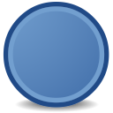
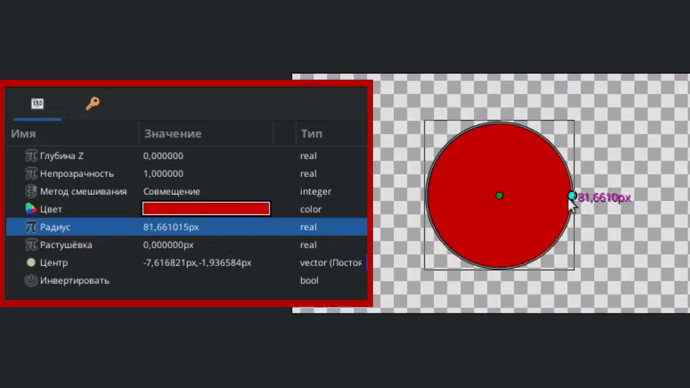
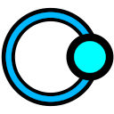
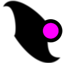
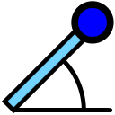

# Параметры слоя

Каждый слой в Synfig Studio обладает набором параметров, которые определяют его вид на рабочей области.  Если слой выделен, то на панели в левом нижнем углу отображается список его параметров.

<figure><figcaption>
Панель параметров слоя.
</figcaption></figure>

Набор параметров слоя зависит от того, к какому **типу слоя** он относится.&#x20;


В списке на панели слоев каждый тип слоя имеет свою иконку.


Наиболее часто используемые типы слоёв:

- Контур;

- Область;

- Окружность;

- Группа;


Полный список доступных типов слоёв и назначение их параметров описаны в разделе [“Перечень слоёв”](broken-reference) данного руководства.


Все типы слоёв имеют три базовых параметра:

* Глубина Z - позволяет корректировать порядок отрисовки слоев. Этот параметр задаёт смещение относительно его текущей позиции в списке слоёв. Отрицательное значение параметра смещает слой ближе к зрителю, а положительное значение смещает его дальше от зрителя. Этот параметр можно анимировать, что позволяет динамически изменять порядок слоёв в процессе анимации.
* Непрозрачность - определяет степень непрозрачности слоя. Значение 0% означает полную прозрачность (слой скрыт), а значение 100% - полную непрозрачность (слой полностью виден).
* Метод смешивания - определяет способ комбинирования слоя с нижележащими слоями.

<figure><figcaption>
Панель параметров слоя "Окружность". Базовые параметры.
</figcaption></figure>


Подробнее о методах смешивания слоёв смотрите  в разделе ["Смешивание слоёв"](smeshivanie-sloyov.md)


Помимо этих трех основных параметров, у разных типов слоев обычно есть дополнительные параметры, которые определяют их специфические свойства. Например:

* Цвет
* Радиус
* Растушёвка
* Толщина контура
* Преобразование

<figure><figcaption>
Панель параметров слоя "Окружность" - дополнительные параметры.
</figcaption></figure>

## Редактирование параметров 

Существует несколько способов редактирования параметров слоя:

* Через панель параметров. Чтобы изменить параметр слоя, нужно щелкнуть на его значении.
* На рабочей области. Вы можете перетаскивать контрольные точки на рабочей области, при этом соответствующие параметры слоя будут меняться автоматически.

<figure><figcaption>
Изменение параметров слоя на рабочей области.
</figcaption></figure>

Когда у вас выделено несколько слоёв, в списке параметров отобразятся только те параметры, которые присутствуют у каждого типа слоя. При этом изменение любого параметра автоматически применяется ко всем выделенным слоям.

<figure><figcaption>
Изменение параметров нескольких слоёв одновременно.
</figcaption></figure>

Если выделено несколько слоёв и какие-либо из их общих параметров имеют разные значения, то они будут окрашены серым цветом. &#x20;

<figure><figcaption></figcaption></figure>

При этом такие параметры по прежнему можно редактировать - в этом случае новое значение будет применено ко всем выделенным слоям.

<figure><figcaption>
Изменение серых параметров слоя на рабочей области.
</figcaption></figure>

### Контрольные точки

Когда слой выделен, на рабочей области появляются контрольные точки, позволяющие его редактировать.

<figure><figcaption>
Контрольные точки
</figcaption></figure>

Существует несколько типов контрольных точек, каждый из которых обладает своим назначением:

 - точка позиции, которая отвечает за расположение объекта на рабочей области. По сути, это центр объекта вокруг которого происходят изменения.&#x20;

 - точка, отвечающая за расположение вершин на рабочей области. С помощью этой точки можно менять размеры и форму объекта.

 - точка отвечает за касательные, с ее помощью можно менять стороны объектов.

 - точка радиуса, с ее помощью можно менять радиус окружностей.

 - точка углов. С ее помощью мы можем менять наклон объекта и вращать его вокруг центральной точки.

 - точка ширины. С помощью этой точки можно изменять ширину контура (кривых). Также она применяется у слоя [“Деформирующий скелет”](../perechen-sloyov/deformiruyushii-skelet.md).&#x20;

### Видимость контрольных точек на рабочей области&#x20;

Для управления отображением контрольных точек на рабочей области необходимо использовать панель инструментов в её верхней части.

<figure><figcaption>
Панель управления отображением контрольных точек
</figcaption></figure>

-  включить отображение точки позиции;

-  включить отображение точек вершин;

-  включить отображение точек касательных;

-  включить отображение точки радиуса;

-  включить отображение точек ширины;

-  включить отображение точек углов.

### Связывание параметров

Вы можете связывать параметры слоёв, чтобы изменение одного параметра влияло на другой параметр этого же или другого слоя. Подробнее об этой функции читайте в статье ["Связывание параметров"](parametry-sloya.md#svyazyvanie-parametrov).

