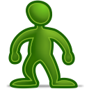
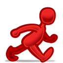
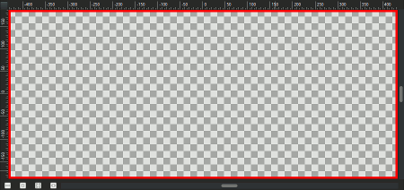
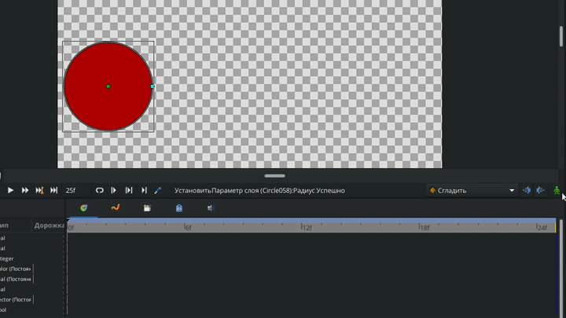
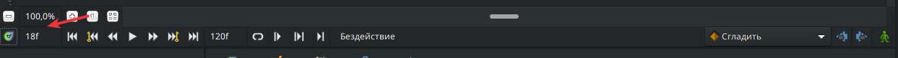
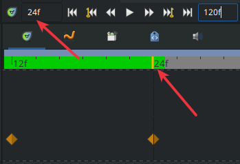
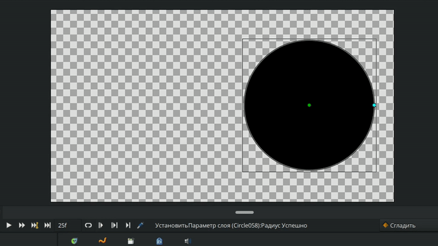
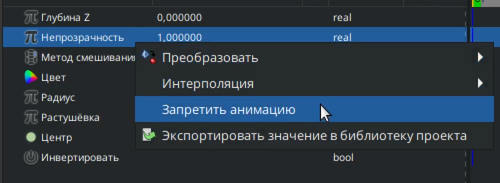

# Режим анимации

### **Режим анимации**

Режим анимации - это специальный режим работы программы Synfig, предназначенный для создания анимации.&#x20;

Для того, чтобы перейти в режим анимации, следует щелкнуть на иконку с зеленым человечком , которая находится на панели ниже рабочей области, или использовать комбинацию клавиш ctrl + пробел.

При нажатии, человечек становится красным, а  вокруг рабочей области загорается красная рамка - это значит, что режим анимации включен.&#x20;

<figure><figcaption>
Режим анимации в Synfig
</figcaption></figure>

Включенный режим анимации позволяет сохранять изменения параметров объектов в виде фиксаторов на панели кадров. Используя созданные фиксаторы, вы можете анимировать параметры объектов, сохраняя изменения их положения, формы, цвета и других характеристик.

<figure><figcaption>
Анимация в Synfig
</figcaption></figure>

Под рабочей областью в нижнем левом углу перед панелью запуска анимации можно посмотреть текущий кадр:

<figure><figcaption>
Окошко с текущим кадром
</figcaption></figure>

Текущий кадр на шкале кадров визуально выделяется желтым бегунком.\

<figure><figcaption>
Визуальное отображение кадра на шкале кадров
</figcaption></figure>

Также в этой же строке есть окно, в котором можно поменять конечное количество кадров в файле.&#x20;

<figure><figcaption>
Настройка конечного количества кадров в файле
</figcaption></figure>

Если режим анимации выключен, то при попытке редактировать параметры, для которых уже существуют фиксаторы, появится диалоговое окно с предупреждением: "Хотите применить смещение к данной анимации?".&#x20;

<figure><figcaption>
Диалоговое окно "Хотите применить смещение к данной анимации?"
</figcaption></figure>

Нажав “Да”, произойдет пропорциональное смещение всей анимации для каждого существующего фиксатора.

<figure><figcaption>
Смещение анимации
</figcaption></figure>

Если у параметра, который вы редактируете, нет фиксаторов, то данное окно не появится.

### Статичные параметры

**Статичный параметр** - это параметр, для которого не ставятся фиксаторы в режиме анимации, при этом он остается редактируемым.

Для того, чтобы сделать параметр статичным, нужно выделить параметр на “Панели параметров слоя”, щелкнуть правой кнопкой мыши и в появившемся меню выбрать пункт - “Запретить анимацию”. После этого параметр станет статичным и напротив него появится иконка с зеленым человечком.

<figure><figcaption>
Запрет анимации
</figcaption></figure>

