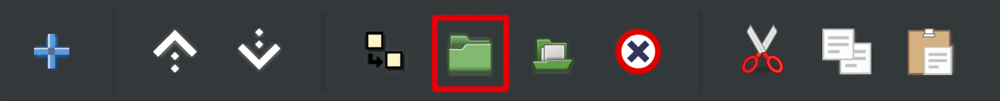
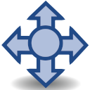

# Слои

В отличии от многих графических редакторов, в Synfig Studio каждый объект является отдельным слоем. Все слои отображаются на панели, которая находится в нижнем правом углу _(рис. 1)._

<figure><figcaption>
<em>Рис. 1  Интерфейс Synfig Studio</em>
</figcaption></figure>

<figure><figcaption>
<em>Рис. 2  Интерфейс Synfig Studio. Панель слоёв.</em>
</figcaption></figure>

Слои можно создавать через кнопку “Добавить слой” в нижней части панели слоев. При нажатии на эту кнопку появляется меню с полным списком всех доступных типов слоёв (Рис. 3.1).

<figure><figcaption>
Рис. 3.1 Панель управления слоями. Кнопка добавить слой.
</figcaption></figure>

Также можно создать слой, кликнув правой кнопкой мыши на пустом месте на панели слоёв или по существующему слою и нажав "создать слой".


Для многих типов графических слоёв есть более удобный способ добавления  - с помощью инструментов. Подробную информацию об инструментах смотрите в разделе “Инструменты”.


Порядок слоёв в списке определяет порядок их отображения на рабочей области.  Слои, расположенные выше в списке, будут перекрывать слои, расположенные ниже.

Порядок слоёв можно менять с помощью кнопок со стрелочками, которые находятся в нижней части “Панели слоёв” (Рис. 3.2).

<figure><figcaption>
Рис. 3.2 Панель управления слоями. Кнопки перемещения слоёв.
</figcaption></figure>

- Поднять слой

- Опустить слой

Рядом  на этой же панели находятся другие кнопки, выполняющие другие полезные функции:&#x20;

- Создать копию слоя (дублировать)

- Группировать слой

- Выбрать все вложенные слои

- Удалить слой

- Вырезать слой

- Скопировать слой

- Вставить слой


При создании новых слоёв или вставке слоёв из буфера обмена они всегда будут появляться над тем слоем, который у вас выделен в данный момент. Если никакой слой не выделен, то слои появляются над самым верхним слоем.


Слои можно объединять в группы. Группа позволяет трансформировать несколько слоёв так, как будто они являются единым объектом.&#x20;


Подробнее о функциях группы описано в разделе “[Группы](gruppy.md)”.


## Выделение слоёв

В Synfig Studio существует два способа выделения объектов (слоёв):

* Первый способ - щёлкнуть левой кнопкой мыши на элементе в списке панели слоёв;
* Второй способ - щёлкнуть по элементу на рабочей области с помощью одного из трансформирующих инструментов - .

Чтобы выделить одновременно несколько слоёв используйте клавиши Shift или Ctrl:

* При зажатой клавише Shift выделение происходит последовательно, по порядку.
* При зажатой клавише Ctrl вы можете выборочно выделить отдельные слои.

## Редактирование параметров слоя

Если слой выделен, то на панели в левом нижнем углу отображается список его параметров (рис. 4).

<figure><figcaption>
<em>Рис.  4  Список параметров слоя.</em>
</figcaption></figure>

Набор параметров слоя зависит от того, к какому типу относится данный слой.&#x20;


В списке на панели слоев каждый тип слоя имеет свою иконку.


Наиболее часто используемые типы слоёв:

- Контур;

- Область;

- Окружность;

- Группа;


Полный список доступных типов слоёв и назначение их параметров описаны в разделе “Перечень слоёв” данного руководства.


Когда у вас выделено несколько слоёв, в списке параметров отобразятся только те параметры, которые присутствуют у каждого типа слоя. При этом изменение любого параметра автоматически применяется ко всем выделенным слоям.

<figure><figcaption>
<em>Рис. 5.1 Панель параметров слоя</em>
</figcaption></figure>

Если выделено несколько слоёв и какие-либо из их общих параметров имеют разные значения, то они будут окрашены серым цветом.  При этом такие параметры по прежнему можно редактировать - в этом случае новое значение будет применено ко всем выделенным слоям (_Рис. 5.2)_.

<figure><figcaption>
<em>Рис. 5.2 Панель параметров слоя.</em> 
</figcaption></figure>

Как редактировать параметры слоя:&#x20;

1\) Через панель параметров. Чтобы изменить параметр слоя, нужно щекнуть дважды на его значении.

2\) На рабочей области. Если вы будете перетаскивать, менять размер и форму объекта, то его параметры отвечающие за преобразование, будут меняться автоматически.

Чтоб изменить имя слоя нужно дважды щёлкнуть на его названии на панели слоёв.


Подробную информацию о параметрах слоя смотрите в разделе “[Параметры слоя](parametry-sloya.md)”.


## Видимость слоёв

Чтобы отключить отображения слоя на Рабочей области, следует снять галочку, что расположена слева от слоя.&#x20;

<figure><figcaption>
<em>Рис. 6 Управление видимостью слоя</em>
</figcaption></figure>

Если вы хотите анимировать видимость слоя или сделать его полупрозрачным, то для этого есть параметр "Непрозрачность", который вы можете изменять на панели параметров.

Когда вам хочется сохранить созданный вами слой, но по какой-то причине он не должен отображаться на отрендеренном файле, в Synfig Studio есть функция “Отключить рендеринг слоя”, которая расположена в списке, что вызывается нажатием правой кнопкой мыши на нужном объекте в списке слоев  (рис. 7).

<figure><figcaption>
<em>Рис. 7 Функция "Отключить рендеринг слоя"</em>
</figcaption></figure>

Слой с отключенным рендерингом выделяется курсивом в списке слоёв (рис. 8).

<figure><figcaption>
<em>Рис. 8 Отображение слоя с выключенным рендерингом.</em>
</figcaption></figure>
