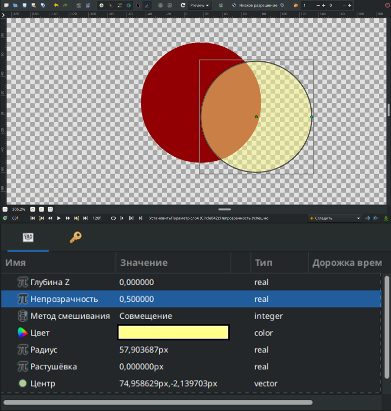
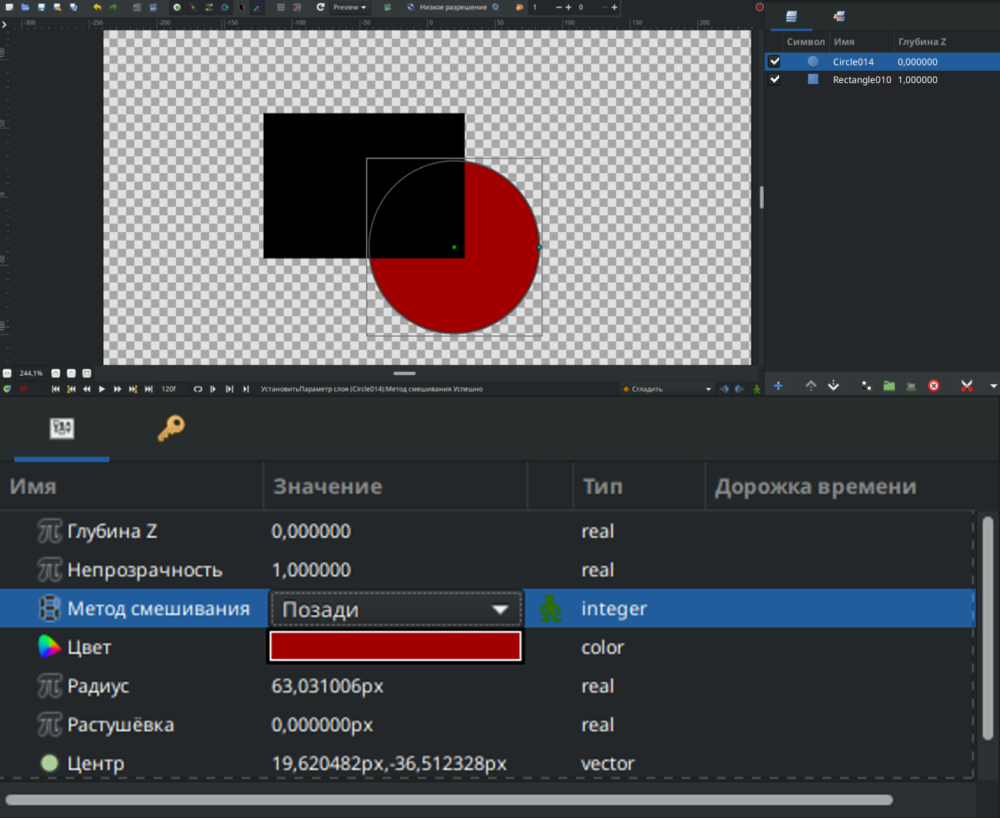
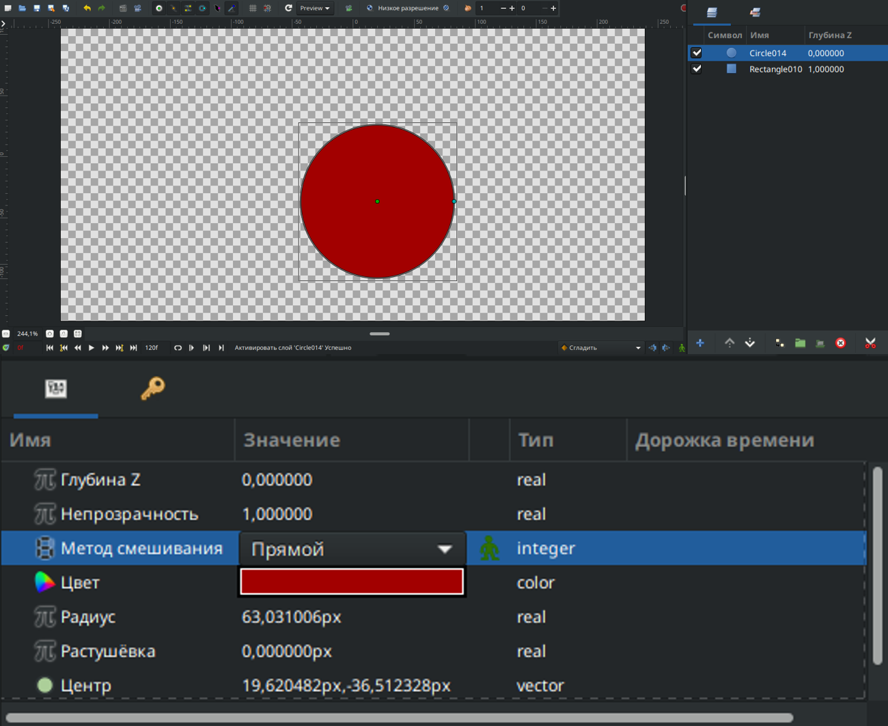
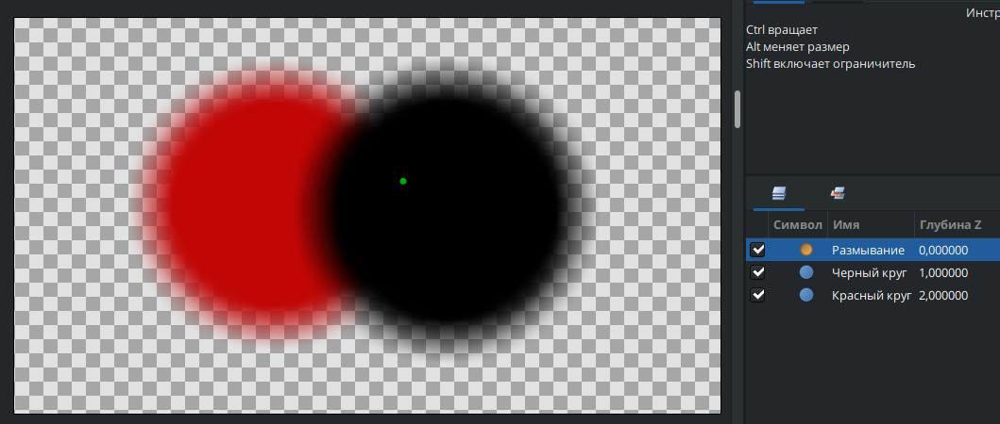
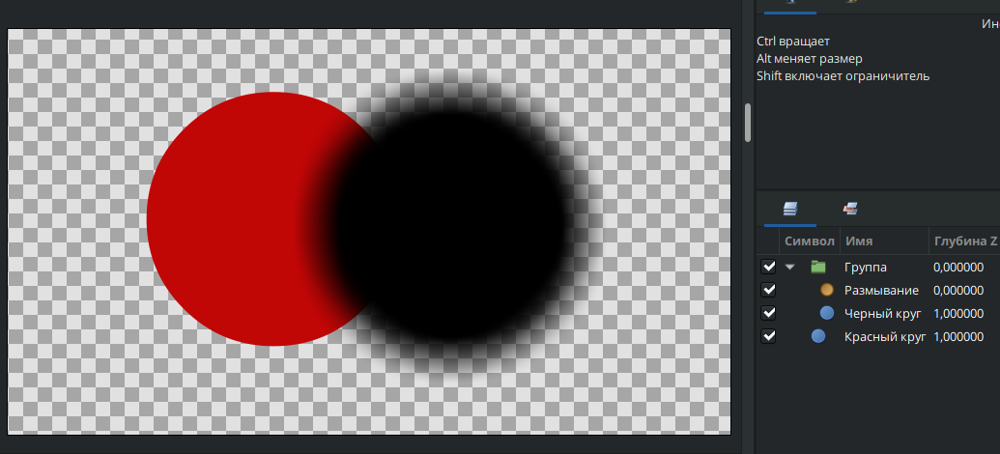

# Метод смешивания слоёв

Использование групп для ограничения эффекта смешивания**Метод смешивания** — один из самых **важных** параметров слоя, который позволяет создавать необычные эффекты наложения слоев друг на друга. В значении параметра доступен выпадающий список режимов наложения, которые можно использовать для преобразования обычных слоев в эффекты.

<figure><figcaption>
Параметр <strong>Метод смешивания</strong>
</figcaption></figure>

Большинство слоев создаются с режимом смешивания **Совмещение**. Этот режим обеспечивает стандартное наложение слоев, где верхний слой полностью перекрывает нижний. Если в этом режиме уменьшить значение параметра **Непрозрачность**, то цвета объектов в месте пересечения будут смешиваться.&#x20;

<figure><figcaption>
Наложение цветов друг на друга в режиме <strong>Совмещение</strong>
</figcaption></figure>

Наиболее интересные методы смешивания, на которые имеет смысл обратить внимание:

* **Альфа канал над** — слой к которому применен этот метод смешивания, становится маской, которая вырезает область по своей форме на объектах, что находятся под ней.

<figure><figcaption>
Режим наложения слоя <strong>Альфа канал над</strong>
</figcaption></figure>

* **На** — слой к которому применен этот метод смешивания, становится маской, которая  накладывается поверх слоев и отображается на рабочей области только на площади фигур, что расположены под ней.

<figure><figcaption>
Режим наложения слоя <strong>На</strong>
</figcaption></figure>


Режимы **Альфа канал над** и **На** используются для создания масок.


* **Позади** — этот метод позволяет помещать слой, что стоит верху списка, под все объекты. это может быть полезно во время анимации, когда вам нужно чтобы один и тот же объект мог быть за предметом и позади него.


Метод смешивания **Позади** применяется по-умолчанию для фильтрующего слоя [**Тень**](../perechen-sloyov/ten.md)**.**


<figure><figcaption>
Режим наложения слоя <strong>Позади</strong>
</figcaption></figure>

* **Прямой** — этот режим смешивания скрывает все слои что лежат под объектом, к которому этот режим применен. Этот метод полезен для фильтрующих слоёв, таких как **Размывание** (подробнее о [фильтрующих слоях](filtruyushie-sloi.md)).

<figure><figcaption>
Режим наложения слоя <strong>Прямой</strong>
</figcaption></figure>

Все остальные методы смешивания — это операции с цветом. Они влияют на то, как цвет верхнего слоя смешивается с цветом нижнего слоя в каждой конкретной точке.

### Использование групп для ограничения эффекта смешивания

Если пользователю нужно ограничить действие маски на конкретные объекты, то ее следует поместить в [группу](gruppy.md) с нужными слоями. В таком случае режим смешивания маски будет воздействовать только на те слои, что находятся в группе под ней. Более наглядно вы можете посмотреть на скриншотах ниже.

<figure><figcaption>
Фильтр <strong>Размытие</strong> вне группы
</figcaption></figure>

<figure><figcaption>
Фильтр <strong>Размытие</strong> в группе с черным кругом
</figcaption></figure>
