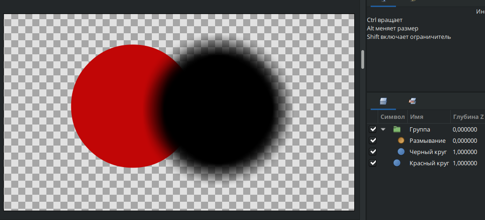

# Смешивание слоёв

**Смешивание слоёв** - один из самых полезных параметров слоя, что позволяет создавать необычные эффекты наложения слоев друг на друга. В значении параметра доступен выпадающий список режимов наложения, которые можно использовать для преобразования обычных слоев в эффекты (Рис. 1).

<figure><figcaption>
<em>Рис. 1 Параметр "Метод смешивания"</em>
</figcaption></figure>

Большинство слоев создаются с режимом смешивания "**Совмещение**". Этот режим обеспечивает стандартное наложение слоев, где верхний слой полностью перекрывает нижний. Если в этом режиме уменьшить значение параметра “Непрозрачность”, то цвета объектов в месте пересечения будут смешиваться (Рис. 10).&#x20;

<figure><figcaption>
<em>Рис. 10 Наложение цветов друг на друга в режиме "Совмещение"</em>
</figcaption></figure>

Наиболее интересные методы смешивания, на которые имеет смысл обратить внимание:

* **"Альфа канал над" -** слой к которому применен этот метод смешивания, становится маской, которая вырезает область по своей форме на объектах, что находятся под ней (Рис. 2).

<figure><figcaption>
<em>Рис. 2 Режим наложения слоя "Альфа канал над"</em>
</figcaption></figure>

* **"На" -** слой к которому применен этот метод смешивания, становится маской, которая  накладывается поверх слоев и отображается на рабочей области только на площади фигур, что расположены под ней (Рис.  3).

<figure><figcaption>
<em>Рис. 3 Режим наложения слоя "На"</em>
</figcaption></figure>


Режимы "Альфа канал над" и "На" используются для создания масок.


* **"Позади"** - этот метод позволяет помещать слой, что стоит верху списка, под все объекты. это может быть полезно во время анимации, когда вам нужно чтобы один и тот же объект мог быть за предметом и позади него (Рис.13).


Метод смешивания "Позади" применяется по-умолчанию для фильтрующего слоя “Тень”&#x20;


<figure><figcaption>
<em>Рис. 4 Режим наложения слоя "Позади"</em>
</figcaption></figure>

* **"Прямой"** - этот режим смешивания скрывает все слои что лежат под объектом, к которому этот режим применен. Этот метод полезен для фильтрующих слоёв, таких как "Размывание" (подробнее о фильтрующих слоях смотрите ниже).

<figure><figcaption>
<em>Рис. 5 Режим наложения слоя "Прямой"</em>
</figcaption></figure>

Все остальные методы смешивания - это операции с цветом. Они влияют на то, как цвет верхнего слоя смешивается с цветом нижнего слоя в каждой конкретной точке.

## Ограничение смешивания через группы

Если пользователю нужно ограничить действие маски на конкретные объекты, то ее следует поместить в [группу](gruppy.md) с нужными слоями. В таком случае режим смешивания маски будет воздействовать только на те слои, что находятся в группе под ней. Более наглядно вы можете посмотреть на рисунках 6 и 7 ниже.

<figure><figcaption>
<em>Рис. 6 Фильтр "Размытие" вне группы</em>
</figcaption></figure>

<figure><figcaption>
<em>Рис. 7 Фильтр "Размытие" в группе с черным кругом</em>
</figcaption></figure>
