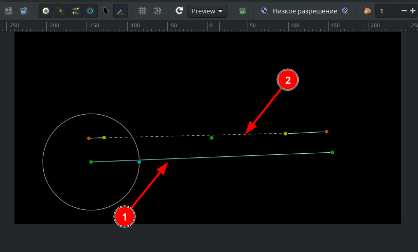

# Деформация по кривой

.png>)

Слой "Деформация по кривой" искажает объект, который изначально лежит по прямой линии, в изогнутую кривую Безье. Каждая точка исходной области определяется двумя перпендикулярными значениями координат, основанными на положении и длине исходной прямой линии. Эти координаты аналогичны координатам X и Y масштабированной и повернутой двумерной системы координат.

На рисунке ниже предствалено графическое отображение данного слоя. Под цифрой 1 - прямая с вершинами, которая отвечает за размер и расположение объекта, на который она влияет. Под цифрой 2 - кривая Безье, с помощью которой можно изгибать объект.

<figure><figcaption>
Рис. 1 Графичкское отображение слоя "деформация по кривой"
</figcaption></figure>

Параметры слоя "Деформация по кривой"

<figure><figcaption>
Рис. 2 Параметры слоя "Деформация по кривой"
</figcaption></figure>

Данный вид слоя хорошо работает с текстовыми слоями.

<figure><figcaption>
Рис. 3 Пример применения слоя "Деформация по кривой" с текстом
</figcaption></figure>
