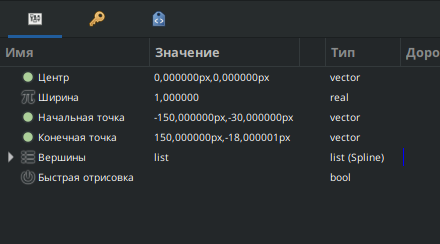

# Деформация по кривой

Слой "Деформация по кривой" искажает объект, который изначально лежит по прямой линии, в изогнутую кривую Безье. Каждая точка исходной области определяется двумя перпендикулярными значениями координат, основанными на положении и длине исходной прямой линии. Эти координаты аналогичны координатам X и Y масштабированной и повернутой двумерной системы координат.

<figure><figcaption></figcaption></figure>
