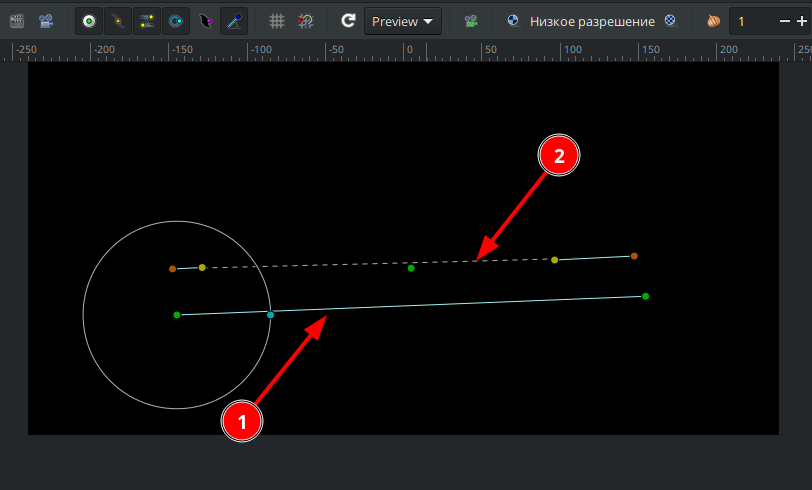
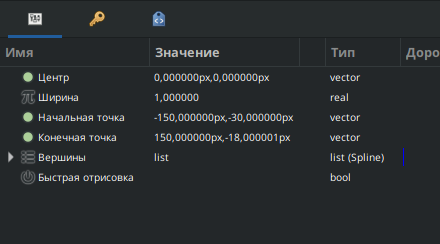

# Деформация по кривой

.png>)

Слой **Деформация по кривой** искажает объект, который изначально лежит по прямой линии, в изогнутую кривую Безье.&#x20;

Каждая точка исходной области определяется двумя перпендикулярными значениями координат, основанными на положении и длине исходной прямой линии. Эти координаты аналогичны координатам `X` и `Y` масштабированной и повернутой двумерной системы координат.

На рисунке ниже представлено графическое отображение слоя «Деформация по кривой».

* Под цифрой `1` — прямая с вершинами, которая отвечает за размер и расположение объекта, на который она влияет.
* Под цифрой `2` — кривая Безье, с помощью которой можно изгибать объект.

<figure><figcaption>
Графичкское отображение слоя <strong>Деформация по кривой</strong>
</figcaption></figure>

Параметры слоя **Деформация по кривой**

<figure><figcaption>
Параметры слоя <strong>Деформация по кривой</strong>
</figcaption></figure>

Данный вид слоя хорошо работает с текстовыми слоями.

<figure><figcaption>
Пример применения слоя <strong>Деформация по кривой</strong> с текстом
</figcaption></figure>
