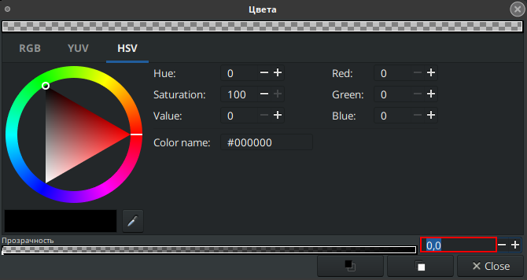

# Фаска

Фаска в Synfig Studio служит для создания эффекта объема на форме. Он имитирует освещение, добавляя светлую область с той стороны, куда падает свет, и затемненную область с противоположной стороны.

### Создание слоя "Фаска"

На панели слоёв с помощью кнопки "создать слой" вызовите контекстное меню, выберите "Стилизация" - "Фаска";

<figure><figcaption></figcaption></figure>

Менять цвет света и тени можно на панели параметров слоя.

Убрать отдельно свет/тень можно изменив прозрачность соответствующего цвета на ноль.

<figure><figcaption></figcaption></figure>

### Параметры слоя “Фаска” 

<table data-header-hidden><thead><tr><th width="226">Имя</th><th width="305">Значение</th><th>Тип</th></tr></thead><tbody><tr><td> Глубина Z</td><td>0.000000</td><td>реальный</td></tr><tr><td> Непрозрачность</td><td>1.000000</td><td>реальный</td></tr><tr><td> Метод смешивания</td><td>Совмещение</td><td>целое число</td></tr><tr><td>Тип</td><td>Быстрое гауссово размытие</td><td>целое число</td></tr><tr><td>Цвет света</td><td></td><td>цвет</td></tr><tr><td>Цвет тени</td><td></td><td>цвет</td></tr><tr><td>Угол освещения</td><td>135,00°</td><td>реальный</td></tr><tr><td> Глубина фаски</td><td>12,000000px</td><td>реальный</td></tr><tr><td> Мягкость</td><td>6,000000px</td><td>векторный</td></tr><tr><td> Светимость</td><td></td><td>bool</td></tr><tr><td> Сплошной</td><td></td><td>bool</td></tr></tbody></table>
