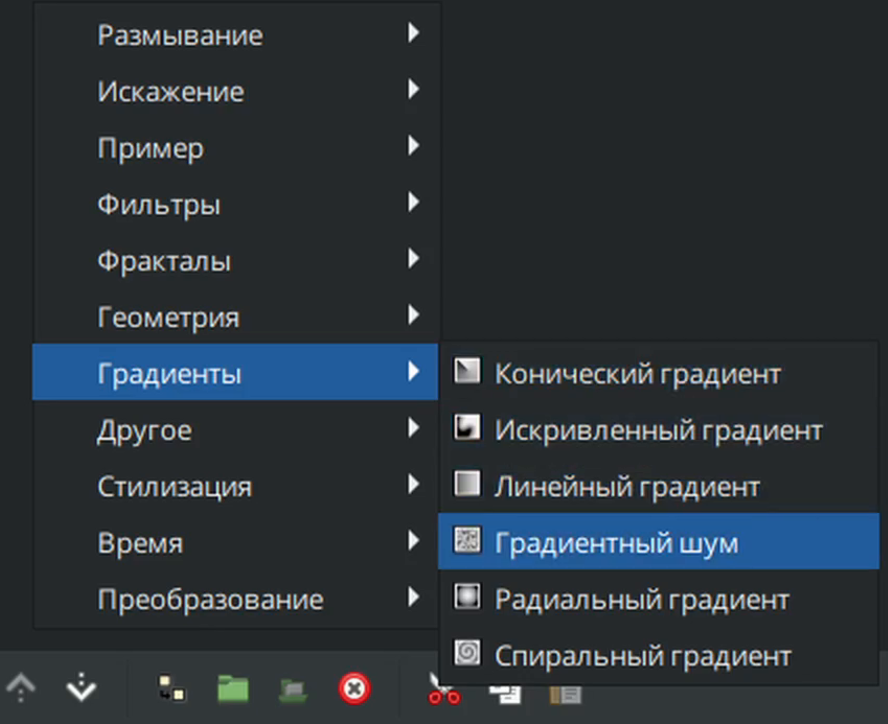

# Градиентный шум

Градиентный шум представляет собой процедурную текстуру, используемую для создания градиентов с контролируемым шумом. Как и все градиенты - является бесконечным слоем.

### **Создание слоя "**&#x413;радиентный шу&#x43C;**"**

* На панели слоёв с помощью кнопки "создать слой" вызовите контекстное меню, выберите "градиенты" - "Градиентный шум"

<figure><figcaption></figcaption></figure>

### Параметры слоя "Градиентный шум"

|                                                                                                                                                                                                                                                                         |                                                                                                                                                                                                                  |             |
| ----------------------------------------------------------------------------------------------------------------------------------------------------------------------------------------------------------------------------------------------------------------------- | ---------------------------------------------------------------------------------------------------------------------------------------------------------------------------------------------------------------- | ----------- |
| Глубина Z             | 0.000000                                                                                                                                                                                                         | реальный    |
| Непрозрачность        | 1.000000                                                                                                                                                                                                         | реальный    |
| Метод смешивания   | Совмещение                                                                                                                                                                                                       | целое число |
| Градиент          |  | градиент    |
| Начальное значение | 1716182861                                                                                                                                                                                                       | целое число |
| Размер              | 60,000000px, 60,000000px,                                                                                                                                                                                        | вектор      |
| Интерполяция       | Косинус                                                                                                                                                                                                          | целое число |
| Детализация        | 4                                                                                                                                                                                                                | целое число |
| Скорость анимации     | 0,000000                                                                                                                                                                                                         | реальный    |
| Турбулентность        |                                                                                                                                                                                                                  | bool        |
| С альфа-каналом       |                                                                                                                                                                                                                  | bool        |
| Супер сглаживание     |                                                                                                                                                                                                                  | bool        |

градиент Начальное значение 1299736373 целое число Размер 60.000000px, 60.000000px целое число Интерполяция Косинус целое число Детализация 4 целое число Скорость анимации 0.000000 реальный Турбулентность

bool С альфа-каналом

bool Супер сглаживание

bool

