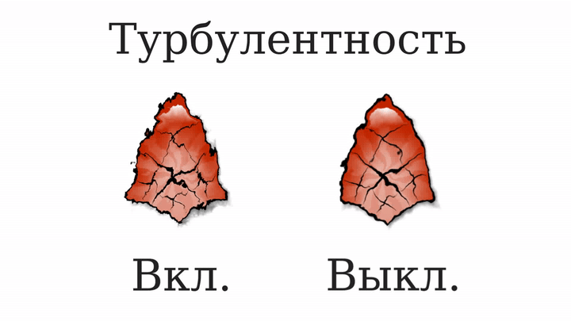

# Искажение шумом

Слой искажение шумом в Synfig Studio используется для применения к слою искажения, генерируемого случайным шумом. Это может создать эффект зернистого изображения, искажения или текстуры.

**Параметры:**

* **Смещение -** определяет величину искажения;
* **Размер -** определяет расстояние между искажениями;

<table><thead><tr><th width="223">Размер/Смещение</th><th>1px:1px</th><th>50px:1px</th><th>50px:50px</th></tr></thead><tbody><tr><td>1px:1px</td><td>

</td><td>

</td><td>

</td></tr><tr><td>50px:1px</td><td>

</td><td>

</td><td>

</td></tr><tr><td>50px:50px</td><td>

</td><td>

</td><td>

</td></tr></tbody></table>

* Начальное значение - случайное начальное значение шума;
* Интерполяция - смена типа интерполяции, что влияет на визуальное отображение применяемого шума;

<table><thead><tr><th width="200">Интерполяция </th><th>Отображение (смещение/размер 50px:50px)</th></tr></thead><tbody><tr><td>Ближайший сосед</td><td></td></tr><tr><td>Линейный</td><td></td></tr><tr><td>Косинус</td><td></td></tr><tr><td>Кривая</td><td></td></tr><tr><td>Кубическая</td><td></td></tr></tbody></table>

* Детализация - определяет качество и детальность накладываемого шума;

<table><thead><tr><th width="158">Детализация</th><th>Отображение (смещение/размер 50px:50px, интерполяция - "Косинус")</th></tr></thead><tbody><tr><td>1</td><td></td></tr><tr><td>2</td><td></td></tr><tr><td>3</td><td></td></tr><tr><td>4</td><td></td></tr><tr><td>5</td><td></td></tr></tbody></table>

* Скорость анимации - задает случайную анимацию для шума. Введеное число отвечает за количество кадров цикла анимации;

<figure><figcaption></figcaption></figure>

* Турбулентость - когда включено, создаёт турбулентный шум.

<figure><figcaption></figcaption></figure>

### **Применение:**

Слой искажения шума можно использовать для создания:

* Спецэффекто&#x432;**:** магия, порталы и др.

| Настройки                                                              | Результат                                                                      |
| ---------------------------------------------------------------------- | ------------------------------------------------------------------------------ |
| Искажение шумом выключено                                              |              |
|      |  |
|  |       |

* Текстур

| Настройки                                                                       | Результат                                                                |
| ------------------------------------------------------------------------------- | ------------------------------------------------------------------------ |
| Искажение шумом выключено                                                       |   |
|  |  |

