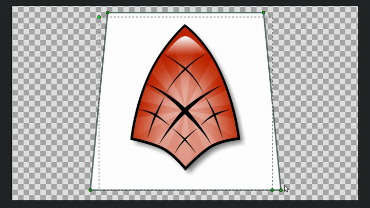
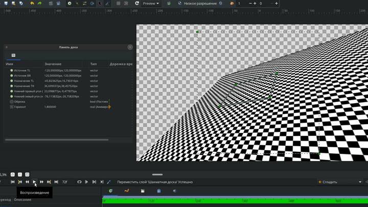

# Искажение

Слой Искажение - позволяет в несколько действий взять прямоугольную область с нижележащими слоев и переместить её четыре угла в произвольные точки на плоскости. Таким образом, слой деформации осуществляет 2D -> 2D преобразование.

Для сохранения объекта на месте при применении перспективы необходимо правильно расположить целевые точки перспективы вокруг объекта. Следует отметить, что для достижения наилучшего эффекта исходный прямоугольник должен быть центрирован по объекту.

<figure><figcaption></figcaption></figure>

### Параметры слоя Искажение

Исходные точки:

* Источник TL: Верхний левый угол (вершина) исходной области, подлежащей отображению.
* Источник BR: Нижний правый угол (вершина) исходной области, подлежащей отображению. Вместе с источником TL он определяет "исходный прямоугольник".

Целевые точки:

* Назначение TL: Верхний левый угол (вершина) целевой области, куда будет отображена исходная область.
* Назначение TR: Верхний правый угол (вершина) целевой области, куда будет отображена исходная область.
* Назначение BL: Нижний левый угол (вершина) целевой области, куда будет отображена исходная область.
* Назначение BR: Нижний правый угол (вершина) целевой области, куда будет отображена исходная область.

Обрезка - флажок, при включении которого отображаются только пиксели, находящиеся внутри "исходного прямоугольника".

Горизонт - для бесконечных слоев (градиенты, шахматная доска и т.д.) данный параметр определяет, где следует остановить отрисовку точек схода.

* Диапазон от 0.0 до 1.0: отрисовываются все точки, расположенные за перспективой (в направлении, противоположном точке схода).
* Диапазон от 1.0 до +бесконечности: отрисовываются точки, расположенные в том же направлении, что и точка схода.

<figure><figcaption></figcaption></figure>
