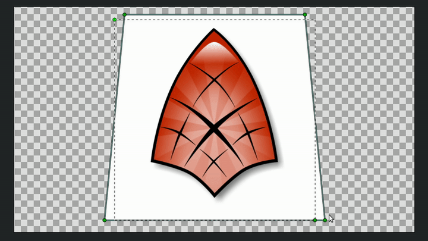
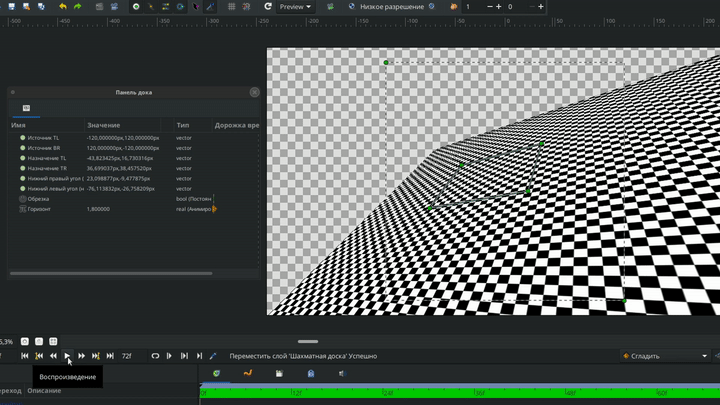

# Искажение

Слой «Искажение» — позволяет в несколько действий взять прямоугольную область с нижележащими слоев и переместить её четыре угла в произвольные точки на плоскости. Таким образом, слой деформации осуществляет `2D -> 2D` преобразование.

Для сохранения объекта на месте при применении перспективы необходимо правильно расположить целевые точки перспективы вокруг объекта. Следует отметить, что для достижения наилучшего эффекта исходный прямоугольник должен быть центрирован по объекту.

<figure><figcaption></figcaption></figure>

### Параметры слоя Искажение

**Исходные точки:**

* `Источник TL` — верхний левый угол (вершина) исходной области, подлежащей отображению.
* `Источник BR` — нижний правый угол (вершина) исходной области, подлежащей отображению. Вместе с `Источник TL` они определяют «исходный прямоугольник».

**Целевые точки:**

* `Назначение TL` — верхний левый угол (вершина) целевой области, куда будет отображена исходная область.
* `Назначение TR` — верхний правый угол (вершина) целевой области, куда будет отображена исходная область.
* `Назначение BL` — нижний левый угол (вершина) целевой области, куда будет отображена исходная область.
* `Назначение BR` — нижний правый угол (вершина) целевой области, куда будет отображена исходная область.

**Обрезка** — флажок, при включении которого отображаются только пиксели, находящиеся внутри "исходного прямоугольника".

**Горизонт** — для бесконечных слоев (градиенты, шахматная доска и т.д.) данный параметр определяет, где следует остановить отрисовку точек схода.

* Диапазон от `0.0` до `1.0` — отрисовываются все точки, расположенные за перспективой (в направлении, противоположном точке схода).
* Диапазон от `1.0` до +бесконечности: отрисовываются точки, расположенные в том же направлении, что и точка схода.

<figure><figcaption></figcaption></figure>
