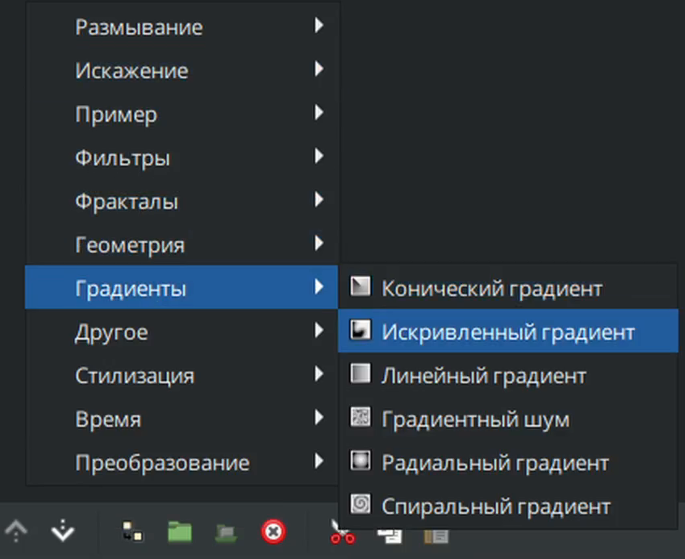

# Искривлённый градиент

Искривлённый градиент – это тип градиента в Synfig Studio, который следует по заданной кривой, создавая плавный переход между цветами. В отличие от линейного градиента, который переходит между цветами по прямой линии, криволинейный градиент позволяет создавать более сложные и динамичные цветовые переходы, отслеживая форму кривой.

### **Создание слоя "**Искривлённый градиент"

* На панели слоёв с помощью кнопки "создать слой" вызовите контекстное меню, выберите "градиенты" - "Искривлённый градиент"

<figure><figcaption></figcaption></figure>

### Параметры "Искривлённого градиента" 

Параметры "Искривлённого градиента" следующие:

|  Глубина Z           | 0.000000                                                                                                                                                                                                                  | реальный    |
| ----------------------------------------------------------------------------------------------------------------------------------------------------------------------------------------------------------------------------------------------------------------- | ------------------------------------------------------------------------------------------------------------------------------------------------------------------------------------------------------------------------- | ----------- |
|  Непрозрачность      | 1.000000                                                                                                                                                                                                                  | реальный    |
|  Метод смешивания | Совмещение                                                                                                                                                                                                                | целое число |
|  Центр             | 0,000000px, 0,000000px                                                                                                                                                                                                    | векторный   |
|  Ширина              | 5.500000px                                                                                                                                                                                                                | реальный    |
|  Вершины             | Список                                                                                                                                                                                                                    | сплайн      |
|  Градиент        |         | градиент    |
|  Цикл                |     | bool        |
|  Зигзаг              |  | bool        |
|  Перпендикуляр       |   | bool        |
|  Быстрая отрисовка   |   | bool        |
