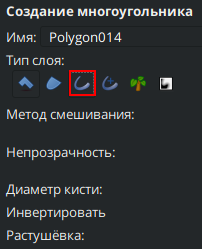
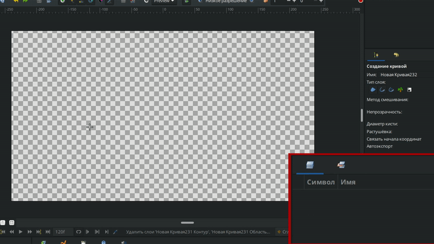
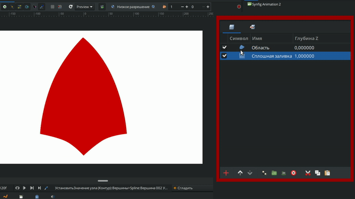

# Контур

Слой "Контур" предназначен для создания обводок фигур/областей. Может быть создан как отдельно, так и вместе с фигурой.

Помимо этого, отдельные контуры используются для создания самостоятельных линий и штрихов для различных художественных целей.

### Создание слоя "Контур"

Существует несколько способов создать "Контур":

* С помощью [инструментов создания объектов](../osnovnye-principy/instrumenty.md#instrumenty-sozdaniya-obektov), выбрав на панели параметров выбранного инструмента иконку с изображением контура.

<figure><figcaption></figcaption></figure>

* С помощью инструмента ["Кривые"](../osnovnye-principy/instrumenty.md#instrument-krivye).&#x20;


При одновременном создании контура и области их вершины будут взаимосвязаны, приводя к синхронному перемещению при изменении положения вершин одного из слоев.


<figure><figcaption></figcaption></figure>

* Нажмите правой кнопки мыши на уже созданом слое "область" на панели слоёв, выберите в выпавшем меню "Создать слой Контур". При создании контура из области происходит автоматическая синхронизация вершин, обеспечивая их точное совпадение.

<figure><figcaption></figcaption></figure>

### Параметры слоя "Контур" 

Параметры контурных слоев следующие:

<table data-header-hidden><thead><tr><th width="323"></th><th width="260"></th><th></th></tr></thead><tbody><tr><td>Имя</td><td>Значение</td><td>Тип</td></tr><tr><td> Глубина Z</td><td>0.000000</td><td>реальный</td></tr><tr><td> Непрозрачность</td><td>1.000000</td><td>реальный</td></tr><tr><td> Метод смешивания</td><td>Совмещение</td><td>целое число</td></tr><tr><td> Цвет</td><td></td><td>Цвет</td></tr><tr><td> Центр</td><td>0,000000px, 0,000000px</td><td>векторный</td></tr><tr><td> Инвертировать</td><td></td><td>bool</td></tr><tr><td> Сглаживание</td><td></td><td>bool</td></tr><tr><td>Растушевка</td><td>0,000000px</td><td>реальный</td></tr><tr><td> Тип растушевки</td><td>Быстрое гауссовое размытие</td><td>целое число</td></tr><tr><td> Обработка взаимопересечений</td><td>Ненулевой</td><td>целое число</td></tr><tr><td> Вершины</td><td>Список</td><td>список</td></tr><tr><td> Толщина контура</td><td>2.000000px</td><td>реальный</td></tr><tr><td> Расширение</td><td>0.000000px</td><td>реальный</td></tr><tr><td> Острые пики</td><td></td><td>bool</td></tr><tr><td> Закругленное начало</td><td></td><td>bool</td></tr><tr><td> Закругленное окончание</td><td></td><td>bool</td></tr><tr><td> Однородность</td><td></td><td>bool</td></tr></tbody></table>
