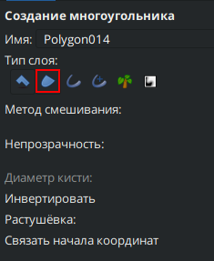
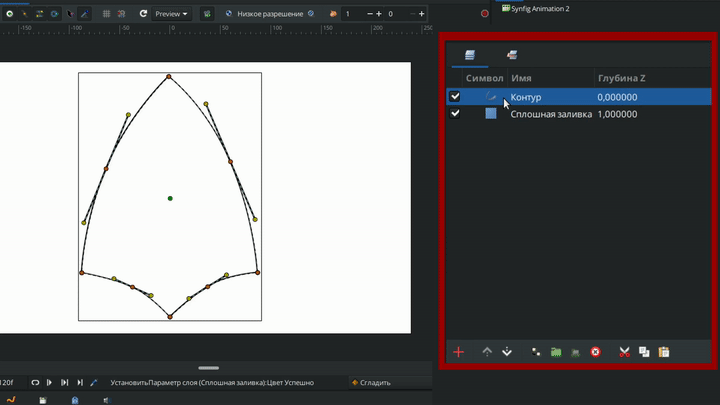

# Область

**Область** - это один из основных типов слоев в Synfig Studio, который используется для создания различных векторных форм. Область похожа на многоугольник, за исключением того, что у её вершин имеются касательные, которые позволяют создавать любые формы.

### **Создание слоя "Область"**

Существует несколько способов создать "Область":

* С помощью [инструментов создания объектов](../osnovnye-principy/instrumenty.md#instrumenty-sozdaniya-obektov), выбрав на панели параметров выбранного инструмента иконку с изображением области.

<figure><figcaption></figcaption></figure>

* С помощью инструмента ["Кривые"](../osnovnye-principy/instrumenty.md#instrument-krivye). При одновременном создании области и контура их вершины будут взаимосвязаны, приводя к синхронному перемещению при изменении положения вершин одного из слоев.

<figure><figcaption></figcaption></figure>

* Нажмите правой кнопки мыши на уже созданом слое "контур" на панели слоёв, выберите в выпавшем меню "Создать слой область". При создании области из контура происходит автоматическая синхронизация вершин, обеспечивая их точное совпадение.

<figure><figcaption></figcaption></figure>

### Параметры слоя "Область" 

<table data-header-hidden><thead><tr><th width="325"></th><th width="232"></th><th></th></tr></thead><tbody><tr><td>Имя</td><td>Значение</td><td>Тип</td></tr><tr><td> Глубина<a href="https://synfig.readthedocs.io/en/latest/parameters/z-depth.html#parameters-zdepth"> Z</a></td><td>0.000000</td><td>реальный</td></tr><tr><td> Непрозрачность</td><td>1.000000</td><td>реальный</td></tr><tr><td> Метод смешивания</td><td>Композитный</td><td>целое число</td></tr><tr><td> Цвет</td><td></td><td>Цвет</td></tr><tr><td> Центр</td><td>0,000000px, 0,000000px</td><td>вектор</td></tr><tr><td> Инвертировать</td><td></td><td>bool</td></tr><tr><td> Сглаживание</td><td></td><td>bool</td></tr><tr><td> Растушёвка</td><td>1,000000px</td><td>реальный</td></tr><tr><td> Тип растушевки</td><td>Быстрое гауссово размытие</td><td>целое число</td></tr><tr><td> Обработка взаимопересечений</td><td>Ненулевое значение</td><td>целое число</td></tr><tr><td> Вершины</td><td>Список</td><td>список</td></tr></tbody></table>
