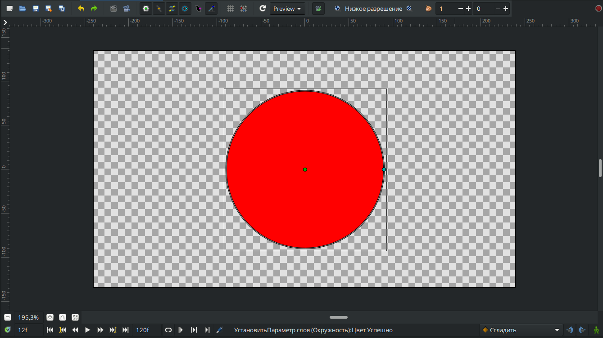

# Окружность

Окружность - это круглый объект, ограниченный замкнутой линией. В отличие от области, у окружности существует только две управляющие вершины: радиус и центр.

<figure><figcaption></figcaption></figure>

### Параметры слоя "Окружность":

<table data-header-hidden><thead><tr><th width="218">Имя</th><th width="308">Значение</th><th>Тип</th></tr></thead><tbody><tr><td> Параметр глубины</td><td>0.000000</td><td>реальный</td></tr><tr><td> Непрозрачность</td><td>1.000000</td><td>реальный</td></tr><tr><td> Метод смешивания</td><td>Совмещение</td><td>целое число</td></tr><tr><td> Цвет</td><td></td><td>Цвет</td></tr><tr><td>Радиус</td><td>90,000000px</td><td>Цвет</td></tr><tr><td>Растушёвка</td><td>0,000000px</td><td>вектор</td></tr><tr><td> Центр</td><td>0,000000px, 0,000000px</td><td>вектор</td></tr><tr><td>Инвертировать</td><td></td><td></td></tr></tbody></table>
