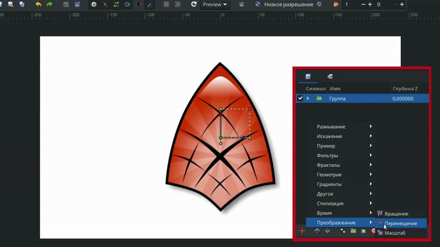

# Перемещение

Слой "Перемещение" - применяет перемещение к нижележащим слоям, не изменяя при этом исходные параметры этих слоев. Этот слой особенно полезен при работе с уже анимированными объектами.

<figure><figcaption></figcaption></figure>

### Параметры слоя “Перемещение” 

<table data-header-hidden><thead><tr><th width="232">Имя</th><th width="305">Значение</th><th>Тип</th></tr></thead><tbody><tr><td> Центр</td><td>0,000000px, 0,000000px</td><td>векторный</td></tr></tbody></table>
