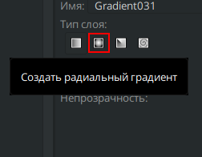
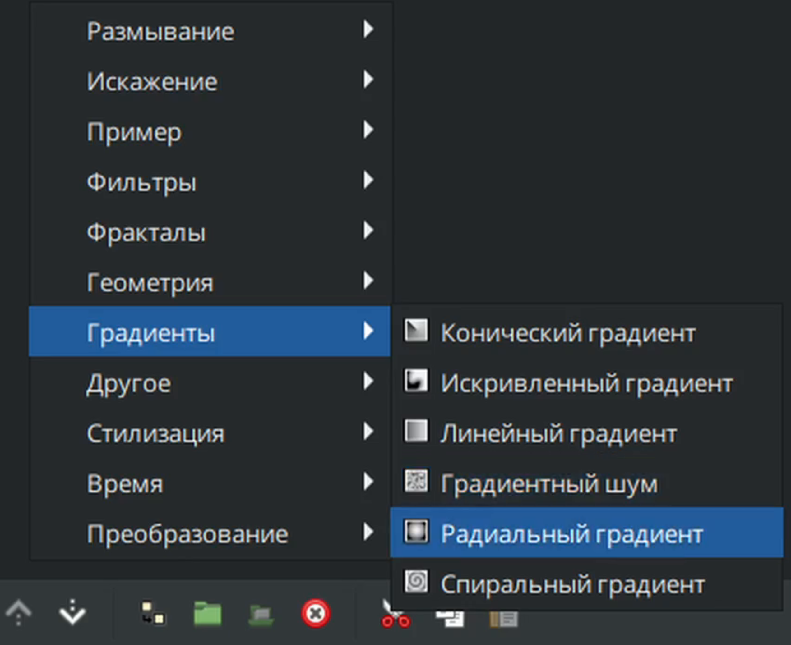

# Радиальный градиент

Радиальный градиент – это тип градиента в Synfig Studio, который создает плавный переход между цветами, исходя из центральной точки. Цвета переходят друг в друга по окружности, создавая эффект излучения или втягивания.

### **Создание слоя "Радиальный градиент"**

Существует несколько способов создать "Радиальный градиент":

* С помощью [инструмента создания градиентов](../osnovnye-principy/instrumenty.md#instrument-gradient), выбрав на панели настройки инструмента "радиальный градиент".

<figure><figcaption></figcaption></figure>

На панели слоёв с помощью кнопки "создать слой" вызовите контекстное меню, выберите "градиенты" - "Радиальный градиент";

<figure><figcaption></figcaption></figure>

### Параметры слоя “Радиальный градиент” 

<table data-header-hidden><thead><tr><th width="239">Имя</th><th width="305">Значение</th><th>Тип</th></tr></thead><tbody><tr><td> Глубина Z</td><td>0.000000</td><td>реальный</td></tr><tr><td> Непрозрачность</td><td>1.000000</td><td>реальный</td></tr><tr><td> Метод смешивания</td><td>Совмещение</td><td>целое число</td></tr><tr><td> Градиент</td><td></td><td>градиент</td></tr><tr><td> Центр</td><td>0.000000px,0.000000px</td><td>векторный</td></tr><tr><td>Радиус</td><td>30,000000px</td><td>реальный</td></tr><tr><td> Цикл</td><td></td><td>bool</td></tr><tr><td> Зигзаг</td><td></td><td>bool</td></tr></tbody></table>
